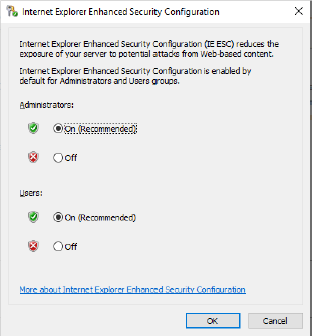

# Disable IE enhanced security configuration

If Internet Explorer Enhanced Security Configuration (IE ESC) is turned on, you will receive an error message to disable this setting before you can log on to OCS and register the PI to OCS Agent. An alternative is to change your default Web browser to one other than Internet Explorer during installation.

### Procedure
Follow these steps to disable Internet Explorer Enhanced Security Configuration:

1. On the computer the agent is installed (Windows Server operating system), open Server Manager.
2. Navigate to the **Internet Explorer Enhanced Security Configuration** window.
 
    

    _IE Enhanced Security Configuration window_

3. Select the **Off** option under **Administrators**.
4. Click **OK**.

You can now complete the PI to OCS Agent install and registration.

**Note:** You can turn off IE Enhanced Security Configuration after you complete the PI to OCS Agent installation.
