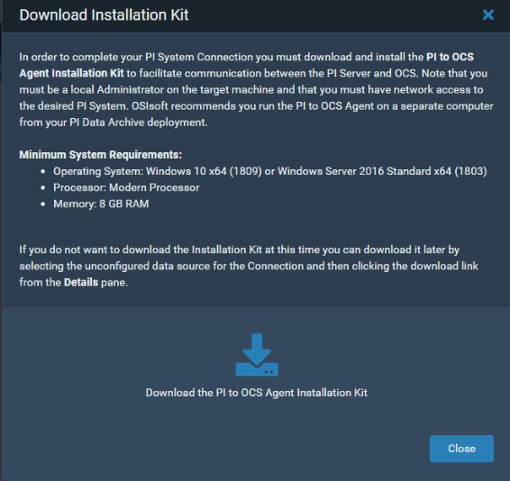
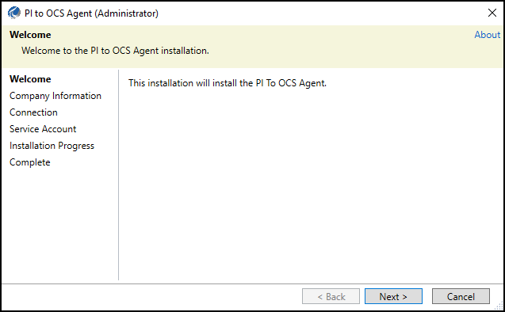
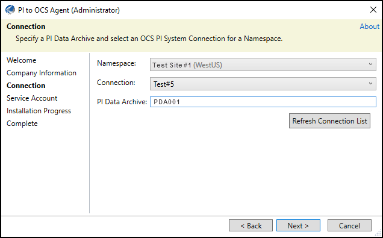
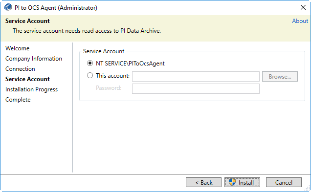

# Install the PI to OCS Agent

Install the PI to OCS Agent on a host computer separate from your PI Data Archive deployment with an account that has Administrative privileges. You can download the PI to OCS Agent Installation kit and then transfer it to the computer that will host the agent.

**Note.** The PI to OCS Agent installation cannot be completed if the system time is not correct. Additionally, you will not be able to complete the PI to OCS Agent installation if Internet Explorer Enhanced Security configuration is enabled.  Please see the [Disable Internet Explorer Enhanced Security Configuration](disable-ie-security.md) topic for details.

## Procedure

1. **Optional:** Navigate to the **Connections** page.
2. Click the **Download the PI to OCS Agent Installation Kit** icon.

3. Download the PI to OCS agent to the desired location.
4. Close the **Download Installation Kit** window.
5. Navigate to the downloaded PI to OCS agent installation file.
6. Right-click the PI to OCS agent installation file, then click **Run as administrator**.
7. Click **Yes**.
 
8. In the **PI to OCS Agent (Administrator)** window, click **Next**.
9. Enter your OCS account ID or company alias, then click **Next**.
10. Select or enter the following for your connection:
    - **Namespace:** Select the location where data will be stored after the data transfer. The region indicates where the namespace resides. Streaming data sent by the PI to OCS Agent will only go to the selected namespace’s region.
    - **Connection:** Select the name of the data transfer connection you created earlier. 
    - **PI Data Archive:** Enter the name of the on-premises PI Data Archive you want to transfer data from.
11. **Optional:** Click the **Refresh Connection List** button to refresh the list of available connections and select a different PI Data Archive.
 
12. Click **Next**.
13. Select the service account type for the connection:
    - **NT Service**: Use an NT account to connect to PI Data Archive.
    - **This account**: Specify a user name and password (domain\account) to connect to PI Data Archive.
**Note.** The service account must have Administrative privileges <+Need link and read access to certain data on PI Data Archive.

14. Click **Install**, then click **Close**.
 **Result:** The PI to OCS Agent is installed and registered to the PI System data source in OCS. The registration process can take a few minutes.
