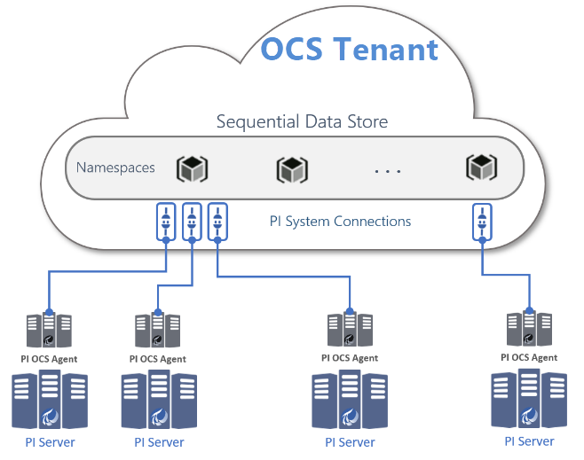

# Overview of PI to OCS

PI to OCS enables data transfer from your on-premises PI Server(s) to OSIsoft Cloud Services (OCS). PI to OCS supports the following features:

* Transfer of a selection of PI Data Archive PI points from PI Servers to OCS Sequential Data Store (SDS) [streams](xref:sdsStreams). Some of the PI point attributes information is transferred as SDS stream [metadata](xref:sdsStreamExtra) and properties.
* Simultaneous transfer of both historical and streaming data from PI Data Archive to SDS for a selection of PI points
* Configuration of a PI points selection and data transfer management via the OCS customer portal

Transferring PI System data into OCS allows your organization to have data available wherever you go, so users can connect with the best in-class analytics, and with your community of vendors, service providers, and business partners.

PI to OCS has two major components:

1. An on-premises component called the "PI to OCS Agent" that serves as a bridge between the source PI Server and the OCS destination. The agent runs as a service and performs fast, secure data transfers.

2. A cloud component called a "PI System connection" or "PI System connection data source", which resides within OCS and receives data from the on-premises PI to OCS Agent and stores it in SDS.

**Note.** Storage in SDS is partitioned by OCS namespace.

The deployment of a PI to OCS Agent establishes a one-to-one connection from an on-premises source PI Server to an OCS PI System connection.

