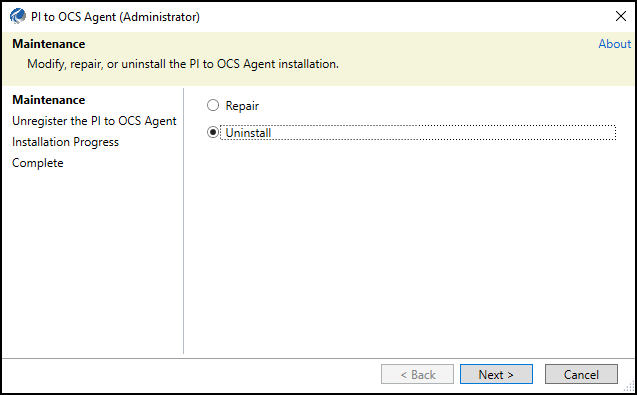

# Uninstall an agent

Before you uninstall a PI to OCS Agent, you need to perform the following tasks to ensure the related data transfer, data source, and PI system connection are also removed:

1. Stop the PI points transfer.
2. Delete the PI Points transfer.
3. Delete the data source.
4. Delete the PI System connection.

**Note:** Removing a data transfer and the corresponding PI System connection does not delete the associated SDS stream types, streams, or the actual data transferred in OCS. These will have to be deleted separately if needed.

## Procedure
1.	Navigate to the downloaded PI to OCS agent installation file.
2.	Right-click the PI to OCS agent installation file, then click **Run as administrator**.
3.	Click **Yes**.
4.	In the **PI to OCS Agent** window, select the **Uninstall** option.
 
    

    _Uninstall option in the PI to OCS Agent Setup Kit_

5. On the **Unregister the PI to OCS Agent** page, click the **Unregister agent from OCS** checkbox.

    **Note:** When you select the option to unregister the agent from OCS, you are required to log on to the OCS portal. To ensure the client and connection information is also removed, make sure to log on with an account that is assigned to the Account Administrative role.

6.	Click **Uninstall**.
7.	**Optional:** You may be required to log on to the OCS portal.
8.	Click **Close**.
9.	**Optional:** To install the latest version of the agent, download and install the latest version of the PI to OCS Agent.
