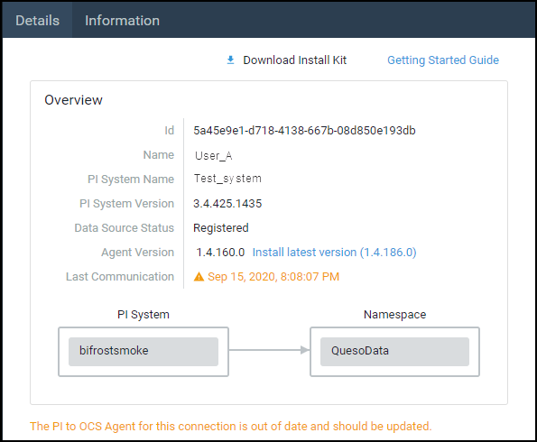

# PI to OCS Agent maintenance

Enhancements and bug fixes for PI to OCS may require you to update both the PI to OCS Agent and the PI System connection. Since these components work together, updating one usually requires that the other is updated also.

The **Details** pane displays the currently installed version of the PI to OCS Agent, and also indicates if you need to update it to the latest version. 
 

_Agent version update message_

If you see the message above, update your agent to the latest version. Updates are required for backward compatibility and when the version of the agent installed is older than the version of the PI System connection.

* The PI to OCS Agent is updated by downloading a new version of the setup kit and installing the new kit.
* Some updates might require uninstalling the agent and reconfiguring both your PI System connection and your data transfer. 
* Specific details about the updates will be communicated by posts in the [OCS Services Blog](https://cloud.osisoft.com/blogs), which is accessed from the OCS main menu.