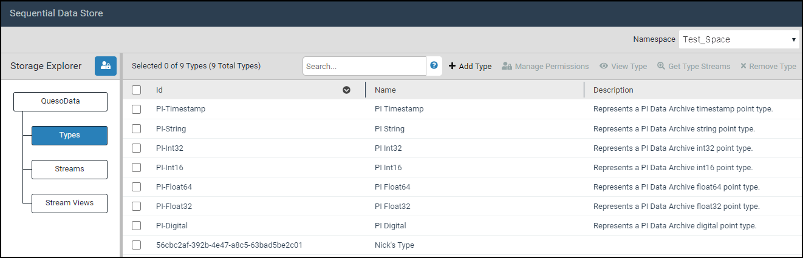

# Confirm data retrieval

To confirm that SDS streams have been created and your data has being transferred, you can view information about these streams on the **Sequential Data Store** page in the OCS portal.

1. Sign in to the [OCS portal](https://cloud.osisoft.com/).
1. Click the navigator menu icon, then click **Sequential Data Store**.

   

   _Sequential Data Store page_

2. Click the **Namespace** down arrow, then select the namespace that the SDS streams have been created in.

   **Note:** By default, the grid displays the SDS stream types created by the PI to OCS data transfer.

3.	Click the **Streams** button.

    **Note:** The grid lists the first 50 SDS streams in alphabetical order. You can change how many streams are displayed per page (50, 100, 200).

4.	**Optional:** Enter search criteria to locate specific streams in the **Search** text box, then press [ENTER].

      **Result:** If there are matches, matching streams are shown.

5.	**Optional:** Select a stream, then click **Manage Data** to query SDS for information about that stream.
