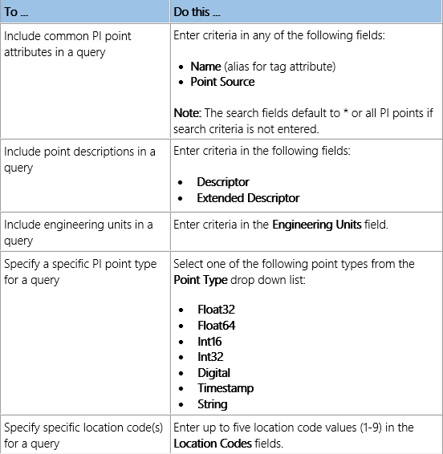
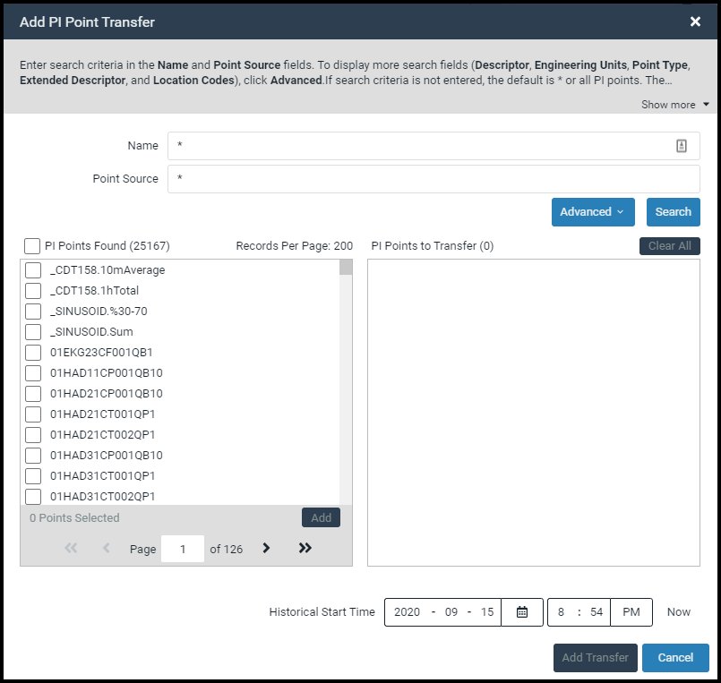
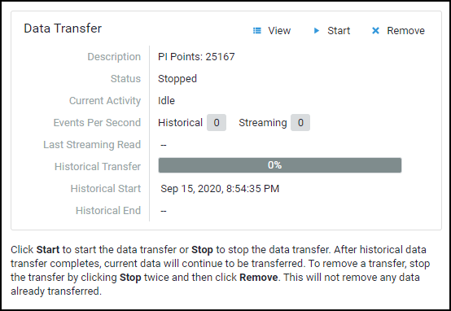

# Create a data transfer

A data transfer contains a selection of PI point data you wish to stream from your on-premises PI Data Archive to the desired namespace in OCS. The data transfer process consists of the following steps:
1.	Select the PI System connection for the data transfer.
2.	Create multiple search queries for PI points.
3.	Select the PI points you wish to transfer.
4.	Transfer the data to OCS.
 

## Before you start

Create a PI System connection, install the PI to OCS agent, and then confirm your data source has been registered in OCS.  

## Procedure

1. Sign in to the [OCS portal](https://cloud.osisoft.com/).
1. In the OCS portal, open the **Connections** page.	
1. On the **Connections** page, select the PI System connection you want to use for the data transfer.
2. In the right pane, click **Add PI Point Transfer**.

    **Result:** The **Add PI Point Transfer** window opens.

     

    _The Add PI Point Transfer window_

3.	**Optional:** Click the **Advanced** button to display more search fields.
 
    

    _Advanced search fields_

4.	To build a search query, choose from the following actions:

    

5.	**Optional:** Click the **Basic** button to hide the extra search fields.
6.	**Optional:** To remove advanced filters from your search criteria, click the **x** on the field label.

    **Note:** If you do not specify filter criteria, all PI points will be returned in your query results.

7.	Click **Search** to execute your query and retrieve a list of matching PI points from your data source.
 
    

    _Query results in the PI Points Found list box_

8.	Scroll through the **PI Points Found** list box and click each PI point you want added to the data transfer.

    **Tip:** To select a range of PI points, [SHIFT+Click] a non-adjacent PI point in the list after selecting a point.

9. **Optional:** To advance through multiple-paged query results, click the back and forward arrows OR enter a page number in the Page text box.

    **Note:** The total number of PI points in the query results is listed in “(  )” to the right of the **PI Points Found** check box. For multiple paged results, PI points are sorted in ascending order. Each page can display up to 200 PI points (this feature is only available with version 1.4.0.0 and later of the Agent).

10.	**Optional:** Click the PI Points Found check box to select all PI points on a page.
11.	After you have finished selecting PI points, click **Add**.

    **NOTE:** PI points that have already been selected for a data transfer appear grey in the **PI Points Found** list box to ensure duplicate points are not added.

12.	**Optional:** Click **Clear All** to remove selected PI points from the PI Points to Transfer list.
13.	To run a new query and add additional PI points to your data transfer, repeat steps 4-12 as many times as needed.

    **TIP:** To prevent duplicate query results, be sure to replace existing search criteria.

14.	**Optional:** Enter a historical time context for data retrieval using the **Historical Start Time** fields.

    **NOTE:** OCS supports out of order events and stores data in chronological order by timestamp.  PI Data Archive 2017 SP2 or higher is required for this feature. Be sure to enter the historical start date and time correctly to ensure all data is included in the transfer.  No data before the historical start time will be captured and stored in SDS.
 
15.	Once you have finished selecting PI points, click **Add Transfer**.
The transfer is saved and displayed in the **Data Transfer** section of the **Details** pane.

    **Note:** If you make multiple PI point selections across pages in a query result, these selections are preserved.

    

    _Data Transfer details_
