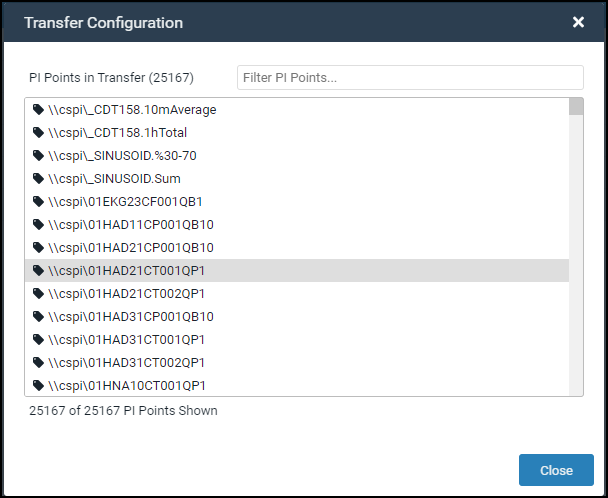
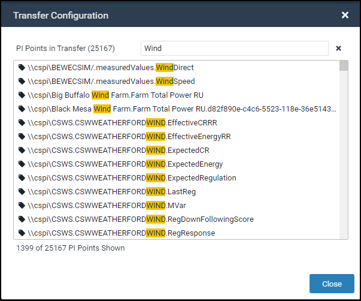
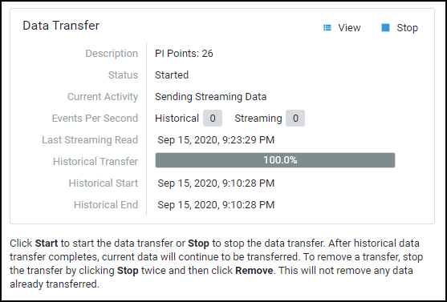

# Transfer PI System data to OCS

After PI points have been added to a data transfer, you are ready to stream your PI system data into OCS. Before data is transferred, the SDS streams are created.  Then, any historical data is transferred first followed by streaming data. You can view PI points selected for the transfer before or during the data transfer.

## Procedure

1. In the **Data Transfer** section of the **Details** pane, click **View**.

    **Result:** The **Transfer Configuration** window opens and display the PI points selected for the data transfer.

    

    _Transfer Configuration window_

2. **Optional:** To filter PI points by a string of characters, enter the first few characters of the PI point name in the **Filter PI Points** text box.

    **Tip:** The **Filter PI Points** text box is not case sensitive.

   

    _PI points displayed by filter criteria_

**Note:** Any PI points that can’t be transferred are listed at the bottom of the **Transfer Configuration** window. There are several reasons a PI point ID might not be resolved and included in a data transfer, such as an out-of-date Agent, security issues or removed PI points.

3. **Optional:** Close the **Transfer Configuration** window.
4. To initiate the data transfer, click **Start** in the **Data Transfer** section of the **Details** pane.
5. Click **Start** again to confirm.
**Result:** The **Status** field changes to **Stopped** (**Starting**) in the **Data Transfer** section.
6. **Optional:** To stop the data transfer at any time, click **Stop**.

    

    _Data Transfer details_

**Note:** The **Data Transfer** section provides details on the streaming status of a data transfer. Since it reports on how much historical data has been transferred for a given time period, the rate of progress varies depending on the density of data in the PI Data Archive. See [Data transfer statuses] (xref:data-transfer-statuses) for status descriptions. 

The **Events per second field** shows the progress of your transfer as data is streamed into OCS. Historical data is transferred first and then streaming data can be viewed. The number of incoming events successfully transferred over to OCS is shown in the Streaming field. Historical data is the number of incoming events per second that are not able to be transferred as “real-time,” but instead come from a backlog of events for the PI points associated with the transfer.
