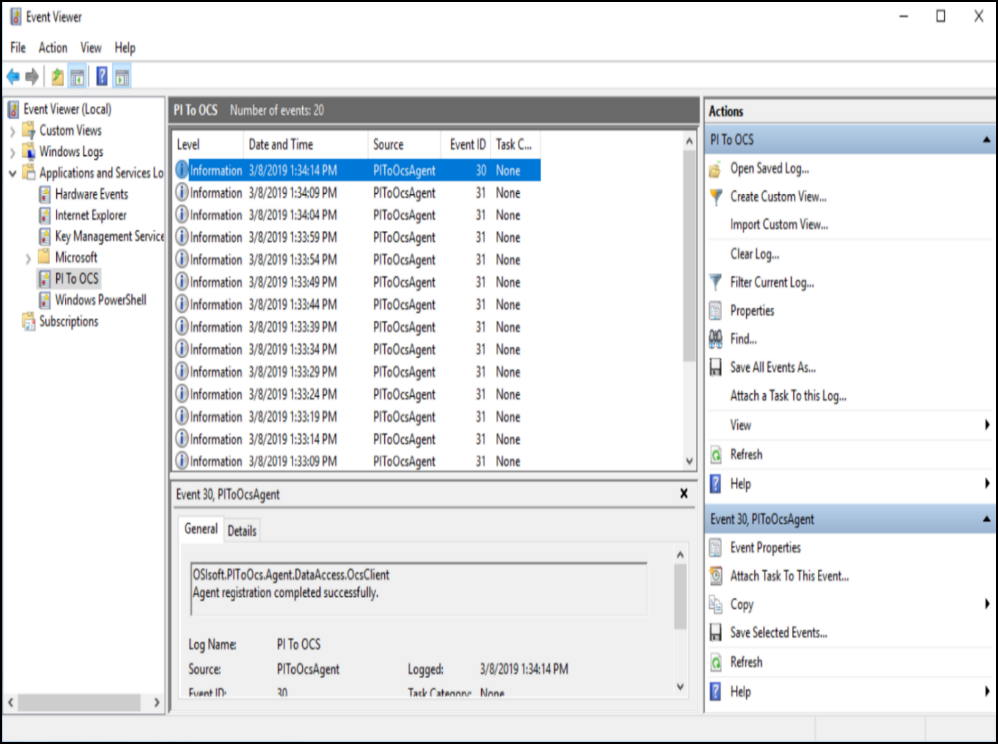

# View PI to OCS Agent logs

To gain valuable clues about account related activity for on-premises components, you can view the PI to OCS Agent logs in the Windows Event Viewer.

1. Click the **Windows** menu button, then scroll to and click **Windows Administrative Tools** > **Event Viewer**.
2. In the **Event Viewer** window, click to expand the contents of the A**pplications and Services Logs** option in the left pane.
3. Click **PI to OCS**.
4. In the PI to OCS pane, scroll through and select an event to view related details.

    

    _PI to OCS log messages in the Event Viewer_
