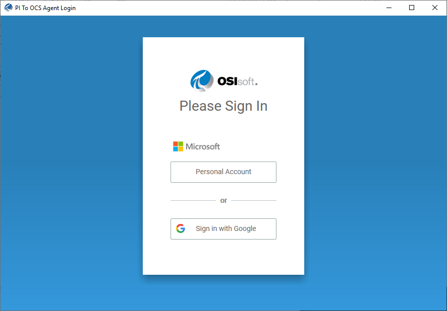

# Access the OCS customer portal

Log on to the OCS customer portal to access and install the PI to OCS agent and then transfer PI system data to OCS.

## Before you start

Make sure to have your OCS account log on credentials, your company alias or tenant ID, and your tenant's namespace for the data transfer. <!-- I want to make a link to Account_Management_Concepts.md and then to the Namespace section within, but there's no UID for that topic -->

**Note.** If you encounter any issues, please refer to your initial OCS activation email or [https://cloud.osisoft.com/account](https://cloud.osisoft.com/account) for help.

## Procedure

1. Navigate to the [OCS customer portal](https://cloud.osisoft.com).
2. In the upper-right corner of the OCS portal window, click **Sign In**.
3. In the **Specify Tenant ID or Company Alias** window, enter your tenant ID or company alias.
4. Click **Continue**.
5. At the **PI to OCS Agent Login** window, sign in to your OCS tenant using a user account that has Account Administrator privileges.

 **Note.** In the screenshot below, the OCS user is configured to use both a Microsoft Account (MSA) and Google to sign in again.  Be sure to sign in to the OCS portal with an account assigned to the Account Administrator role. 

_Sign in window_