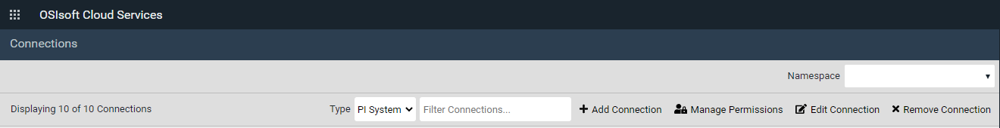
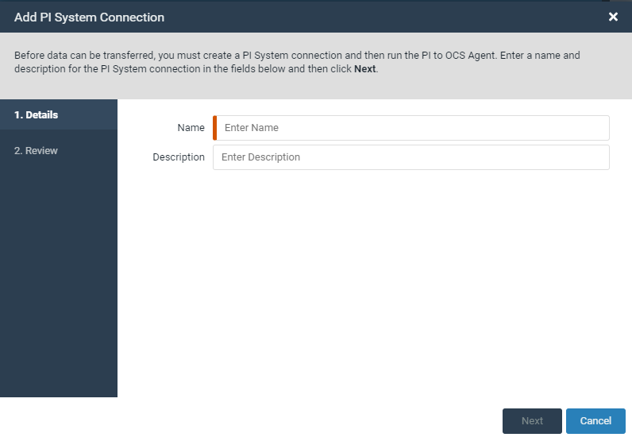

# Create a PI System connection and install the PI to OCS Agent

You need to create a PI system connection and install the PI to OCS agent before you can transfer data to OCS.

## Create a PI System connection

### Before you start

Sign in to the [OCS portal](https://cloud.osisoft.com).

### Procedure

1. Click the menu  icon, then click **Connections**.
 
2. On the **Connections** page, click the **Namespace** field, then select the data transfer destination.
  **Note.** A namespace exists within a region, and all data is stored in the namespace’s region.
3. Click **Add Connection**.
 
4. In the **Add PI System Connection** window, enter a name and description for the connection.
5. Click **Next**.
6. Click **Save**.
 The **Download Installation Kit** window opens