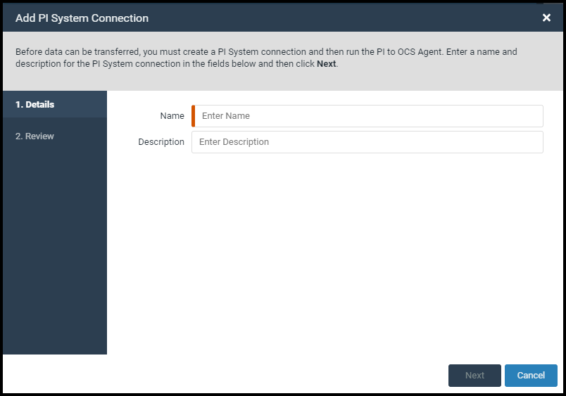

# Create a PI System connection

Before you can transfer data to OCS, you need to create a PI system connection and install the PI to OCS agent.

### Procedure

1. Sign in to the [OCS portal](https://cloud.osisoft.com).
1. Click the menu  icon, then click **Connections**.

2. On the **Connections** page, click the **Namespace** field, then select the data transfer destination.
  **Note.** A namespace exists within a region, and all data is stored in the namespace’s region.
3. Click **Add Connection**.

     
_PI System Connection window_

4. In the **Add PI System Connection** window, enter a name and description for the connection.
5. Click **Next**.
6. Click **Save**.
 The **Download Installation Kit** window opens.

Next, [Install the PI to OCS Agent](xref:install-pi-to-ocs-agent).

