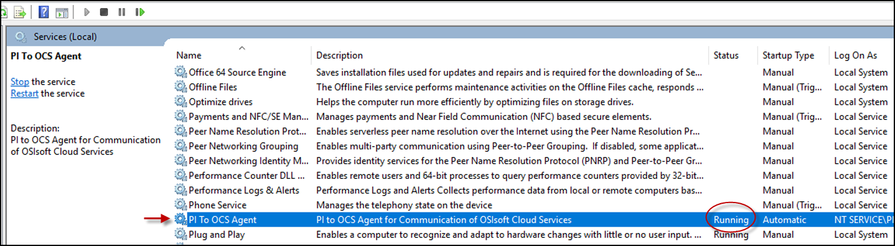
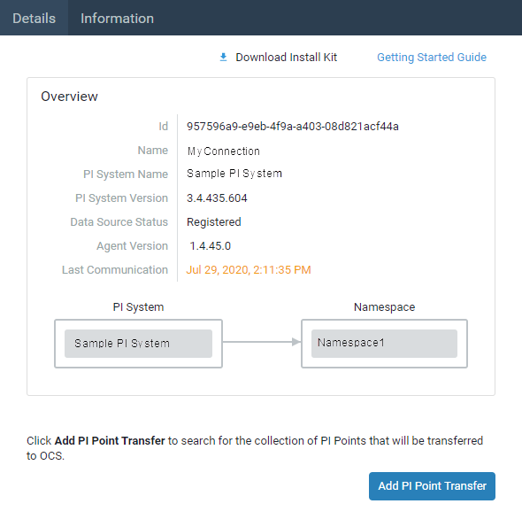

# Confirm your agent is running

After installation, confirm your PI to OCS Agent is running on the machine it was installed. You also need to confirm the agent has successfully connected to and registered with your on-premises PI Data Archive.

## Procedure
1. Type `services.msc` in the text box next to the **Windows** menu button, then press [ENTER].
2. In the **Services** window, scroll down to **PI to OCS Agent** and verify that that the **Status** field shows **Running**.

    
    _Services window_

3. Navigate to the Connections page, then select the connection you just created.
4. On the Details tab, view the Data Source Status field.
5. Verify that Registered appears next to the **Data Source Status** field.

    
    _Registered data source_

**NOTE:** It may take a few minutes for your PI System to be registered. The following states may also appear next to the Data Source Status field to indicate a connection issue:

State | Description
---------|----------
 Data Source Connection Issue| Indicates the PI To OCS Agent isn’t able to connect to the PI Data Archive. Some reasons for this status include the PI Data Archive is turned off, a firewall issue is preventing connections or an incorrect name is configured for the Data Archive (for example, trying to connect to a machine that doesn’t exist/was renamed). There may be additional reasons for this status.
 Data Source Security Issue | Indicates the PI Data Archive connection is unsecure and security settings need to be addressed. 
 Not Registered | You need to troubleshoot your PI System connection. Contact OSIsoft Technical Support at +1 510-297-5828 or through the [OSIsoft Customer Portal](https://ssoadfsbe.osisoft.com/adfs/ls/idpinitiatedsignon.aspx?SAMLRequest=fZJdb6pAEIb%2FCtl7FBGIJcVGRVuq%2BIFgkZtm%2BbIrsIvMosVff6ieJu1NJ9mL2XfmncnkeXz6LHLhnFRAGDVQryMhIaERiwk9GMhzZ%2BIAPQ0fARd5qY9q%2FkGd5FQnwIW2j4J%2BEwxUV1RnGAjoFBcJ6DzStyN7ocsdSS8rxlnEciSMAJKKt4MmjEJdJNU2qc4kSjxnYaAPzkvQu92oBs5aDTqs9WMp70Ss6ObsQOgTMEOSzJ4l3UKeKQoSzHYZQjG%2F7f9tAsBwnEKY%2FDL5%2Burm0CVxSSjhBPMkBnKgjHYwlJ9IsEwDvcuTURt%2BctG8uWJPBxfbyy62Ofp60uaaXb9k1T5e3X1qp4tp%2BZlvx6EZbdy5CQcx5ctjqZ5Ie45pENZncV4fT4PTznJEtdrKezHZYSe9zLSmGRTv0WsWSNlk47yGTVD58UGVrfGGX8V97i52wVKdibI3zpWLBMeBp%2B0jtQqjVa6wJttng4ZdFl6B%2B3PfIlq8El28NBk9u0tLnazE%2FkN8pMpM8YHTl7mdr8vQGfXf4Ip5owR5wHFwdGC2j0iRBfK6WdfVm48z9Xl88MXBfHJ619zMn8bLpfxQyTNNs5z0rJyfpWqxWo3aawHUiUWBY8oNJEtyT5R6oiy5PU1X%2B3q%2F3%2Bk9KAES1v8BGBN6x%2BovWsJ7EegvrrsW16uti4TdN55tAbrDqN%2BGVz8o%2FNsWf6OHhn%2BC9tj94T68Z7%2FBH%2F4D&RelayState=%2Fs%2F&SigAlg=http%3A%2F%2Fwww.w3.org%2F2001%2F04%2Fxmldsig-more%23rsa-sha256&Signature=cEXMU%2FcKNyUJwG7OtFpybbv8R1iC%2BLdv4W%2FG3kAX0HQlcNYDwqnaYdBf6pedIux3Eb8hZZH09bzV7mn5iorb0ZQz6C4i%2F838Cj8rHmKiM0V2jWE2Ij3JqqlHiE4CRZqK04sGopvso1TBesyrHrvhhwzLmBN3%2FJfKaYE3PDFzrFpJCmkdrBw2IPlJ%2BEgD87%2BcUxzKqWC4cViqeNvLydst%2FMXuDjhbHrWYrFoFXexOHttyRDO%2BWl5m2pg8l5gzr43WTBbNPm1VFjoR6tJ3Z3%2BGphXpOgErCG41MAAOFH0qO8%2BWwjDVZgNX5KXVaIXbjISFb8jXccMQ9NhPfvfRSbwMgg%3D%3D).