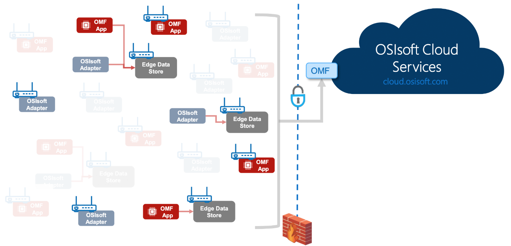
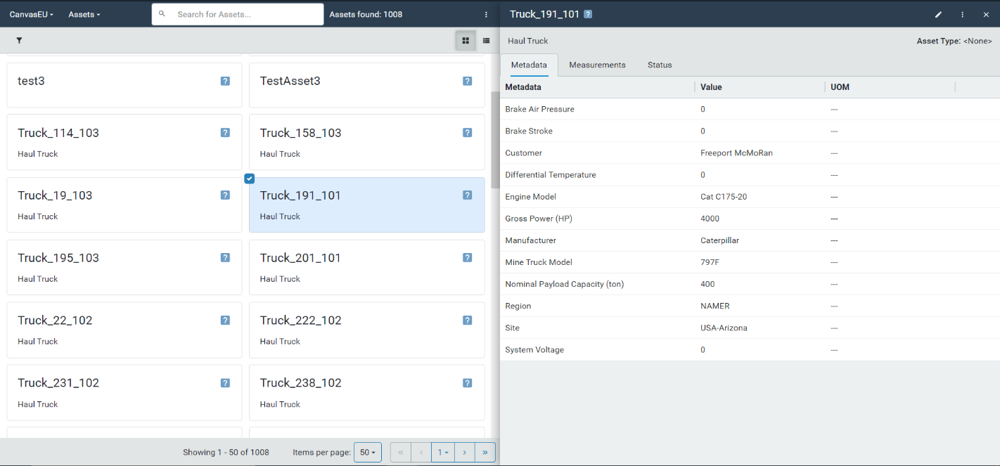
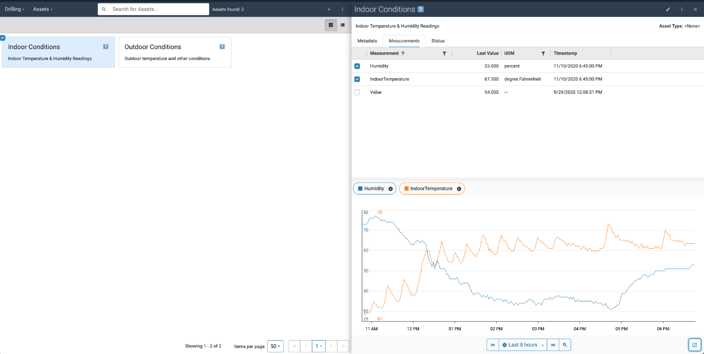
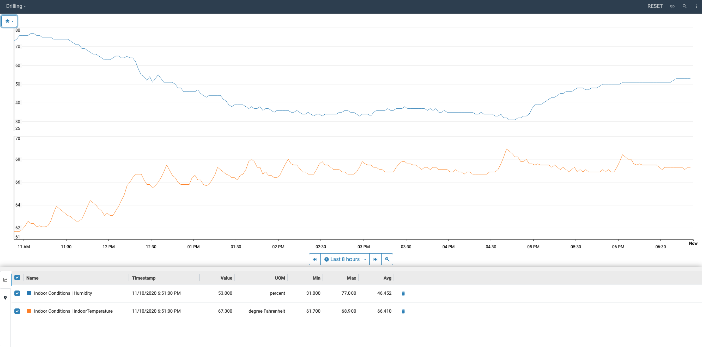

# What is OSIsoft Cloud Services (OCS)?

OSIsoft Cloud Services (OCS) is a cloud data platform for storing, retrieving, and analyzing sequential data. It provides real-time data transfer and easily scales to high data volumes. 

OCS creates a seamless, trustworthy data infrastructure, incorporating information from sensors, assets, plants, enterprises, and communities of interested users. This enables Operational Technology (OT) to be fully utilized across your organization. 

OCS offers the following capabilities: 

**QUESTION: We ordered these with the ones most relevant and eye-catching to users first. They are all important, we might need additional sections, and/or to re-order these.** 

* [Remote monitoring from the network edge](#remote-monitoring-from-the-network-edge) 
* [Easy data import (ingress)](#easy-data-import)
* [Data aggregation from many sources](#data-aggregation-from-many-sources)  
* [Integration with custom applications and business intelligence tools and new types of data sharing](#integration-with-custom-applications-and-business-intelligence-tools-and-new-types-of-data-sharing) 
* [Management of assets by using the Asset Explorer](#management-of-assets-by-using-asset-explorer) 
* [Secure and robust data infrastructure](#secure-and-robust-data-infrastructure) 
* [Elastic resource allocation](#elastic-resource-allocation) 
* [Interruption resilience](#interruption-resilience) 
* [Easy management and maintenance](#easy-management-and-maintenance )

## Remote monitoring from the network edge

A big challenge for companies is gaining access to data that is stranded in remote locations and unconnected due to the lack of network connectivity and resources. For example, farms need data to answer questions such as how much grain is in the silos, or what is the predicted corn harvest this season. Data for mining trucks can provide insight into when to plan for maintenance. This untapped data can provide valuable insight to the enterprise for its decision making. 

Accessing and integrating these “dark” data locations is possible with edge systems and OCS. With pervasive data collectors, connectors and adaptors, EDGE data store, and custom OMF applications, operational assets from which it was once not feasible to collect data are now viable data sources. 

You can choose the data collection technology that meets your specific needs: 

* **PI Adapters**: For collecting data from other standard systems and protocols 
* **Custom OMF applications**: For integrating data collection directly into a device or asset 

## Easy data import

**QUESTION: We do need to explain some terms that might not be familiar to those new to the cloud and OCS: ingress, elastic, shape come to mind. There are others…** 

OCS provides a variety of methods to ingress and organize (or shape) your data. You can ingress data from an asset, an external application, or from PI Server directly to OCS, by using any or all of the following methods: 

* **PI to OCS**:  The PI to OCS utility transfers PI time-series data from an on-premises PI Server into OCS. PI to OCS maps PI Data Archive data shapes to SDS types and streams. 
* **OSIsoft Message Format (OMF)**: A platform-independent format for passing JSON messages to OCS using an HTTP client. You can use OMF to achieve high-throughput asynchronous data ingress into the Sequential Data Store. 
* **Sequential Data Store (SDS) libraries**: The SDS Libraries are .NET based client libraries which read and write data through REST APIs. SDS supports JSON files as well for platform independence with data ingress and retrieval. 

## Data aggregation from many sources

OCS can function as a centralized location for synthesizing data from multiple partner applications, and from both external and OSIsoft sources. While you can tightly integrate OCS with a PI System, you are not limited to PI System data sources. Sources for data can range from industrial facilities such as oil refineries or power plants to edge data sources, such as mobile industrial equipment or unstaffed Industrial Internet of Things (IIoT) sensors. By interfacing with applications or sensors in remote locations, OCS provides visibility into real-time data that was previously inaccessible. 

Although OCS is optimized for sequential data that is typically time series data, it can store any type of data indexed by an ordered sequence, such as by depth or location readings. 

## Integration with custom applications and business intelligence tools and new types of data sharing

OCS allows you to export your data to many different partner applications, data pipelines and workflows, collaboration tools, business intelligence and data exploration tools, and custom applications. A few examples include: 

* TrendMiner 
* Seeq 
* Power BI 
* Jupyter Notebook 
* Grafana 
* Apache Spark 
* Amazon Web Services (AWS) 

You can export and view OCS data in the following ways: 

* By using the Secure Data Store (SDS) REST API libraries 
* Configuring data views in the OCS Portal 

OCS also offers opportunities for many new types of data consumers. For example, you could integrate OCS with applications that perform machine learning or AI functions. 

## Management of assets by using Asset Explorer

Asset Explorer allows you to view and create asset definitions and visualize asset information details. 

Asset metadata provides semi-static information about a particular asset, for example the make, model, and location of a truck. This information makes it easy to search through a fleet of assets and identify the assets of interest. 

Measurements are streamed data about the asset, for example, tire pressure or fuel consumption. This data is updated in near real-time as information from your data source is passed to OCS and provides users with a preview of what their data looks like as a trend. This view is helpful for preliminary troubleshooting for a given asset. 

The display of the status of a critical measurement can be used to flag problems. The asset explorer allows users to identify problematic assets and to perform a full root-cause analysis by narrowing down the issue for an asset. Users can view historical information on any measurement using the Trend application. 

## Secure and robust data infrastructure

OCS is built from the ground up to ensure security. 

The OCS platform is based on industry standard techniques to ensure the strongest possible data integrity. All users authenticate through trusted identity providers, such as Google, Microsoft Live, and Azure Active Directory. Authenticated users can only perform actions for which their role is authorized. Machine access to OCS is controlled through a variety of defensive strategies. All data in OCS is fully encrypted in transit and at rest. 

OCS is designed to prevent your data from being accessible to others. Each organization using OCS, known as a tenant, sets up one or more logical units of work called a *namespace*. Each namespace is distinct. When you request a new namespace, OCS automatically allocates the resources needed to support your data infrastructure needs. The storage and computing resources for each namespace are completely separate from all other namespaces. 

## Elastic resource allocation

Due to its microservice-based architecture, OCS dynamically adapts to workload changes by automatically provisioning and de-provisioning resources. Each microservice performs a subset of the system’s overall capabilities, and when orchestrated together, they function as a complete platform. 

When a tenant requests a new namespace, OCS provisions a new set of microservices and all necessary data storage. As the tenant’s needs for the namespace grow, OCS automatically provisions additional microservices and storage so the namespace can expand horizontally. Similarly, if requirements shrink, OCS can reduce the number of required microservices and de-allocate storage. 

## Interruption resilience

To prevent data interruptions or loss, OCS incorporates many safeguards. 

By design OCS is built for high availability. You are not required to perform any specific actions to ensure continuous access to reliable, distributed data storage. 

OSIsoft continuously tests OCS to ensure the platform is performing reliably. Both the platform and the underlying operating systems are updated regularly. In addition, OSIsoft conducts frequent threat analyses to thwart potential exploitations. Load balancing precludes distributed denial of service attacks, and a gateway prevents unauthorized access to resources. 

## Easy management and maintenance

OSIsoft manages, operates, and maintains all aspects of the OCS platform. 

OCS is built and deployed on Microsoft Azure and operates outside the OSIsoft corporate firewall. Currently, OCS runs in two Azure regions: West US and West Europe. By housing the platform in multiple regions, OCS accommodates regulations that mandate where data must be stored. 

With OCS, you can perform virtually all actions on your data infrastructure by using modern, secure, developer-friendly REST APIs. OCS also provides an easy-to-use user interface. 
