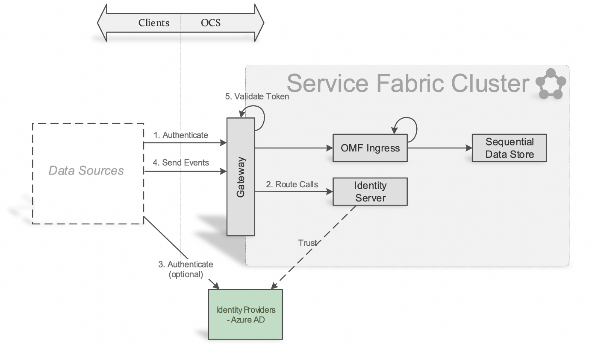
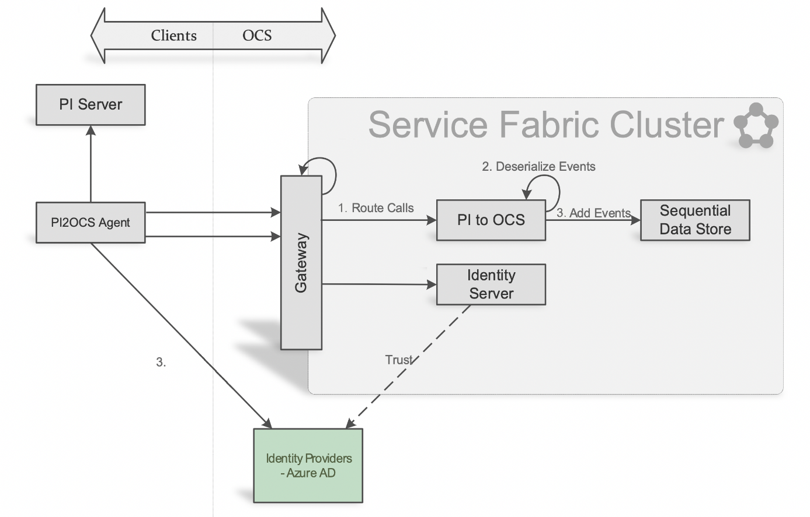
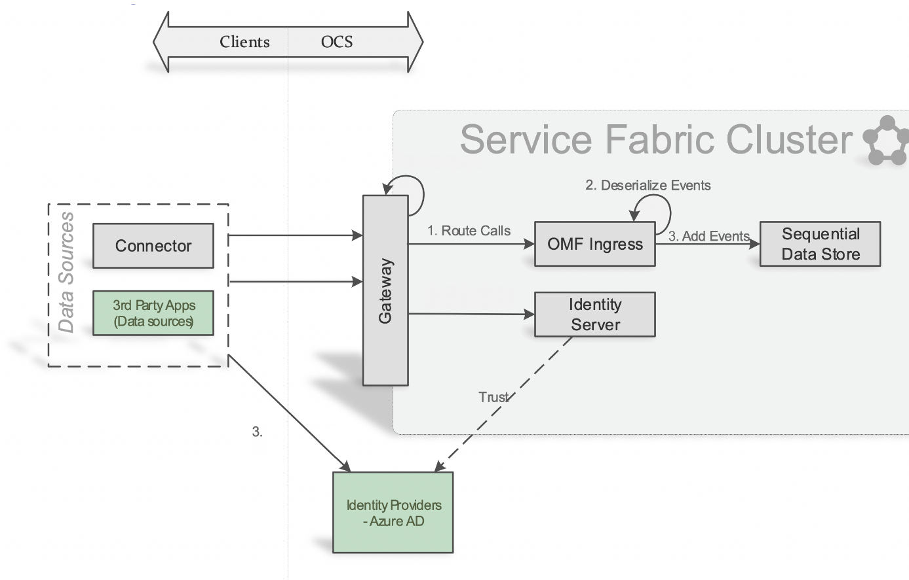
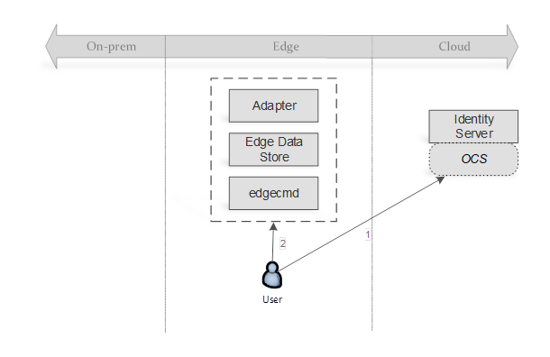
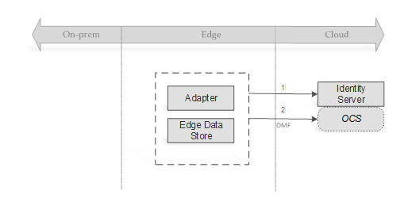
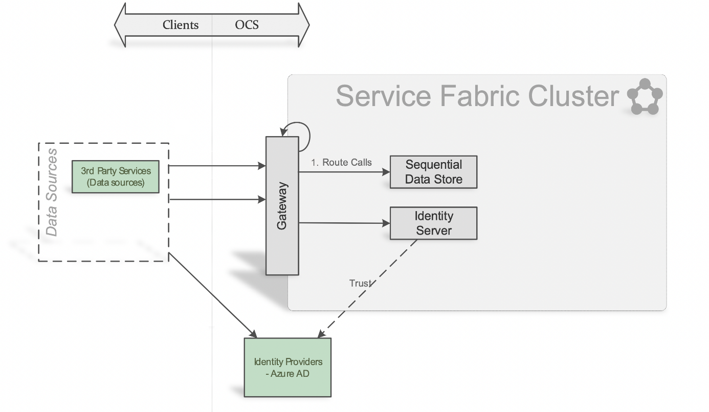
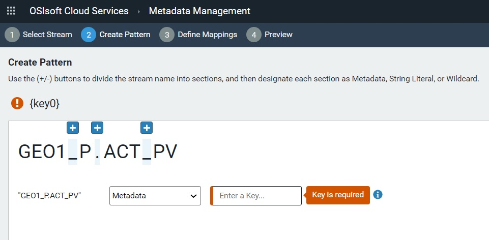
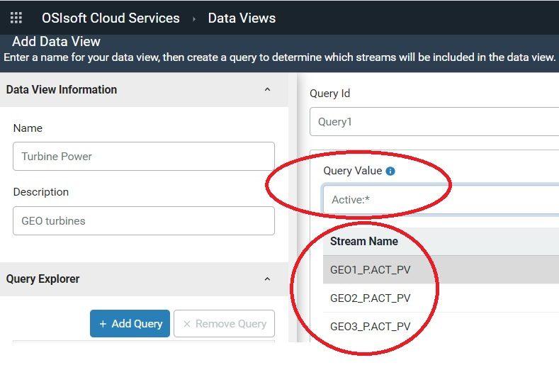

# What does OSIsoft Cloud Services do? 

OSIsoft Cloud Services (OCS) consists of several different areas of core functionality:

* [Tenant management](#tenant-management) - Explains basic concepts in managing OCS, including clients, roles and metadata and discusses how administrators can customize OCS based on organizational requirements 
* [Data collection](#data-collection) - Summarizes techniques to collect and feed data from multiple sources across your organization into a namespace within OCS 
* [Data organization](#data-organization) - Provides a high-level description of how OCS stores and retrieves operational data 
* [Data analysis](#data-analysis) - Highlights some of the capabilities of using OCS for data analysis, which enables informed planning, predictive maintenance, and operational optimization

The flow of this document is modeled after the steps that you take to configure OCS to collect data from various sources and organize it for analysis within the platform or third-party BI tools.

## Tenant management    

OCS provides many configuration and control options that allow administrators to customize interactions with the platform based on organizational requirements. Administrators can create users and clients, define and assign roles, and manage namespaces for their tenant. They can control access to data and resources ensuring that only authorized entities can gain access to resources (such as, data collection, namespaces, streams, analytics, visualization, and metadata).

Using access control lists (ACLs), administrators can also limit permissions to a resource. Generally, only administrators should have access to tenant management features. Administrators can perform tenant management and configuration using a REST API or the OCS portal, a web-based user-interface for managing and monitoring tenant resources.

### Tenant 

A tenant represents a set of services, applications, data, and available configuration states. You can authenticate users for a tenant by using one or more identity providers. You can manage user access to resources by assigning roles. Data and services provided by a tenant can span geographical regions. 

### Namespace 

A namespace is a logical unit of organization for data within a tenant. Before any data can be collected in OCS, you must create a namespace for that tenant. Each tenant can contain more than one namespace. Namespaces help you create separate instances of your data and resources in OCS so one tenant does not affect other tenants. In practice, namespaces may correspond to a specific set of infrastructure assets, but commonly they correspond to virtual partitions within a single set of assets dedicated to a specific tenant.

### Identity 

The concept of identity is the key to how OCS limits and protects services and resources available to an entity. An entity’s identity allows OCS to know how much access to grant to that entity. OCS identity services provide the following functions: 

* Protect data resources 
* Authenticate users using a local account store or through an external identity provider 
* Provide session management and single sign-on 
* Manage and authenticate client applications 
* Issue identity and access tokens to client applications and users 
* Validate access tokens 

### User 

A user is an individual identity that represents a person using OCS. When users log in to OCS, they authenticate through an identity provider such as Google or Azure Active Directory. The identity provider authenticates the user against credentials stored in its database. After successful authentication, the identity provider passes a token back to OCS granting the user access for a specific time period. 

### Clients 

Clients are applications and PI Adapters that act on behalf of users and have programmatic access by using OCS APIs. OCS supports the following client types: 

* **Authorization code clients** – Used by web-based, mobile, and desktop applications, this client type requires user interaction. Users authenticate with an identity provider. Authorization code clients support silent refresh, which allows the user to automatically receive a new access token, providing for uninterrupted access to the application. 
* **Client credential clients** – Used for server-to-server communication without the presence or intervention of a user. Examples include PI Adapters or the Edge Data Store sending data to OCS. This type of client is issued a client ID and secret. After authentication, the client is granted an access token with a defined lifetime. 
* **Hybrid clients** – Used by thick client applications, this type of client requires user interaction. The user authenticates with an identity provider. After the user authenticates, the server-side client steps in and server-to-server communication commences. 

### Roles 

A role is a representation of a user’s job function that determines whether the user can have access to resources needed to accomplish a job. You can assign multiple roles to a user or client-credential client. The user or client’s role, in combination with the access control list (ACL) for a resource or service, determines access permissions to that resource or service. The tenant Administrator creates roles and assigns users and clients to those roles. 

For both users and clients, roles authorize API requests for access, such as access to data streams. All clients have the Access Member role, which provides read access to resources. 

### Identity provider 

Identity providers manage databases of user records and authenticate users against the credentials in their databases. This allows users to be granted access to the service provider using the credentials the identity provider manages, but without sharing actual login details.  

### Authentication 

Authentication is the process of verifying the identity of a user or client and confirming that the requestor is an approved entity for OCS. This verification process is performed by the identity provider. After successful authentication, the identity provider passes an access token back to OCS granting the user or client access for a specific time period. 
Authentication consists of the following steps: 

1.	A requestor makes a request to access an OCS resource. 
2.	OCS does not recognize the requestor and routes the request to a gateway. 
3.	The gateway routes the authentication call to an identity service. 
4.	The identity service asks the user which account/credentials should be used to connect. This determines which identity provider should be used for authentication. 
5.	The identity service sends an authentication request to a third-party identity provider along with the user credentials. 
6.	The identity provider verifies the user credentials with its corresponding database. 
7.	After successful verification, the identity provider passes an access token for the user back to the identity service. This access token grants the user a limited period of access. 

### Authorization 

Authorization is the process of determining the appropriate access level for a user or client for each OCS resource and service. Two factors determine the level of access: the role that the user or client is assigned at authentication and the corresponding access control list that grants a level of access to a role for each resource and service. 
Authorization consists of the following steps: 

1.	The requestor sends a request to an OCS resource. 
2.	A gateway service examines the access token of the requestor to validate the token. 
3.	The gateway service routes the request to the appropriate OCS resource. 
4.	The resource examines the user’s assigned role and correlates the role against its access control list. The ACL defines an access level to the resource for each role. 
5.	The resource grants that level of access to the user. 

### Access control list 

Each OCS service and resource has an access control list (ACL) that defines how much access is granted to assigned roles. The OCS Administrator configures each ACL. When a request is made to a specific OCS resource, the role assigned to the requestor (whether a user or client) is compared to the ACL for that resource to determine whether the request should be authorized. 

### Group 

A group is a logical collection of identities for which access rights can be managed as a whole.

## Data Collection

After defining tenants, setting permissions and access levels for users, and creating clients for programmatic access, you can begin to configure OCS for data collection. Data collection allows you to bring data from multiple sources and systems scattered across your organization into a namespace within OCS.

Tenants may contain data across multiple geographic locations; however, in order to remain compliant with local laws and regulation, a namespace can contain or collect data for a specific region only. 

### Collection methods 

The type of data, the location of that data, and the way that a particular source sends data all affect how you can collect that data in OCS. You can choose the data collection technology that best meets your specific needs. These technologies include: 

#### PI to OCS 

The PI to OCS collection method transfers PI time series data from a local PI Server to OCS. PI to OCS is installed and configured directly on your on-premises PI Server. PI to OCS creates pre-defined types and streams that are mapped from PI Data Archive data shapes. 
In the diagram below, PI to OCS collects data after authorization with the following steps: 
1.	Gateway passes request to proper partition of PI to OCS based on tenant ID in the token. Roles associated with the client are included in the request header.
2.	PI to OCS deserializes events from the payload, which may contain events for multiple streams. 
3.	For each stream, PI to OCS passes the events to the Sequential Date Store (SDS) in OCS. 

#### Custom OMF applications

OSIsoft Message Format (OMF) is a platform-independent format for passing JSON messages to OCS using an HTTP client. 
For programmatic access to data, you can use OMF to develop data acquisition applications on platforms and in languages for which there is no native support. This allows you to integrate data collection directly into a device or asset. 
OMF topics aggregate OMF messages received from one or more clients and make them available for consumption by a subscription. An OMF subscription consumes OMF messages from a topic and forwards them to a data store. Multiple subscriptions can retrieve OMF messages from a single topic. Together, these two components make up an OMF connection, which allows collection from a client into an OCS namespace. 

OMF itself does not define or depend on any binary message protocol, such as HTTP, AMQP, or Kafka. Instead, it is based on an abstract message type, where a message consists of a set of key/value pairs and a binary payload, which may consist of a set of binary files, configuration files, and batch or Shell scripts. You can construct OMF messages using any message protocol that defines headers and bodies. 
In the diagram below, OMF sends data to OCS after authorization with the following steps: 

1.	A gateway passes the request to the proper partition of OMF collection based on a tenant ID in the token. Roles associated with the client are included in the request header. 
2.	OMF collection serializes events from the payload, which may contain events for multiple streams. 
3.	For each stream, OMF sends the events to the Sequential Date Store. 

Refer to [OMF Message Format](https://omf-docs.osisoft.com/) for additional information about the OMF specification. 

#### Edge Data Store (EDS)

The Edge Data Store (EDS) is a software component similar to a PI Adapter. It enables you to store data from a device locally and make the data available for local querying. This is useful for displaying trending on an edge device.
 OCS can collect data from EDS via the OSIsoft Message Format (OMF). Edge Data Store currently includes two built-in protocol adapter components, Modbus and OPC UA, and a storage component that also collects and sends OMF. Multiple data sources, referred to as adapter component instances, are supported in protocol components. See the Custom OMF Applications section above for additional information about data collection from EDS. 
The diagram below demonstrates the process for configuring data egress from EDS to OCS: 

1.	Configure OCS collection 
   1.	Register client. 
2.	[OCS] Tenant identity management (profile/users/roles/client) 
   1.	[OCS] Collection management (topics/subscriptions) 
3.	Configure client egress: destination location, client credentials, prefix, and rate via on box REST or *edgecmd* tool 

#### PI Adapters 

PI Adapters are software components that collect sequential data from edge data sources and send it to OCS or PI Server or both. Use PI Adapters for collecting data from standard systems and protocols. 
In the diagram below, the PI Adapters egress data to OCS using the following steps: 

1.	Get access token with configured client ID and secret 
2.	Call OMF endpoint using token 
3.	OCS Data collection via OMF 

#### Programmatic REST API 

The OCS programmatic REST API reads and writes data. It supports JSON files and platform independence with platform-independent data and retrieval. 
In the diagram below, OCS collects data from the REST API after authorization with the following steps: 

1.	A gateway passes the request to the Sequential Data Store. 

## Data organization 

After setting up data collection, you can use the Sequential Data Store (SDS) to store, retrieve, and analyze any type of streaming data. Typically, developers use the SDS to create customized applications. 

To organize and use the data in the SDS, you need to understand the basic features of the system: 

* [Types](#types) 
* [Streams](#streams) 
* [Stream views](#stream-views) 

### Types 

A type, also called an SDS type, defines the structure of data to be collected in OCS. A type is analogous to a template that defines each instance in a stream of data. 

For example, if you want to collect three measurements streamed from a device (longitude, latitude, and speed) and you want to collect those measurements over a period of time, you can define a type to include properties for longitude, latitude, speed and a timestamp. Collectively, these properties define the structure of the data you are storing. While this is a simple example, OCS lets you create much more complex types. 

A type can consist of many properties, but one property must function as the primary index. Time is frequently used as the primary index, effectively time-stamping all corresponding properties in each data instance. However, the primary key is not limited to time stamps; it can be any sequential data, such depth or movement. You can also designate other properties as secondary indexes. 

After you create a type, you cannot change it. If you want to change a type, you must delete the existing type and create a new one. However, you can only delete a type if no other streams, views, or other types reference it. 

OCS provides a simple user interface for creating types. Alternatively, you can create types using programming tools provided by OSIsoft. For an automated programmatic approach, OSIsoft offers .NET client libraries available in NuGet packages. For a manual approach, OSIsoft provides code samples in different programming languages, including Python, Java, and JavaScript. The JSON file format is used to specify the properties and related information in each type. 

### Streams 

A stream, also called an SDS stream, is a series of ordered events. Each event is an instance of a type. Collectively, the stream of data forms the structure that the type specifies. 

Streams organize data brought from another system into OCS. To define a stream, you must first define a type, which specifies the structure of the data you want to stream into an OCS namespace. Every stream has a unique identifier. You can have many streams based on the same type, but each stream must have its own unique identifier. 

There are two sources of data for streams: 

* Data already stored for a type - In OCS, information for a stream is stored together in an ordered sequence so it is extremely fast to store new values or retrieve existing data from the sequence. 
* Data sent to OCS - The type associated with a stream defines the structure of data being sent to OCS. 

There are multiple techniques for sending data to OCS. See [Data Collection](#data-collection). 

Each stream is associated with a namespace. You can associate one or more streams with the same namespace. However, to move data between namespaces, you must read data out from one namespace and read it back into another namespace. 
You can categorize streams using metadata, which is a dictionary of key value pairs used to store additional information. Metadata is not real-time information, and it is not updated at high frequency. Typically, metadata is static information that provides context for a stream. 

You can also use tags to assign information to a stream. A tag is a string value. For example, a tag might identify a region. 
REST APIs give you the ability to read and write streams data programmatically. In addition, if you are using the .NET framework, OSIsoft offers client libraries to help you create and use streams.

### Stream views 

Because types cannot be modified, OCS provides a flexible mechanism for viewing data in a stream view. A stream view is a logical overlay for stream data. 

For example, a process engineer and a maintenance technician, might want to see different data from the same stream. Because you cannot change the data sent to a stream, a stream view allows you to see a subset of the data in a stream. In this way the process engineer can see one subset of data in one stream view while the maintenance technician can see a different subset in a second stream view. 

Stream views can perform additional functions, such as to implement data conversions and change names so the terminology that is displayed is more appropriate for a particular persona. 

To create a stream view, you create a target type that defines the properties to be made available. Then you map the properties in one or more source types to the target type. The source types and the target type must be in the same namespace, and they must exist before you define the stream view. When mapping between source and target properties, both properties must be of the same data type. 

OCS provides a graphical interface for setting up stream views or you can use REST APIs to define stream views programmatically. If you are using the .NET framework, OSIsoft also offers client libraries to help you create and use stream views. 

## Data analysis 

OCS provides data analysis capabilities that allow you to group and arrange operational PI, IoT, and OCS data to detect unrealized patterns and insights. OCS analysis tools are a central element in OSIsoft data science enablement efforts, allowing better informed planning, predictive maintenance, and operational optimization. These tools help you capture and order data that can be consumed by third party data science applications for deep analysis. 

### Analysis methods 

Three analytical methods are available in OCS, each of which works dynamically, continuing to filter and order data after they are in place. These methods include the following: 

* [Metadata rules ](#metadata-rules)
  Metadata rules simplify the task of collecting and retrieving data streams. 
* [Data views ](#data-views)
  Data views facilitate the ordering, indexing, and organization of data from multiple streams. 
* [Visualization ](#visualization)
  Visualization converts data from one or more streams into graphical representations of data values collected over a custom-defined time period. 

#### Metadata rules 

Metadata rules provide meaningful contextual information to stream data.  A metadata rule defines the patterns in the stream name. Therefore, stream names that follow a standard naming pattern, including items such as location, asset class, and asset ID, allow users to create rules based on this naming pattern. The application of the metadata to streams makes it easier for users to understand the data contained in the stream. 

The following diagram shows metadata in the context of several different but similar data streams: 

The diagram above shows three data streams for turbines named GEO1 and GEO2. 
1.	The color-coded data streams show the specific data each stream is tracking, detailed in the Stream Metadata column. 
2.	The basic description of the stream data is encoded in the stream name. For example, looking at the first stream in the table, the metadata rule takes what might have been meaningless to a user, *GEO1_P.ACT_PV*, and translates this.  The user sees that GEO1 is the name of the turbine and ACT_PV  or Active Power is the measurement in this stream.  
3.	A metadata rule based on this stream naming pattern can capture active power values for all turbines in each wind farm. 

The OCS portal provides a wizard to create metadata rules. Users select a stream as the template for creating a metadata rule and define the criteria by which the metadata rule determines matching streams.

In the screen capture above, the wizard displays the stream name selected by the user, and it identifies each delimiter with a + sign. 

Each part of the stream name is assigned a metadata type. The screen capture above shows the different metadata types (wildcard, metadata, and string literal) that can be assigned to each delimited part of a stream name. 

* In this example, all data is coming from wind turbines on a wind farm. The user knows that the first part of the stream name (GEO1 in the selected stream above) identifies the wind turbine. This rule uses a wildcard to capture streams for all turbines.

* The second part of the stream name (P.ACT in the selected stream above) has been assigned a metadata type of metadata. Metadata is defined as key-value pairs. For example, P.ACT is the key for Active Power. The user defines all key-value pairs for this part of the stream name. 

  **Note**: Stream name parts designated as metadata are defined as key-value pairs. Each value occupying a part designated as metadata is categorized under a key defined for it. This typically takes the form of values recorded at different timestamp intervals for a particular object or device, or key. The key-value data structure facilitates analytical processing of stream data returned by a metadata rule. 

* PV is defined as a string literal. In this example, it refers to the Pine Valley Wind Farm. 

* As defined, this metadata rule captures streams for all turbines for Active Power in the Pine Valley Wind Farm.

In addition to being applied to any existing streams, a metadata rule captures any matching streams that are subsequently added to the selected namespace. You can edit a metadata rule. The modified rule may then capture a different set of streams.

#### Data views 

Data views are subsets of data from one or more streams. Data scientists typically query large datasets, and need to index, sort, and organize data into a consumable format for data science applications. In data views, data items can be ordered. Time indices, data presentation format, and fields used to group the included data are also configurable.

Data views serve as a bridge between raw OCS data and data science applications. Users use an API to programmatically access normalized, aligned, and interpolated data in data views for the purpose of doing advanced analytics. Data views mesh neatly with OSIsoft’s larger data science enablement efforts. 

The diagram above depicts multiple streams captured by a metadata rule and organized into a data view that a third-party data science application can consume: 
1.	Data streams from three wind turbines are captured by a metadata rule. 
2.	A user creates a data view in OCS based on the streams captured by the rule, selects specific data elements from the streams, and orders and indexes them as needed. 
3.	Ordered and normalized data is then consumable by data science applications for in-depth analysis. 

The OCS portal provides a wizard to facilitate creating data views. You create a query in the form of a stream name pattern. The query is typically part of a stream name followed by the wildcard asterisk character (*). You can also reference a metadata rule by entering a metadata key from the rule in the query criteria. By doing so, the data view includes all the streams captured by the referenced metadata rule. 

You can specify the time range for the data and the time intervals in which data values are displayed. You can configure which data fields from the streams to include, the order in which data fields appear, and the data field by which other fields are grouped. 

Data views allow you to arrange data fields in a way that they can be consumed by a third-party data science application. You can specify the time intervals for display and analysis. 

#### Visualization

Visualization enables you to select one or more data streams in a selected namespace, specify a preset or custom time range, and then render a graphical depiction of those data values. 

The example above shows stream data for two streams over a selected period of several days. 

The ability to observe stream data graphically can unlock trends, high points, or trouble spots. Combined with metadata rules and data views, visualization rounds out a powerful set of OCS analytical tools. 
