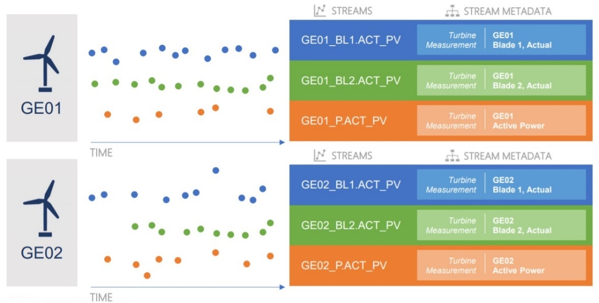
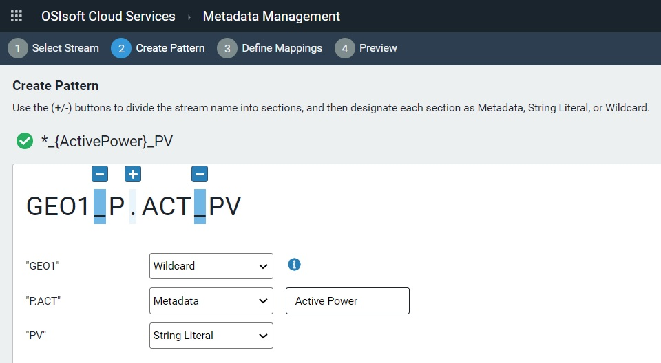

# What does OSIsoft Cloud Services do? 

OSIsoft Cloud Services (OCS) provides edge-to-cloud data visibility for industrial operations. 

The following sections introduce core areas of OCS functionality: 

- Tenant management - Explains basic concepts and terminology and discusses how administrators can customize OCS based on organizational requirements 

- Data collection - Summarizes the techniques you can use to collect and feed data from multiple sources across your organization into a namespace within OCS 
- Data organization - Provides a high-level description of how OCS stores and retrieves operational data 
- Data analysis - Highlights some of the capabilities of using OCS for data analysis, which enables informed planning, predictive maintenance, and operational optimization 

## Tenant management    

OCS provides many configuration and control options that allow administrators to customize interactions with the platform based on your organizational requirements. Administrators can create users and clients, define and assign roles, and manage namespaces for their tenant. They can control access to data and resources (that is, data collection, namespaces, streams, analytics, visualization, metadata, orchestration for onboarding, and so forth), ensuring that only authorized entities can gain access. Using access control lists (ACLs), administrators can also limit permissions to a resource. Administrators can perform tenant management and configuration using a REST API as well as the OCS portal, a web-based user-interface for managing and monitoring tenant resources. Generally, only administrators should have access to tenant management features. 

### Tenant 

A tenant represents a set of services, applications, data, and configuration states available to a customer. You can associate users with a tenant by means of one or more identity providers. You can manage user access to resources by assigning roles to users. Customers can have more than one tenant, and customers are billed based on their usage of a tenant’s resources. Data and services provided by a tenant can span geographical regions.  

### Namespace 

A namespace is a logical unit of organization for data within a tenant. Before any data can be collected in OCS for a given tenant, you must create a namespace for that tenant. Each tenant can contain more than one namespace. In practice, namespaces may correspond to a specific set of infrastructure assets, but more commonly they correspond to virtual partitions within a single set of assets dedicated to a specific tenant. Namespaces help you create separate instances of your data and resources in OCS so one tenant does not affect other tenants. 

### Identity 

The concept of identity is the key to how OCS limits and protects services and resources for an entity. Knowing an entity’s identity allows OCS to make decisions about how much access should be granted to that entity. OCS identity services provide the following functions: 

- Protect data resources 
- Authenticate users using a local account store or via an external identity provider 
- Provide session management and single sign-on 
- Manage and authenticate client applications 
- Issue identity and access tokens to client applications and users 
- Validate access tokens 

### User 

A user is an individual identity that represents a person using OCS. An identity provider associated with a tenant authenticates users. When users log in to OCS, they authenticate via an identity provider such as Google or Azure Active Directory. The identity provider authenticates the user against credentials stored in its database. After successful authentication, the identity provider passes a token back to OCS granting the user access for a specific time period. 

### Clients 

Clients are applications and adapters that act on behalf of users and allow programmatic access to OCS APIs. OCS supports the following client types: 

- Client credential clients – Used for server-to-server communication without the presence or intervention of a user. Examples include PI Adapters or the Edge Data Store sending data to OCS. This type of client is issued a client ID and secret. After authentication, the client is granted an access token with a defined lifetime. The tokens may either be short-lived or longer-lived refresh tokens that allow the client to request new access tokens. 
- Authorization code clients – Used by web-based applications, native mobile applications, and desktop applications that access OCS, this client type requires user interaction. Users authenticate with an identity provider. Authorization code clients support silent refresh, which allows the user to automatically receive a new access token, providing for uninterrupted access to the application. 
- Hybrid clients – Used by thick client applications, this type of client requires user interaction. The user authenticates with an identity provider. After the user authenticates, the server-side client steps in and server-to-server communication commences. Refresh tokens and access tokens are granted to the server-side client, requiring no further user interaction. 

### Roles 

A role is a representation of a user’s job or function within the organization that determines whether the user should have access to resources needed to accomplish a job. You can assign multiple roles to a user or client-credential client. The role assigned to a user or client, in combination with the ACL for a resource or service, determines access permissions to that resource or service. The Account Administrator creates roles and assigns users and clients to those roles. 

For both users and clients, roles authorize API requests for access, such as access to data streams. All clients have the Access Member role, which gives read access to resources. 

### Identity provider 

Identity providers manage databases of user records for authentication purposes. Identity providers offer authentication services to client organizations by authenticating a user, allowing that user to be granted access to the service provider using the credentials the identity provider manages but without sharing actual login details. The identity provider authenticates the user against the credentials in its database. 

### Authentication 

Authentication is the process of verifying the identity of a user or client and confirming that the requestor is an approved entity for OCS. This verification process is performed by the identity provider. After successful authentication, the identity provider passes an access token back to OCS granting the user or client access for a specific time period. 

Authentication consists of the following steps: 

1. A requestor makes a request to access an OCS resource. 
2. OCS does not recognize the requestor and routes the request to a gateway. 
3. The gateway routes the authentication call to an identity service. 
4. The identity service asks the user which account/credentials should be used to connect. This determines which identity provider should be used for authentication. 
5. The identity service sends an authentication request to a third-party identity provider along with the user credentials. 
6. The identity provider verifies the user credentials with its corresponding database. 
7. After successful verification, the identity provider passes an access token for the user back to the identity service. This access token grants the user a limited period of access. 

### Authorization 

Authorization is the process of determining the appropriate access level for a user or client for each OCS resource and service. Two factors determine the level of access: the role that the user or client is assigned at authentication and the corresponding access control list that grants a level of access to a role for each resource and service. 

Authorization consists of the following steps: 

1. The requestor sends a request to an OCS resource. 
2. A gateway service examines the access token of the requestor to validate the token. 
3. The gateway service routes the request to the appropriate OCS resource. 
4. The resource examines the user’s assigned role and correlates the role against its access control list. The ACL defines an access level to the resource for each role. 
5. The resource grants that level of access to the user. 

### Access control list 

Each OCS service and resource has an ACL that defines how much access is granted to assigned roles. The OCS Administrator configures this list. When a request is made to a specific OCS resource, the role assigned to the requestor (whether a user or client) is compared to the ACL for that resource to determine whether the request should be authorized based on the role’s access permissions. 

### Group 

A group is a logical collection of identities for which access rights can be managed as a whole.

## Data Collection

After defining tenants, setting permissions and access levels for users, and creating clients for programmatic access, you can begin to configure OCS for data collection. 

Data collection allows you to bring data from multiple sources and systems scattered across your organization into a namespace within OCS. Each tenant can contain more than one namespace, but before you can put any data can into OCS for a given tenant, you must first create a namespace within the scope of that tenant. 

Tenants may contain data across multiple geographic locations; however, in order to remain compliant with local laws and regulation, a namespace can only contain or collect data for a specific region. 

### Collection methods 

The type of data, the location of that data, and the way that a particular source sends data all affect how you can collect that data in OCS. You can choose the data collection technology that best meets your specific needs. These technologies include: 

#### PI to OCS 

The PI to OCS collection method allows you to transfer PI time series data from a local PI System to OCS. PI To OCS is installed and configured directly on your on-premises PI System. Additionally, PI to OCS creates pre-defined types and streams that are mapped from PI Data Archive data shapes. 

In the diagram below, PI to OCS collects data after authorization via the following steps: 

1. the token. Roles associated with the client are included in the request header. 
2. PI to OCS deserializes events from the payload, which may contain events for multiple streams. 
3. For each stream, PI to OCS passes the events to the Sequential Date Store (SDS) in OCS. 

#### Custom OMF applications

OSIsoft Message Format (OMF) is a platform-independent format for passing JSON messages to OCS using an HTTP client. You can use OMF to develop data acquisition applications on platforms and in languages for which there is no native support. This allows you to achieve high-throughput asynchronous data collection into the Sequential Data Store and integrate data collection directly into a device or asset. 

OMF topics aggregate OMF messages received from one or more clients and make them available for consumption by a subscription. An OMF subscription consumes OMF messages from a topic and forwards them to a data store. Multiple subscriptions can retrieve OMF messages from a single topic. Together, these two components make up an OMF connection, which allows collection from a client into an OCS namespace. 

OMF itself does not define or depend on any binary message protocol, such as HTTP, AMQP, or Kafka. Instead, it is based on an abstract message type, where a message consists of a set of key/value pairs and a binary payload. You can construct OMF messages using any message protocol that defines headers and bodies.  

In the diagram below, OMF sends data to OCS after authorization via the following steps: 

1. A gateway passes the request to the proper partition of OMF collection based on a tenant ID in the token. Roles associated with the client are included in the request header. 
2. OMF collection serializes events from the payload, which may contain events for multiple streams. 
3. For each stream, OMF sends the events to the Sequential Date Store. 

Refer to [OMF Message Format](https://omf-docs.osisoft.com/) for additional information about the OMF specification. 

#### Edge Data Store (EDS)

The Edge Data Store (EDS) is a software component similar to a PI Adapter. It provides you with the ability to store data from a device locally and make the data available for local querying. This is useful for displaying trending on an edge device. OCS can collect data from EDS via the OSIsoft Message Format (OMF). Edge Data Store currently includes two built-in protocol adapter components, Modbus and OPC UA, as well as a storage component that also collects and sends OMF. Multiple data sources, referred to as adapter component instances, are supported in protocol components. See the Custom OMF Applications section above for additional information about data collection from EDS. 

The diagram below demonstrates the process for configuring data egress from EDS to OCS: 

1. Configure OCS collection 
   1. Register client. 
2. [OCS] Tenant identity management (profile/users/roles/client) 
   1. [OCS] Collection management (topics/subscriptions) 
3. Configure client egress: destination location, client credentials, prefix, and rate via on box REST or *edgecmd* tool 

#### PI Adapters 

PI Adapters are software components that collect sequential data from edge data sources and send it to OCS or PI Server or both. Use PI Adapters for collecting data from standard systems and protocols. 

In the diagram below, the PI Adapters egress data to OCS using the following steps: 

1. Get access token with configured client ID and secret 
2. Call OMF endpoint using token 
3. OCS Data collection via OMF 

#### Programmatic REST API 

The OCS programmatic REST API reads and writes data. It supports JSON files and platform independence with platform-independent data and retrieval. 

In the diagram below, OCS collects data from the REST API after authorization via the following steps: 

1. A gateway passes the request to the Sequential Data Store. 

## Data organization 

After setting up data collection, you can use the Sequential Data Store (SDS) to store, retrieve, and analyze any type of streaming data that is indexed by time or some other sequential measurement. Typically, developers use the SDS to create customized applications based on streaming data. 

To organize the data in the SDS and make it useful, you must understand the basic features of the system: 

- Types 
- Streams 
- Stream views 

### Types 

A type, also called an SDS type, is a logical entity that defines the structure of data to be collected in OCS. A type is analogous to a template that defines each instance in a stream of data. 

For example, if you want to collect three measurements streamed from a device (longitude, latitude, and speed) and you want to collect those measurements over a period, you can define a type to include properties for longitude, latitude, and speed and another property to serve as a timestamp. Collectively, these properties define the structure of the data you are storing. While this is a simple example, OCS lets you create much more complex types. 

A type can consist of many properties, but one property must function as the primary index. For example, time is frequently used as a primary index, effectively time-stamping all corresponding properties in each data instance. However, the primary key is not limited to time stamps; it can be any sort of sequential data, such as consecutive readings for depth or movement. You can also designate other properties as secondary indexes. 

After you create a type, it is immutable. If you want to change a type, you must delete the existing type and create a new one. However, you can only delete a type if no other streams, views, or other types reference it. 

OCS provides a simple user interface for creating types. Alternatively, you can create types using programming tools provided by OSIsoft. For a more automated programmatic approach, OSIsoft offers .NET client libraries available in NuGet packages. For a more manual approach, OSIsoft provides code samples in different programming languages, including Python, Java, and JavaScript. The JSON file format is used to specify the properties and related information in each type. 

### Streams 

A stream, also called an SDS stream, is a series of ordered events. Each event is an instance of a type. Collectively, the stream of data forms the structure that the type specifies. The values for each event are indexed by a single property, typically time series data. 

Streams organize data brought from another system into OCS. To define a stream, you must first define a type, which specifies the structure of the data you want to stream into an OCS namespace. Every stream has a unique identifier. You can have many streams based on the same type, but each stream must have its own unique identifier. 

There are two sources of data for streams: 

- Data already stored for a data type - In OCS, information for a stream is stored together in an ordered sequence so it is very fast to store new values or retrieve existing data from the sequence. 
- Data is sent into OCS - The type associated with a stream defines the structure of data being sent to OCS. 

There are multiple techniques for sending data to OCS. See <<link to Data Collection>>. 

Each stream is associated with a namespace. You can associate one or more streams with the same namespace. However, to move data between namespaces, you must read data out from one namespace and read it back into another namespace. 

You can categorize streams using metadata, which is a dictionary of key value pairs used to store additional information. Metadata is not real time information, and it is not updated at high frequency. Typically, metadata is static information that provides context for a stream. 

You can also use tags to assign information to a stream. A tag is a string value. For example, a tag might identify something like a region. 

REST APIs give you the programmatic ability to read and write streams. In addition, if you are using the .NET framework, OSIsoft offers client libraries to help you create and use streams. Alternatively, OCS provides a simple user interface for creating streams. 

### Stream views 

Because types are immutable, OCS provides a flexible mechanism for viewing data in a stream view. A stream view is a logical overlay for stream data. 

For example, two personas, such as a process engineer and a maintenance technician, might want to see different data from the same stream. Because you cannot change the data sent into a stream, a stream view allows you to see only a subset of the data in a stream. In this way the process engineer can see one subset of data in one stream view while the maintenance technician can see a different subset in a second stream view. 

Stream views can perform additional functions to improve the viewer experience. They can implement data conversions. Stream views can also change names so the terminology that is displayed is more appropriate for a particular persona. 

To create a stream view, you create a target type that defines the properties to be made available from a stream view. Then you map the properties in one or more source types to the target type. The source types and the target type must exist in the same namespace, and they must be created before defining the stream view. When mapping between source and target properties, both properties must be of the same data type. 

OCS provides a graphical interface for setting up stream views. In addition, REST APIs give you the programmatic ability to define stream views. If you are using the .NET framework, OSIsoft also offers client libraries to help you create and use stream views. 

## Data analysis 

OCS provides data analysis capabilities that allow you to group and arrange operational PI, IoT, and OCS data to detect unrealized patterns and insights. OCS analysis tools are a central element in OSIsoft data science enablement efforts, enabling better informed planning, predictive maintenance, and operational optimization. These tools help users capture and order data that can be consumed by third party data science applications for deep analysis. 

### Analysis methods 

Three analytical methods are available in OCS, each of which works dynamically, continuing to filter and order data after they are in place. These methods include the following: 

- **Metadata rules** 
  Metadata rules greatly simplify the task of collecting and retrieving data streams based on user defined criteria. 
- **Data views** 
  Data views facilitate the ordering, indexing, and organization of data from multiple streams. 
- **Visualization** 
  Visualization converts data from one or more streams into graphical representations of data values collected over a custom-defined time period. 

#### Metadata rules 

A metadata rule is a user-defined pattern based on a selected stream name. By assigning a metadata type to each part of the stream name, you create a metadata rule that captures any streams matching the defined name pattern in each namespace. In the OCS portal, metadata rules simplify the process of assigning metadata to streams. The interface guides you through the process of designating metadata types for a stream name pattern. 

The following diagram contains an example of metadata in the context of several different but similar data streams: 

The diagram above shows three data streams for turbines named GEO1 and GEO2. 

1. The color-coded data streams show the specific data each stream is tracking, detailed in the Stream Metadata column on the right side of the diagram. 
2. A closer look reveals that the basic description of each stream’s data is encoded in the stream naming pattern. 
3. A metadata rule based on this stream naming pattern can capture active power values for all turbines in each wind farm. 

##### Example

The Metadata Management section of the OCS portal provides a wizard to create metadata rules. Users select a stream as the basis of a metadata rule, and they can then capture streams matching the stream name pattern they define. Stream names that follow a standard pattern, including items such as location, asset class, and asset ID, are more applicable to the creation and use of metadata rules. 

In the example above, the wizard displays the stream name selected as the basis for the rule, with each delimited part denoted by a + sign.

The example above shows metadata type selections that can be assigned to each delimited part of a stream name. 

- Users define the criteria by which the metadata rule determines matching streams. 

- The rule in this example captures streams for all turbines (the wildcard) for Active Power (a metadata value) in PV, that is, in the Pine Valley Wind Farm (a string literal). 

  **Note:** Stream name parts designated as metadata are defined as key-value pairs. Each value occupying a part designated as metadata is categorized under a key defined for it. This typically takes the form of values recorded at different timestamp intervals for a particular object or device, or key. The key-value data structure facilitates analytical processing of stream data returned by a metadata rule. 

- A metadata rule also captures any matching streams that are subsequently added to the selected namespace. You can use a metadata rule to select multiple streams from which you can create a data view. When you edit a metadata rule, the modified rule may capture a different set of streams. 

#### Data views 

Data views are user-selected subsets of data from one or more streams. You can order data items within a data view as needed. Time indices, data presentation format, and fields used to group the included data are also configurable. Data scientists typically query large datasets, and they need to be able to index, sort, and organize data into a consumable format for data science applications. 

Data views can serve as a bridge between raw OCS data and data science applications, enabling users to programmatically access normalized, aligned, and interpolated data via an API for the purposes of advanced analytics. Data views mesh directly with OSIsoft's larger Data Science Enablement efforts. 

The diagram above depicts multiple streams captured by a metadata rule and organized into a data view that a third-party data science application can consume: 

1. Data streams from three wind turbines are captured by a metadata rule. 
2. A user can create a data view in OCS based on the streams captured by the rule, select specific data elements from the streams, and order and index them as needed. 
3. Ordered and normalized data is then consumable by data science applications for deep analysis. 

##### Example

The Data Views section of the OCS portal provides a wizard to create data views. Users begin by creating a query, which is essentially a stream name pattern matched by multiple streams. The query is typically a portion of a stream name followed by *, or wild card. Users can also reference an existing metadata rule by entering a metadata key from the rule for their query criteria and thus base the data view on all the streams captured by the referenced metadata rule. 

The Configure Data View page lets you specify starting and ending time indices and the time interval by which data values should be displayed. You can configure which data fields from the streams should be excluded or included in the data view, the order in which data fields should appear, and the data field by which other fields should be grouped. 

Data views allow you to arrange data fields as needed so they can be consumed by a third-party data science application. You can specify any time interval for both display and analysis. 

#### Visualization

Visualization enables you to select one or more data streams in a selected namespace, specify a preset or custom time range, and then render a graphical depiction of those data values.  

The example above shows stream data for two streams over a selected period of several days. 

The ability to observe stream data graphically can unlock trends, high points, or trouble spots. Combined with metadata rules and data views, visualization rounds out a powerful set of OCS analytical tools. 
