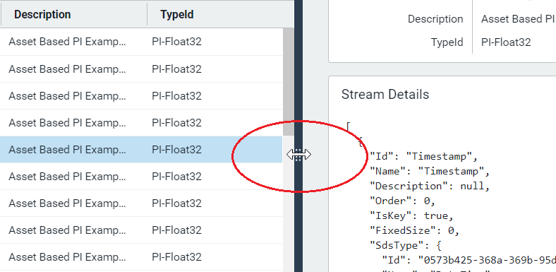

# Metadata rules

Use metadata rules to identify groups of similar streams for analytical purposes. You select a stream name to use as a name pattern and assign metadata to selected stream name parts, such as a plant location or device category. The resulting stream name pattern with assigned metadata parts defines a metadata rule. Metadata rules assign defined metadata to all streams in a given namespace matching the stream name pattern defined in the rule.  

## Create a metadata rule
<!-- The main things I noticed were that:
There should be only one action in each step.
Break out dense info to a section after the procedure
Use dropdown list or just list, not droplist
The description for the Metadata type called Metadata was rather confusing - can you please tidy it up.
 -->
To create a new metadata rule, follow these steps:

1. Click **Sequential Data Store** under **Data Management** in the OCS Portal. 
2. On the **Sequential Data Store** page, click **Streams**.
3. In the **Namespace** list, select the namespace in which you intend to create the metadata rule.
4. Expand the **Streams** pane if necessary to copy the full name of the stream that will be the basis for your metadata rule.

    

6. Click the menu icon to display the menu again, and select **Metadata Management** under **Data Management**. The **Metadata Management** page displays.
7. In the **Metadata Management** page, choose the namespace in which the model stream resides, and the metadata rule is to be created, from the **Namespace** dropdown list.
8. Click **Add Metadata Rule**. The **Select Stream** page displays.
9. In the **Select Stream** page, paste the copied steam name into the **Search** field. All streams in the namespace that share the name pattern of the stream you selected display.
10. Click the row of the stream name to use for the metadata rule and click **Next**.

   **Note**: You can search for a stream name by entering the first few characters of a name followed by * (wild card).
   
8. In the **Create Pattern** page, click the **+** sign above the delimiter to separate selected sections of the stream name.
9. For each section of the stream name, use the dropdown list to assign a metadata type: **Metadata**, **String Literal**, or **Wildcard**. See the table following this procedure for a description of these metadata types. 
10. After entering all metadata type entries, click **Next**.
11. In the **Define Mappings** page, choose one of these options:
  11.1 To display the raw stream data for the specified metadata key, select **Copy Values** under **Mapping Type**. 
  11.2 <!--Need to say why a user would choose this option, or what it does -->Select **Map Values** and click **Generate Mappings**.
12. If you selected **Map Values**, type in the **Map To...** entry field the label you wish to display for each defined metadata key for each matching stream, and click **Next**.
13. (Optional) Click **Add Mapping** to define mapping for any other stream name part.
14. Click **Next**. 
    All matching streams for the rule are displayed.
15. Enter the metadata rule **Name** and **Description** in the **Preview and Run** page.
16. Click **Save & Execute**.
   
   ### Metadata types
<!--The description for Metadata type Metadata is rather confusing -can you clarify? And I may have messed up your table formatting ,sorry! This kind of detail is better broken out of the procedure, I think.-->
| Metadata type                       | Description                                        |
|---------------------------------|------------------------------------------------------------|
| **Metadata**     | Typically assigned to the actual data provided by each stream matching the name pattern of the metadata rule. If you select metadata type **Metadata**, you must also enter a metadata key. A metadata key is the key portion of a key-value pair. The value entered is typically to indicate the type of data provided, such as "Measurement."|
| **String Literal**      | Only stream names that start with the specified string will match the name pattern of this metadata rule. |
| **Wildcard**       | Designates a part of the stream name pattern in which any value will match the name pattern of this metadata rule. |
