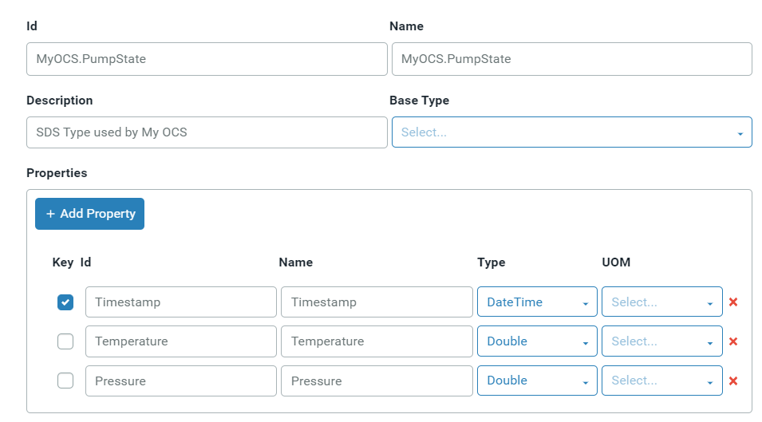

# Types Best Practices

The following are best practices OSIsoft recommends for creating types and streams.

- When you create SDS types, the most important consideration to be aware of is that types are immutable. Once created, additional properties or information cannot be added and existing properties cannot be deleted.

- An SDS type can include multiple data measurements of different data types. Each data measurement is a property of the type. In the screen capture below, the SDS type, MyOCS.PumpState, has two measurements represented by the Temperature and Pressure properties. Each property describes the data fields. The user interface allows you to define the following fields for each property: Id, Name, Description, Type, and Key. At least one property in the SDS type must be an index, most commonly a timestamp. In the example below, the Timestamp property is the index. Each property is a value in each event of this type. Therefore, in an event of the MyOCS.PumpState type, there is a value for Timestamp, Temperature, and Pressure. 

  - Note: You may use the REST API or client libraries to define additional optional fields, including Value, Order, and InterpolationMode for each property. Therefore, it may be preferable to create types programmatically.

  - Ensure that each property is defined completely. A common error is to try to add Unit of Measure (UOM) to the type definition after it has been created, but UOM can only be defined on the type when it is created. InterpolationMode and UOM on the type are inherited by the stream; however, these fields can be overridden. If they are not defined on the type, they can be added on the stream.

- If properties are added to a type later, you must create a new type that includes all the properties of the original type, plus the new properties. Use a stream view to convert the existing streams to the new stream type and migrate the data. There are no values for the new properties for the existing streams, and null values are assigned. Before you migrate your data, be sure to consider the effect of the null values on your application and ensure that the application will not break if it encounters null values.

- For custom applications using the SDS client libraries or OSIsoft Messaging Format (OMF), OSIsoft recommends that you use the client libraries to define the type rather than defining them in the OSIsoft portal. This ensures that the type the application expects matches the type in the Sequential Data Store. You can also take advantage of the custom property fields such as UOM when defining a property using the .NET client libraries methods.

## Property Patterns

When defining what value properties should be added to a type in Sequential Data Store, these are some common patterns that types fall into:

-  Inextricably linked data
   - The data contains multiple properties that must all be present to interpret the data
   - Examples include: latitude and longitude, value and quality, and X Y and Z coordinates
   - In this case, use a single type with all required properties
-   Independent data
   - The data is not always captured together, rarely used together, or must be independently secured
   - Examples include: existing PI points and separate equipment or assets
   - In this case, use separate types for each property or use a single type with one index and a generic value property
-  Data is always captured together, but they are not inextricably linked
   - All of the data is collected by the same equipment at the same time and could be used together
   - An example is multiple measurements taken by different instruments on the same equipment
   - In this case, use a single type if data is likely to be used together, can be secured together, does not exceed 15 properties, and the list of properties is not likely to change.  Otherwise, split the data into multiple types.
