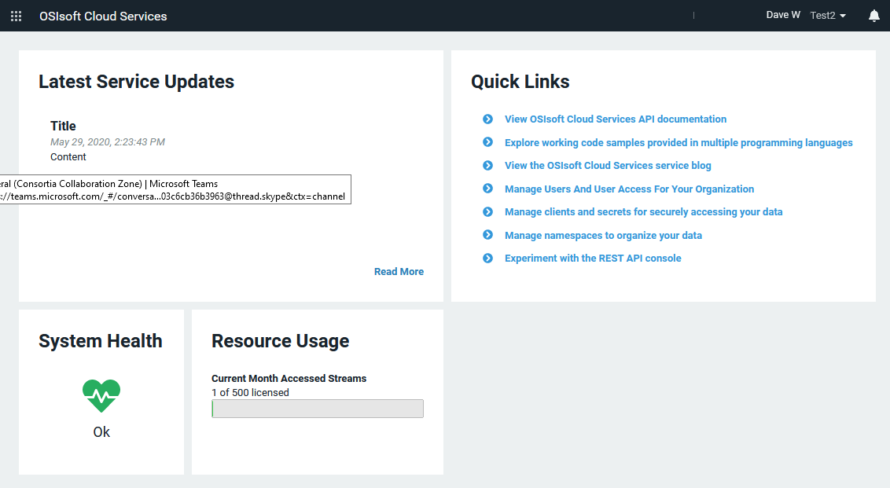
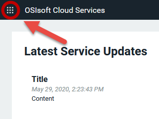
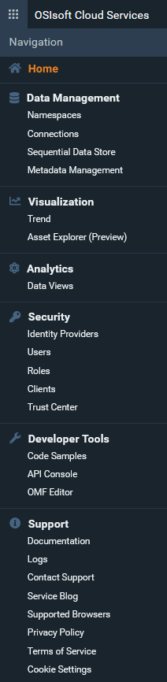
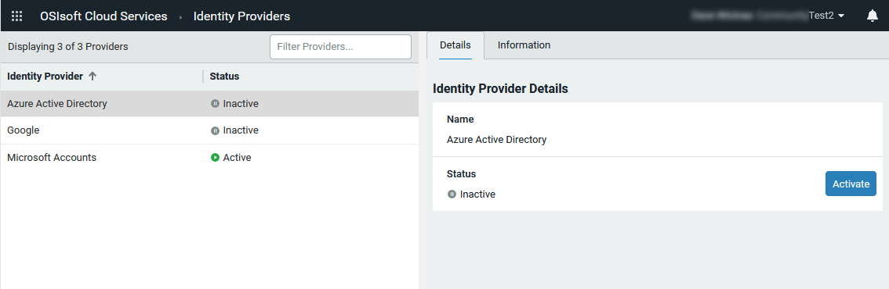
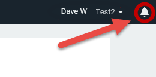
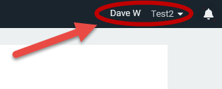

# Introduction to the portal interface

This topic provides a brief overview of the elements you interact with on the OCS portal interface.

When you first access the interface, you see several panes providing information about the state of your system's health as well as quick links to popular documentation topics.

## OCS features

The navigation icon at top left opens a menu from which you display different OCS features. You always have access to this menu wherever you are in the OCS portal.

Clicking the navigation icon lists the OCS features.

Here is a short summary of each OCS feature:

- **Data Management**: Provides tools for setting up basic capabilities of OCS, including tenants, connections to PI Systems, the Sequential Data Store (SDS), and metadata rules for data streams.
- **Data Collection**: Provides mechanisms to bring data from multiple sources and systems into a namespace within OCS.
- **Visualization**: Allows you to view data trends and use assets to set up digital twins of real-world physical entities.
- **Analytics**: Provides tools for shaping and querying large datasets.
- **Security**: Allows you to specify identity providers for authentication and add users, roles, and clients to your tenant.
- **Developer Tools**: Provides code samples, an API console, and an editor for the OSIsoft Message Format (OMF).
- **Support**: Provides access to documentation, logs, support links, an OCS blog, and other useful information.

## Feature pages

Clicking one of the menu items in the list of OCS features takes you to a page for that feature.

Most pages consist of two panes:

- The left pane is where you perform the tasks associated with the OCS resource. For example, the left pane is where you add and edit or manage permissions for the OCS resource.
- The right pane has one or more tabs:   
  - The Details tab contains additional information about the selected resource.
  -  The Information tab provides documentation about the current feature and describes how to perform relevant tasks.
  - Some resources have additional panes for other configuration tasks.

## Notifications

At top right, the View Notifications icon lists any OCS-generated notifications.

## User and tenant information

At top right, a drop-down menu gives you access to information about your user profile and tenant. This menu provides:

- Tenant information
- Resource usage data
- User profile information and roles assigned to your user

The menu also provides a link to a page where you can give feedback about OCS.

