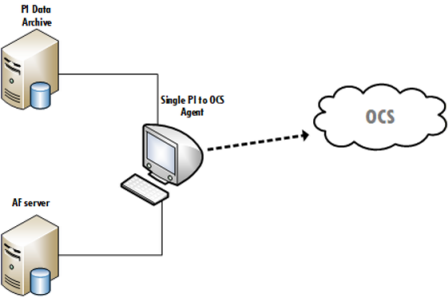

# PI to OCS architecture

PI to OCS enables you to connect and transfer your on-prem data to OCS from one PI Data Archive and one optional Asset Framework (AF) server using one PI to OCS Agent. The PI to OCS Agent creates and sends a transfer that contains the requested PI point data (metadata and PI events) and assets (AF elements and attributes) to OCS. <!--What else do we want to say here?-->

## Restrictions of PI to OCS architecture

These are some restrictions to the PI to OCS architecture:

* The connecting AF server must reference the connected PI Data Archive. The list of available PI Data Archive servers is based on what servers are referenced by elements on the AF server you selected.

* The same PI to OCS Agent is required to transfer data from the on-prem PI Data Archive and AF server.
