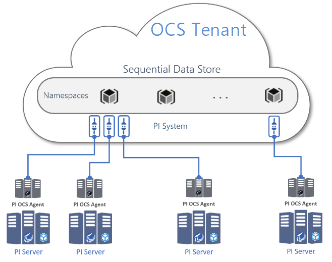

# Overview of PI to OCS

PI to OCS enables data transfer from an on-premises PI Server to OSIsoft Cloud Services (OCS). Transferring PI System data into OCS allows your organization to have data available wherever you go, so you can connect with the best in-class analytics, and with your community of vendors, service providers, and business partners. PI to OCS includes the following features:

* Transfer selected PI Data Archive PI points from PI Servers to OCS Sequential Data Store (SDS) [streams](xref:sdsStreams). As part of this transfer, some PI point attributes information is stored as SDS stream [metadata](xref:sdsStreamExtra) and properties.
* Simultaneous transfer both historical and streaming data from PI Data Archive to SDS for a selection of PI points.
* Configuration of a PI points selection and data transfer management via the OCS customer portal.

PI to OCS has the following components:

- *PI to OCS Agent* - an on-premises component that serves as a bridge between the source PI Server and the OCS destination. The agent runs as a service and performs fast, secure data transfers.

- *PI System connection* - a cloud component which resides within OCS and receives data from the on-premises PI to OCS Agent and stores it in SDS.<!--Angela Flores 6/24/21 - I would argue that the "data source" is a part of the PI System connection. This component should have one name.-->

**Note:** Storage in SDS is partitioned by OCS namespace.

The deployment of a PI to OCS Agent establishes a one-to-one connection from an on-premises source PI Server to an OCS PI System connection. The following diagram shows a deployment of PI to OCS Agents that transfer data to OCS PI System connections.

