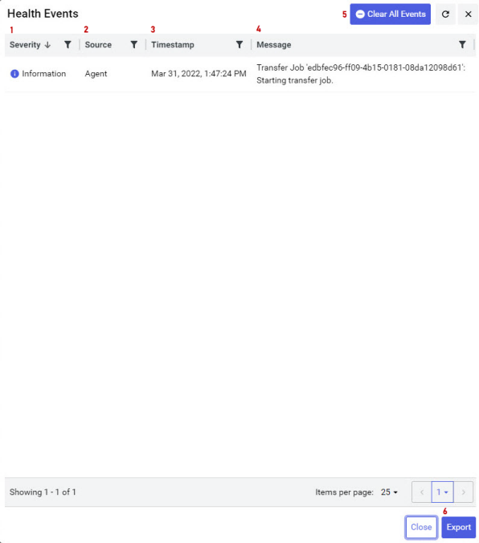

# Health Events window

The `Health Events` window provides information about an agent's activity and current status. Health events are based on log messages. You can sort messages by severity, source, time and message content.

The following table provides descriptions for the elements of the `Health Events` window.

| Element | Description                                                  |
| ------- | ------------------------------------------------------------ |
| Severity | The severity level of the log message. To filter by a particular severity level (Critical, Error, Warning, Information, Debug or Trace), select the filter icon and select one or more severity levels. |
| Source | The source of an error message. To filter by source (agent, PI point indexing or AF indexing), select the filter icon and select one or more sources. |
| Health Event | The health event that occurred. |
| Timestamp | The date of the event. To filter log messages by a particular date and/or time, select the filter icon, then enter the date and/or time in `Month 00, 000 00:00:00 PM` format. |
| Message | The actual log message. To filter by a word or phrase, select the filter icon, then enter the word or phrase. |
| Clear All Events | Select **Clear All Events** to remove all events from the view. |
| Export | Select **Export** to save a copy of the health event messages to a .csv file. |
