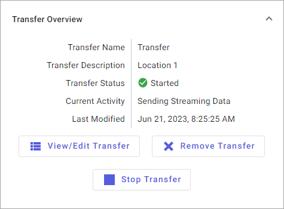

# PI to Data Hub change synchronization

The PI to Data Hub Agent supports synchronizing changes in the PI Data Archive and PI Asset Framework. Updates are automatically sent to AVEVA Data Hub without any user interaction. 

## Data Archive synchronization 

The PI to Data Hub Agent signs up for the following updates to stay in sync with the Data Archive:

- PI point updates

  - **Adding a PI point**: If PointId was listed in the transfer specification, a stream is created and the data streams to SDS.

  - **Updating a PI point name**: The SDS stream name is updated.

  - **Updating metadata**: The corresponding SDS stream metadata is updated.

  - **Deleting a PI point**: The SDS stream is deleted if the AutoDeleteCloudObject flag is enabled in the transfer settings.

- Digital state updates

  - **Update set name/values**: The SDS stream values are changed to the updated digital state set/name. See the Data Archive synchronization limitations table below.

- Data updates

  - **Point compression updates**.

Sign-up for PI point updates and digital state updates occurs when the agent starts, while data updates do not begin until the start of a transfer.

### Data Archive synchronization limitations 

| Issue | Restrictions |
| ----- | ------------ |
| Toggling compression | Toggling On to Off: It is possible that the PI point’s corresponding SDS stream may be missing an event near the time when the PI point’s compression setting was changed from On to Off.   Toggling Off to On: There is a small chance for an extra event (an event which was compressed out from the server) to be in SDS near the time when the PI point’s compression setting was changed from Off to On. |
| Analysis backfilling and rapid succession of data addition and deletion | There is a possibility for a data gap after an analysis backfill operation due to the nature of rapid data deletion and insertions being performed by the analysis service on the PI point. |
| Updating digital state | The SDS stream will store the updated state name and values at time of change. Previously stored state values are preserved. Updated digital state values will not be backfilled or recalculated for existing data saved to the corresponding SDS stream. |

## Asset Framework synchronization 

The agent performs an indexing of the AF server after agent registration is successful. The indexing caches all known elements and templates along with their attributes. The agent updates this index periodically.

When a transfer starts, the agent builds out the implicit PI points referenced by the element Ids specified in the transfer specification to enable change synchronization.

The supported AF change synchronization events and the result of each change are listed below:

- Database

  - **Database addition**: No effect on the existing transfer, but elements from the new database will be available to add if the transfer is edited.

  - **Database rename**: The path metadata of assets referencing the database is updated.

  - **Database deletion**: All elements and templates that were also deleted because of the database being removed will propagate and synchronize.1

- Element

  - **Updates to Name, Description, Template**: The corresponding asset property is updated.

  - **Addition or updates to attributes**: An SDS stream is created if newly referenced in transfer. The stream reference of the asset is added or updated.

    - **Note:** If an AF element has a PI point reference that is not yet created when the transfer is started, creating that PI point reference will not trigger change synchronization. The PI point reference must be created before a transfer is started.

  - **Deletion of attributes**: The stream reference is removed from the asset. The SDS stream is removed if a point is no longer referenced in the transfer.1

  - **Deletion of the element**: The asset is deleted.1

- Point attributes

  - **Metadata updates (Name, Description, etc.)**: The asset property is updated to reflect the change.

  - **PI point reference updates**: The stream reference of the asset on the cloud changes to the updated stream. If the previously referenced point is no longer referenced implicitly or explicitly in the transfer, the SDS stream is removed.1

- Static attributes

  - **Metadata updates (Name, Description, etc.)**: The asset metadata associated with the attribute is updated.

  - **Value updates**: The value of the attribute is updated.

- Template

  - **Updates to Name, Description, Template**: The corresponding property is updated on the asset type.

  - **Addition or updates to attribute templates**: The stream reference and metadata associated with the asset type is updated.

  - **Deletion of attribute templates**: The stream reference and metadata is removed from the asset type.

  - **Deletion of the template**: The asset type is removed.1

- Point attribute templates

  - **Metadata updates (Name, Description, etc.)**: The asset type property is updated to reflect the change.

  - **PI point reference updates**: The stream reference is updated on the asset type.

- Static attribute templates

  - **Metadata updates (Name, Description, etc.)**: The asset type metadata associated with the attribute is updated.

  - **Asset type value updates**: The asset type metadata is updated.

1 This action occurs only if the AutoDeleteCloudObject flag is enabled in the transfer settings.

## PI point type change

When the PI to Data Hub Agent detects that a PI point's type is changed on the source PI Data Archive after the corresponding stream has been created in the SDS database, it takes the following actions:

- The `PI Point Type Change Detected` message displays next to **Current Activity** in the `Details` pane, as shown below:

  

- The agent prevents data being sent from the source PI point to the SDS stream until the type is changed to match the corresponding SDS stream type.

- The agent logs details about the corresponding SDS stream in both the Windows Event Viewer and AVEVA Data Hub logs.

### Causes for PI point type changes

A point change can occur for multiple reasons, including:

* The source PI point data and type is configured incorrectly. The data and point must be deleted and recreated.

* The source PI point was misconfigured initially. For example, the point needs to be updated from `Float32` to `Float64`. The data is still relevant and should be kept.

### Resume streaming data to an existing SDS stream after a type change

After you create an SDS stream, its underlying SdsType cannot change. As a result, new data from the PI point in question cannot be stored in the same stream. You can resume streaming data from the PI point to the existing SDS stream by taking the following corrective actions:

1. View the [Windows Event Viewer logs](xref:view-logs) or [AVEVA Data Hub logs](xref:download-tenant-log) to determine which PI point incurred a PI point type change.

   **Note:** The Windows Event Viewer logs are the preferred source of information for PI point type changes.

1. Change the PI point type to match the SDS stream type and then restart the transfer.

To see what types of point coercions are supported in PI Data Archive, refer to the [Allowable point type coercions](https://docs.osisoft.com/bundle/pi-server/page/allowable-point-type-coercions.html) topic.