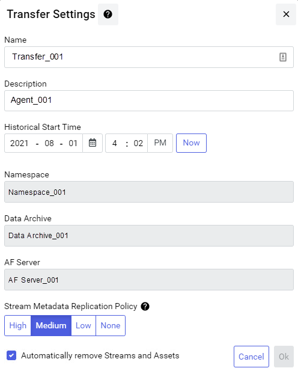
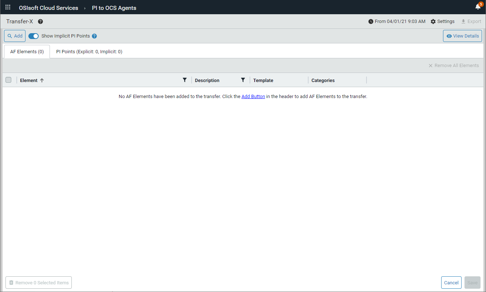
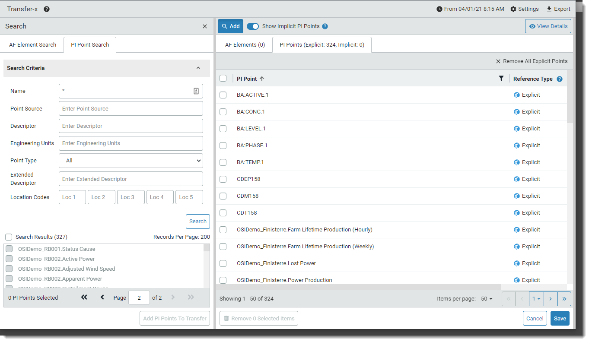
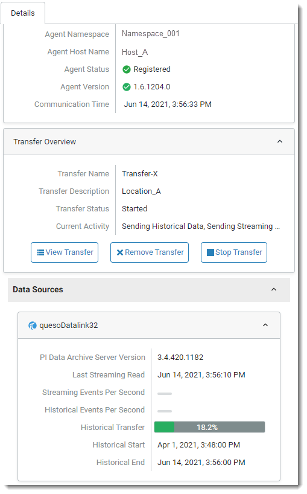

# Transfer PI System data to OCS

To transfer PI points into OCS, you must first define transfer settings and then build a PI points transfer table. The following topics contain the procedures and information you need to transfer data to OCS:

* [Create a transfer](#create-a-transfer)
* [Overview of the PI Points Search pane](#overview-of-the-pi-points-search-pane)
* [Explicit and implicit PI points](#explicit-and-implicit-pi-points)
* [Build a PI points transfer list](#build-a-pi-points-transfer-list)
* [View PI point details](#view-pi-point-details)
* [Remove PI points from a transfer](#remove-pi-points-from-a-transfer)
* [Save and transfer data to OCS](#save-and-transfer-data-to-ocs)

## Create a transfer

You create a transfer to have a placeholder to store the PI point data you wish to transfer.

### Before you start

Download and install the PI to OCS agent. Register your PI Data Archive with the PI to OCS Agent Configuration Utility.

### Procedure

1. Log on to the [OCS portal](https://cloud.osisoft.com).

2. Click the menu  icon, then click **Data Collection > PI to OCS Agents**.

4. In the `PI to OCS Agents` window, select an agent for the data transfer.

5. Click the **Create Transfer** button in the `Details` pane.
   
   **Result:** The `Transfer Settings` dialog box opens.
   
   
6. Enter a name and description for the transfer.

7. **Optional**: In the **Historical Start time** fields, enter a historical time context for the data retrieval. 

   **NOTE:** OCS supports out of order events and stores data in chronological order by timestamp. PI Data Archive 2017 SP2 or higher is required for this feature. Enter the historical start date and time correctly to ensure all data is included in the transfer. No data before the historical start time will be captured and stored in SDS.

8. Select the level of data privacy for the transfer by selecting one of the following **Stream Metadata Replication Policy** settings: 

   * **High**: Send all identifying information about an asset with the PI point.
   * **Medium (default)**: Send metadata without logical addresses from the data source.
   * **Low**: Does not send any metadata. Locally configured metadata such as point source and local aliases can be sent in the transfer.
   * **None**: No sensitive data is included in the transfer.

10. Click **Ok**.

   **Result:** The new transfer opens in the `PI to OCS Agents` window.

   

## Overview of the PI Points Search pane

You build a PI points transfer list in the **PI Points Search** pane. The screen capture and table below point out the key elements of the **PI Points Search** pane.

This table contains descriptions for the numbered fields and controls in the above screen capture.

No. | Description  | 
---------|----------
1   | Hide or reveal the Search Criteria panel  
2 | Filter by PI point name 
3 | Filter by PI point source  
4 | Filter by PI point description 
5 | Filter by a specific engineering unit (gallons, temperature, etc.) 
6 | Filter by PI point type (Float32, Float 64, Int16, Int32, Digital, Timestamp or String) 
7 | Filter by an additional extended description 
8 | Filter by location code value 
9 | Execute the query and return matching results. 
10| Quickly select all PI points returned by a query 
11| Navigate through search result pages.  
12| Add selected PI points to a transfer. 

## Explicit and implicit PI points

PI points added to a transfer are assigned one of two reference types:

* Explicit
* Implicit

The reference type indicates a PI point's source and how it was retrieved. The reference type appears on the **PI Points** tab under the **Reference Type** column.  

The explicit reference type is assigned to PI points directly retrieved from a PI Data Archive.  The implicit reference type is assigned to PI points referenced by AF element attributes that have been retrieved by searching an AF server.

## Build a PI points transfer list

You build a PI points transfer list to select the PI points you want included in your transfer. 

### Procedure

1. Click the **Add** button.

   **Result:** The **Search** pane opens on the left.

2. Click the **PI Point Search** tab.

3. Refer to the table below to define your search query critera.

   | Specific Values | Action to Take |
   -------------------------- | ------------------------
   | Common PI point attributes | Enter criteria in any of the following fields: <ul><li>**Name** (alias for tag attribute)</li><li>**Point Source**</li></ul> **Note:** The search fields default to * or all PI points if search criteria is not entered. |
   | Point descriptions         | Enter criteria in the following fields: <ul><li>**Descriptor** </li><li>**Extended Descriptor**</li></ul> |
   | Engineering units | Enter criteria in the **Engineering Units** field.           |
   | A PI point type            | Select one of the following point types from the **Point Type** drop-down list: <ul><li>**Float32** </li><li>**Float64**</li><li>**Int16**</li><li>**Int32**</li><li>**Digital**</li><li>**Timestamp**</li><li>**String**</li></ul> |
   | Specific location code(s)  | Enter up to five location code values (1-9) in the **Location Codes** field. |

4. **Optional:** Click the **Search Criteria** toggle arrow to hide or show search fields.

5. Click **Search** to execute the query and retrieve matching results.

   **Result:** Search results are displayed in the **Search Results** list box.
6. Scroll through the PI points in the **Search Results** list and click each point you want to add to the data transfer.
   
   **Tip:** To select a range of PI points, click a PI point and then scroll to and [SHIFT+Click] a non-adjacent point. 

7. To advance through multiple-paged search results, click the back and forward arrows OR enter a page number in the **Page** text box.

8. When you are done selecting PI points, click the **Add PI Points To Transfer** button.

   **Result:**  The points are added to the transfer.

   

**NOTE:** Once you have added PI points, you must save the transfer before you can start to transfer data to OCS.

## View PI point details

You can view attribute details for a PI point that has been added to a transfer. 

### Procedure

1. Select a PI point on the PI Points tab.

2. Click  at the top right of the **Transfer** pane.

   **Result:** The PI Points Information pane opens to the right and the PI point's attributes are shown.

3. To view another PI point's details, click to unselect the selected PI point, then select the new point.

4. Click **x** on the **PI Point Information** pane to close it.

## Remove PI points from a transfer

You can remove unwanted PI points from a transfer prior to saving the transfer.

### Procedure

1. On the PI Points tab, click to select the PI points you wish to remove from your transfer.

2. Click the **Remove # Selected Items** button, then click **Remove** again.

   **Result:** The PI point are removed from the transfer.

3. **Optional:** To remove all PI points from a transfer, click the checkbox to the left of the **PI Point** column header, then click the **Remove # Selected Items** button.

## Save and transfer data to OCS

You must save a transfer before you can transfer data to OCS. During a data transfer, events are sent asynchronously. Historical events are sent first, followed by current events.  The progress of a data transfer is displayed in the Details pane.  

**Note:** Modifications to an underlying Data Archive digital state table during a transfer require that you manually stop and then restart the transfer to capture all changes. Follow these steps to ensure all data is captured in the transfer:

   1. Stop the transfer.
   2. Make modifications to the Data Archive digital state tables.
   3. Restart the transfer to pick up these changes.

### Procedure

1. On the PI Points tab, click the **Save** button in the lower-right corner of the window.

   **Result:** The transfer is saved and you are returned to the `PI to OCS Agents` window.

2. Make sure to select the agent with the saved transfer.

3. In the **Details** pane, click the **Start Transfer** button, then click **Start**.

   **Result:** The data transfer begins and the fields in the Transfer Overview section display the transfer's progress. 
   

4. In the `Details` pane, click the **Data Sources** down arrow to view more information about your transfer:

   * Server version: The version of the connected PI Data Archive
   * Last Streaming Read
   * Streaming Events Per Second: The number of streaming events being transferred
   * Historical Events Per Second: The number of historical events being transferred
   * Historical Transfer: Displays the percentage of completion for streamed historical events.
   * Historical start and end: The time range of past, historical events transferred to OCS 

5. **Optional:** Click the **Stop Transfer** button, then click **Stop** to stop the transfer of data to OCS.

6. **Optional:** Click the **Remove Transfer** button, then click **Remove** to delete the transfer completely.
