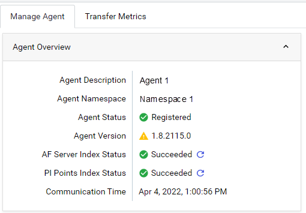
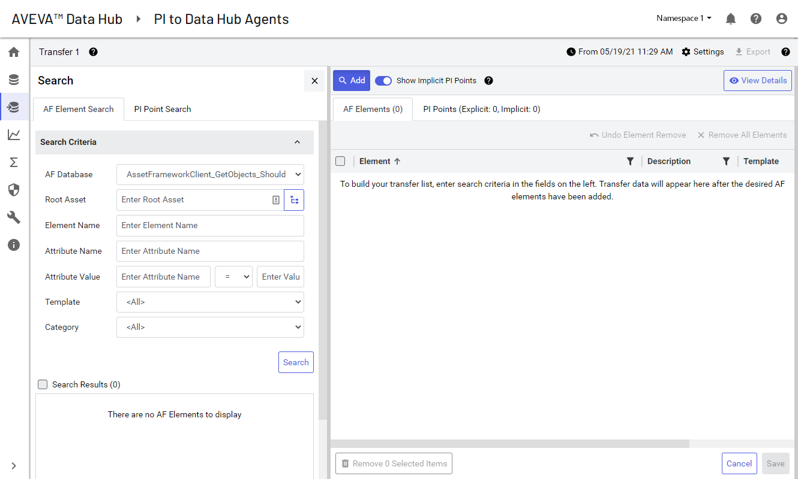
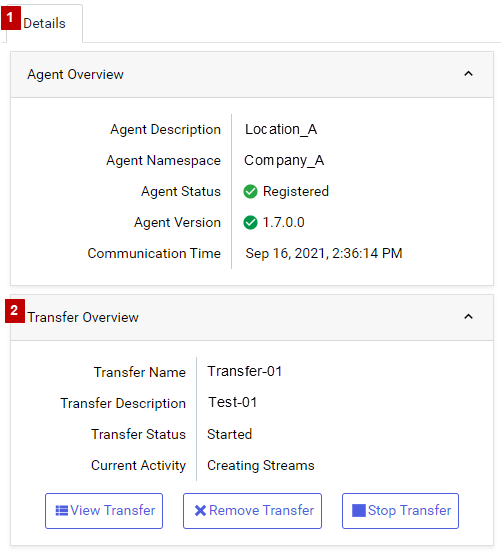
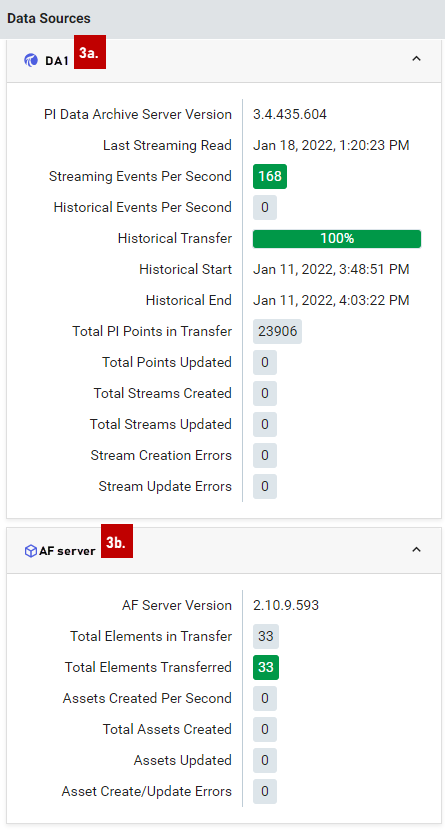

# Transfer data to OCS

You initiate a data transfer from the `PI to OCS Agents` window. A transfer can consist of PI points and AF elements or AF elements that reference at least one PI point. This topic contains these sections:

1. [Create a transfer](#create-a-transfer)
1. [Name the transfer and set data privacy settings](#name-the-transfer-and-set-data-privacy-settings)
1. [Build an AF elements transfer list](#build-an-af-elements-transfer-list)
1. [View AF element details](#view-af-element-details)
1. [Build a PI points transfer list](#build-a-pi-points-transfer-list)
1. [View PI point details](#view-pi-point-details)
1. [Save a transfer](#save-a-transfer)
1. [Transfer data to OCS](#transfer-data-to-ocs)

PI points can be added to a transfer explicitly (via a tag search) or implicitly (via AF element references). To learn more about the difference between implicit and explicit references, see [Overview of explicit vs. implicit PI points](#overview-of-explicit-vs.-implicit-pi-points).

**Before you begin:** Download and install the PI to OCS Agent. Register your PI Data Archive and AF data sources using the PI to OCS Agent Configuration Utility. 

### Create a transfer

During transfer creation, you will need to perform the following tasks:

1. Assign a name, description, and optional historical start and end time for data retrieval.
1. Select a level of data privacy to control how much identifying information about an asset is sent with PI point data.
1. Set query criteria and retrieve and add optional AF elements, which reference at least one implicit or explicit PI point, and/or PI point data to your transfer lists.
1. View transfer details
1. Save your transfer.
1. Optional: Export a file(s) that contains transfer detail information.
1. Initiate your data transfer and monitor its progress. 

**Note:** If you have configured an AF server, you will not be able to create a transfer until AF indexing is complete. AF indexing status is listed on the Details pane in the PI to OCS Agents page.

### Name the transfer and set data privacy settings 

1. Sign in to the [OCS portal](https://cloud.osisoft.com).

1. Click the menu  icon, then click **Data Collection > PI to OCS Agents**.

1. In the `PI to OCS Agents` window, select the agent for the data transfer.

1. In the `Details` pane, click **Create Transfer**.

   **Result:** The **Transfer Setting** dialog box opens.

   
   
1. Enter a name and description for the transfer.

1. Optional: In the **Historical Start time** fields, enter a historical time context for the data retrieval.

   **NOTE:** OCS supports out of order events and stores data in chronological order by timestamp. PI Data Archive 2017 SP2 or higher is required for this feature. Be sure to enter the historical start date and time correctly to ensure all data is included in the transfer. No data before the historical start time will be captured and stored in SDS.  See [Overview of data transfers](https://docs.osisoft.com/bundle/ocs/page/add-organize-data/collect-data/connectors/pi-to-ocs/pi-to-ocs-data-transfers/overview-data-transfers.html) to learn more about transferring historical data.

1. Set the data privacy level for the transfer by selecting one of the following **Stream Metadata Replication Policy** settings: 

   * **High**: Sends all intended metadata.
   * **Medium (default)**: Send metadata without logical addresses from the data source.
   * **Low**: Sends no metadata from the data source namespace. Locally configured metadata such as point source and local aliases is allowed (point name, point ID and point source only).
   * **None**: Only the point ID and point name is sent; no metadata is included in the transfer.

1. Click **Ok**.

   **Result:** The transfer is created and the `Transfer` page opens.

   

**Note:** You can click the **Settings** button to access the **Transfer Setting** dialog box and modify transfer settings (name, description, historical start and end times, and data privacy settings).

## Build an AF elements transfer list

You build an AF elements transfer by setting query criteria and then selecting AF elements after naming the transfer.  You can narrow your search by filtering by element name, asset group, attribute name/value, template, and category. 

1. Click the **AF Database** down arrow, then select the source AF database you want to search.

1. Optional: Click the **Root Asset** button.
   
   **Result:** The `Select Root Element` dialog box opens.

1. Optional: In the `Select Root Element` dialog box, click the plus buttons to drill down to the desired root asset in the AF database hierarchy, select a root asset, then click **Select**. 

1. Optional: In the **Element Name** text box, enter search criteria to filter by part or all of an AF element name.

   **Note:** If you don't enter filter criteria, the search defaults to "*" or all.  

1. Optional: In the **Attribute Name** text box, enter the attribute name.

1. Optional: In the **Attribute Value** fields, filter attribute values by specifying the following information:

      * In the first text box, enter an attribute name.
      * Click the operator down arrow, then select an operator (=, <>, <, >, =<, =>, In).
      * In the last text box, enter an attribute value.

   **Note:** Custom unit of measurements (UOMs) are not supported in OCS. During the transfer of AF element data, AF elements with custom UOMs will not have their corresponding asset’s UOM property set.

1. Optional: Click the **Template** down arrow, then select a template to narrow your search by template name.

1. Optional: Click the **Category** down arrow, then select a category to narrow the search by a specific AF category.

1. Click **Search** to execute the query and retrieve matching results.

   **Result:** Query results are displayed in the **Search Results** list.

1. Scroll through the query results and click each AF element you want added to the transfer.

   **Result:** A checkmark appears next to each selected AF element.

   **Tip:** To select a range of elements, click an element and then scroll to and [SHIFT+Click] a non-adjacent element. 

1. To advance through multiple-paged query results, click the back and forward arrows OR enter a page number in the **Page** text box.

1. Repeat step 11 until you have finished selecting elements.

1. When you are done selecting elements, click **Add AF Elements To Transfer**.
    **Result:**  The elements are added to the transfer and listed on the `AF Elements` tab.

1. Repeat steps 1-13 to query other AF databases and add additional elements. 

1. Click **Save** to add the selected AF elements to the transfer.

**Note:** AF indexing needs to complete before you can view implicit PI points and start the transfer process.

## View AF element details

You can view details about an individual AF element such as related attribute names, values, and data references. 

1. Select an AF element on the **AF Elements** tab.

1. Click the **View Details** button.

   **Result:** The `AF Element Information` pane opens and displays details about AF element attributes (name, value, and data reference). 
   
1. Click the **Reference AF Elements** tab.

   **Result:** If defined, the path(s) of any referenced AF element is listed. 

1. To view details for another AF element, deselect the currently selected element, and then select a different element in the transfer list.

1. Repeat step 4 as needed.

1. Click the **View Details** button to close the `AF Element Information` pane.

## Build a PI points transfer list

You build a PI points transfer list by setting query criteria and then adding the desired PI points.  A PI points transfer list may contain both implicit and explicit PI points. See [Overview of explicit vs. implicit PI points](#overview-of-explicit-vs.-implicit-pi-points) for more information.

1. Click the **PI Point** **Search** tab.

1. Click the **Add** button.

   **Result:** The `Search` pane opens.

1. Define your search query:

   | To Filter Results By Certain Criteria    | Action To Take                                               |
   | -------------------------- | ------------------------------------------------------------ |
   | Common PI point attributes | Enter criteria in any of the following fields: <ul><li>**Name** (alias for tag attribute)</li><li>**Point Source**</li></ul>  **Note:** Enter * to retrieve all PI points. |
   | Point descriptions         | Enter criteria in the following fields: <ul><li>**Descriptor** </li><li>**Extended Descriptor**</li></ul> |
   | Engineering units          | Enter criteria in the **Engineering Units** field.           |
   | PI point type            | Select one of the following point types from the **Point Type** drop-down list: <ul><li>**Float32** </li><li>**Float64**</li><li>**Int16**</li><li>**Int32**</li><li>**Digital**</li><li>**Timestamp**</li><li>**String**</li></ul> |
   | Specific location code(s)  | Enter up to five location code values (1-9) in the **Location Codes** field. |

1. Optional: Click the **Search Criteria** bar to collapse or expand the criteria section.

1. Click **Search** to execute the query and retrieve matching results.

1. Scroll through the **Search Results** list box and click each PI point you want added to the data transfer.

   **Result:** A checkmark appears next to each selected PI point.

   **Tip:** To select a range of PI points, click a PI point and then scroll to and [SHIFT+Click] a non-adjacent PI point. 

1. To advance through multiple-paged query results, click the back and forward arrows OR enter a page number in the **Page** text box.

1. Repeat step 6 until you have finished selecting PI points.

1. When you are done selecting PI points, click the **Add PI Points to Transfer** button.

   **Result:**  The points are added to the transfer and listed on the `PI Points` tab.

## Overview of explicit vs. implicit PI points

PI points added to a transfer are assigned one of two reference types:

* Explicit
* Implicit

The reference type indicates the PI point's source and how it was retrieved. The reference type for each PI point is listed in the Reference Type column on the **PI Points** tab. 

The explicit reference type is assigned to PI points directly retrieved from a PI Data Archive.  The implicit reference type is assigned to PI points referenced by AF element attributes that have been retrieved by searching an AF server.

## Hide implicit PI points

Implicit PI points are PI points referenced by AF elements in a transfer. You can hide implicit PI points to temporarily remove them from view on the **PI Points** tab.  Hidden implicit PI points are still included in a transfer unless the referencing AF elements are removed from the transfer list. 

1. On the **Transfer** page, click the **Show Implicit PI Points** toggle button to hide and temporarily remove implicit PI points from the PI points list.

   **Note:** Implicit PI points are referenced by AF element attributes and retrieved from an AF server. Hiding implicit PI points does not remove them from a transfer.  

1. Optional: Click the **Show Implicit PI Points** toggle button again to reveal hidden implicit PI points.

## View PI point details

You can view attribute details for selected PI points in a transfer, and also hide/show implicit PI points on the `Transfer` pane.

1. Optional: In the `Transfer` pane, click the **PI Points** tab.

1. Select a PI point on the PI Points tab.

1. At the top right of the `Transfer` window, click the **View Details** button.

   **Result:** The **PI Point Information** pane opens.

1. Click the **Source AF Elements** tab to view the path of any AF elements that reference the PI point. 

1. To view another PI point's details, click to select a different PI point in the transfer list.

1. Repeat steps 4-5 as needed.

1. Click the **View Details** button or **x** to close the **PI Point Information** pane.

## Save a transfer

Before you can transfer data to OCS, you must save the transfer to retain your PI point and/or AF element selections.

1. In the `Transfer` pane, click **Save**.

   **Result:** The transfer is saved and you are returned to the `PI to OCS Agents` window.

**Note:** To make changes to a transfer, you will have to remove and rebuild a new transfer.

## Overview of the Details pane

The `Details` pane provides information about the agent associated with the transfer, the transfer progress, the data sources, and details about the PI points and AF elements transferred.  As shown in the screen capture below, the sections in the `Details` pane can be expanded and collapsed using the chevron arrows (  ):  

 

| Numbered section | Description                                                  |
| ---------------- | ------------------------------------------------------------ |
| **1**            | `Agent Overview:` Lists the agent description (if any), namespace, status, version, and date and time of last connection. |
| **2**            | `Transfer Overview:` Displays transfer details and progress. Also contains buttons to view, remove or stop a transfer. |
| **3a**            | Under the registered Data Archive (  ), the Streaming and Historical Events Per Second fields list the number of events successfully transferred to OCS. Historical events represent the number of incoming events per second that come from a backlog of events for the PI points associated with the transfer, which are not transferred as “real-time” events. Streaming events represent the number of current, real-time events transferred into OCS. |
|**3b**            |If an AF server has been added, details about the AF server and transferred elements are shown under the listed  AF server data source (  ). The AF status fields provide information about the number of AF elements and assets succesfully transferred and created:  <ul><li>**Total Elements in Transfer**: The total number of AF elements in transfer to OCS. </li><li>**Total Elements Transferred**: The number of elements transferred to OCS.</li><li>**Total Assets Created**: The number of assets created in OCS.</li><li>**Assets Updated**: The number of assets updated during the transfer process.</li><li>**Asset Create/Update Errors:** The number of errors generated while creating or updating assets in OCS.</li> |

## Transfer data to OCS

Data is ready for transfer to OCS after the desired PI points and/or AF elements have been added.  During the transfer, events are sent asynchronously. Historical events are sent first, followed by current events. 

**Note:** Modifications to an AF database or Data Archive digital state table during a PI to OCS transfer require that you manually stop and restart the transfer to capture all changes. Follow these steps to ensure all data is captured:

1. Stop the transfer.

2. Make modifications to the AF database and/or Data Archive digital state tables.

3. Restart the transfer to pick up these changes.

### Start the data transfer

1.  Optional: In the `PI to OCS Agents` window, select the PI to OCS Agent associated with the data transfer. 

1. Optional: In the `Details` pane, click the `Transfer Overview` down area to expand this section.

   **Result:** The `Transfer Overview` section expands.

1. Click the **Start Transfer** button, then click **Start**.

   **Result:** The transfer of data begins and the transfer status is reflected in the `Transfer Overview` section.

1. In the `Details` pane, expand the `Data Source` section to view the status of a transfer as data is sent to OCS.

   **Note:** The rate at which data transfers varies and depends on the density of data in the source PI Data Archive and/or AF server. See [Data transfer statuses](xref:data-transfer-statuses) for a list of transfer statuses and descriptions. To find out more information about an asset error, agent status, or asset create/update error, click the **Logs** button above the list of agents to access more information. Possible statuses that appear in the **Current Activity** field may indicate an issue include Uncategorized Error, PI Point Type Change Detected, and No Valid PI Points In Transfer.   

1. Optional: If the fields in the `Details` pane indicate there are issues with the transfer or agent, click the **Logs** button to open the `Logs` window and view more information.
    
1. Optional: To stop a transfer, click **Stop Transfer**, then click **Stop**.

1. Optional: To remove a transfer, click **Remove Transfer**, then click **Remove**.
