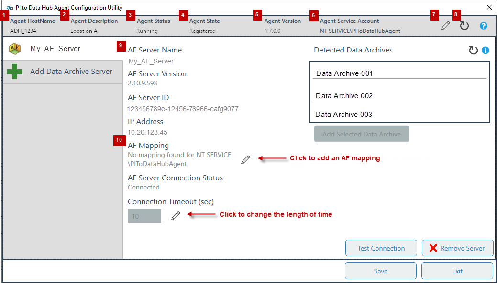
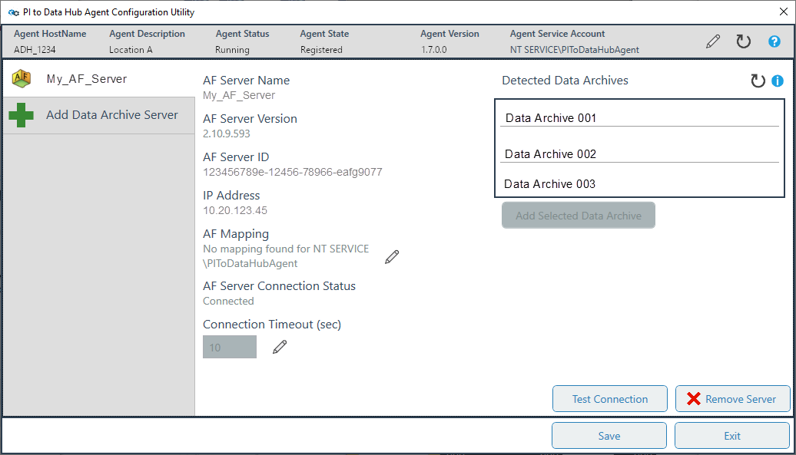
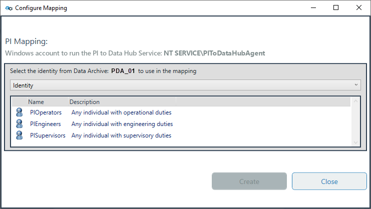

# Run the PI to OCS Agent Configuration Utility

You use the PI to OCS Agent Configuration Utility to set up and configure AF server and Data Archive data sources before creating a data transfer. After installing or upgrading a PI to OCS Agent, you use the utility to select a source AF server and/or Data Archive, view connection details, create and add AF and PI mappings, set data privacy settings, and register the agent. 

### Topics in this section

* [Access the PI to OCS Agent Configuration Utility](#access-the-pi-to-ocs-agent-configuration-utility)
* [Overview of the PI to OCS Agent Configuration Utility](#overview-of-the-pi-to-ocs-agent-configuration-utility)
* [Add an AF server](#add-an-af-server)
* [Select the default Data Archive in PI System Explorer](#select-the-default-data-archive-in-pi-system-explorer)
* [Create an AF Mapping](#create-an-af-mapping)
* [Add a PI Data Archive](#add-a-pi-data-archive)
* [Create a PI mapping](#create-a-pi-mapping)
* [Set data privacy and add an agent description](#set-data-privacy-and-add-an-agent-description)
* [List of agent status states](#list-of-agent-status-states)

## Access the PI to OCS Agent Configuration Utility

You can open the PI to OCS Agent Configuration Utility to change server connections and other settings after initial setup. 

**Note:** If you are not the original user who installed the agent, authenticatication with the new user account is required before access is granted to the utility. 

1. Click the Windows start button.

2. On the Windows menu, scroll to and click **OSIsoft**, then click **PI to OCS Agent Configuration Utility**, then click **Yes**.

   **Result:** Upon successful authentication, the **PI to OCS Agent Configuration Utility** opens.

3. Click **Connect to OSIsoft Cloud Services**.
   
   **Note:** If you have not yet added an AF server or PI Data Archive server, see [Add an AF server](#add-an-af-server) or [Add a PI Data Archive](#add-a-pi-data-archive) for instructions.
 

### Overview of the PI to OCS Agent Configuration Utility

The table below provides descriptions of the numbered fields in the screen capture of the utility.  

   

| Number  | Description                                                  |
| :-----: | ------------------------------------------------------------ |
| **1.**  | Name of the host computer where the agent is installed       |
| **2.**  | An optional name for an agent                                |
| **3.**  | Displays the PI to OCS Agent's status                        |
| **4.**  | Provides details about the agent's registration state        |
| **5.**  | Currently running PI to OCS Agent version                    |
| **6.**  | Type of agent service account.                               |
| **7.**  | Set data privacy options and assign an agent description.    |
| **8.**  | View information about the server connection and its configuration. |
| **9.**  | Source AF server name                                        |
| **10.** | Type of AF mapping configured for the service account. Click the pencil icon next to this field to assign an AF mapping to an AF identity. |

   **Note:** After a PI Data Archive server is added, similar information in the table above is displayed in the utility.

## Add an AF server

The PI to OCS Agent Configuration Utility opens after you install or upgrade a PI to OCS Agent. If you are installing an agent for the first time, the utility opens after agent installation. If you are upgrading an agent, you can add an AF server after completing the upgrade. 

The utility validates an AF server connection to ensure the following criteria is met:

* The AF server is not currently registered to any other agents under the same namespace as the current agent
* The version of PI Asset Framework (AF) installed on the AF server supports the features required for transfers

1. In the `PI to OCS Agent Configuration Utility` window, click the **AF** button.

1. In the **AF Server Name** text box, enter the name of your AF server, then press Enter or click **Add Server**.
 
   **Result:** After successful detection, you are advanced to the next screen of the utility.

   

​     **Note:** Once an AF Server has been added, the utility searches for PI Data Archives that are referenced by the AF Server. 

1. Optional: Select one of the Data Archives listed under **Detected Data Archives**, then click **Add Selected Data Archive**.

1. Review the AF source server details to ensure they are correct:
   * AF server name, version & ID
   * IP address
   * Connection status and timeout

1. **Optional:** Click the pencil icon next to the **Connection Timeout** field to change the time the agent checks for a server connection before timing out.

1. Click **Save** to keep the current AF server configuration settings and restart the agent.                                                                                                    
1. **Optional**: Click **Test Connection** to check that the connection to the AF server is working.

1. **Optional**: To delete a server connection, click the **Remove Server** button, then click **Yes**. 

   **Note:** After you save the AF server configuration settings and restart and register the agent, you will need to select a default Data Archive in PI System Explorer to resolve substitution references for AF element attributes.

## Select the default Data Archive in PI System Explorer

You need to specify the default Data Archive, also referred to as the default data server, for the PI system and PI AF database after setting an AF server. By default, PI AF databases inherit the PI AF Server's local default data server. See [Find the default PI Data Archive server](https://docs.osisoft.com/bundle/pi-server/page/find-the-default-pi-data-archive-server.html) for more information.

1. Open PI System Explorer on the client machine.

1. Click **File** > **Server Properties**.

   **Result:** The **PI AF Server Properties** dialog box opens.

1. Click the **Default Data Server down arrow**, then select the desired default data server.

1. Click **Apply**, then click **Ok** to save your selection.
 
1. Exit PI System Explorer and return to the utility.  
 
## Create an AF Mapping

You can assign an AF mapping to an AF identity. AF mappings enable a specific service account assigned to an AF identity in PI System Explorer to read and transfer AF element and attribute data.  The following apply to AF mappings:

* The user account used to launch the utility must have permission to create mappings.
* You can edit mappings.

1. Optional: Open the `PI to OCS Agent Configuration Utility` window.

1. Click the pencil icon next to the **AF Mapping** field.

   **Result:** The **Configure AF Mapping** dialog box opens.
   
1. Select an identity for the AF mapping.

1. Click **Save**.
  
   **Result:** If successful, the AF mapping is created for the selected identity.
                                              
    **Note:** If an AF mapping has been created with another tool, a warning is displayed.

1. Optional: Repeat steps 3-4 as needed.  
   
5. Click **Close** to exit.

## Add a PI Data Archive

After adding an AF server, you select the source PI Data Archive that contains the PI points you want to transfer. 

**Note:** There is a one-to-one (1:1) Data Archive to PI to OCS Agent constraint for PI to OCS transfers. If your AF server references multiple Data Archives, only one Data Archive can be selected and configured for the transfer.  

The list of available PI Data Archive servers is based on what servers are referenced by AF elements on the AF server you selected. If you are upgrading an agent, the PI to OCS Agent Configuration Utility maintains the previously selected PI Data Archive configuration.  

**Note:** If you are not adding an AF server, click the PI Data Archive icon on the first screen of the PI to OCS Agent Configuration Utility.

1. Open the utility and connect to OCS. 
 
   **Result**:  The first screen of the **PI to OCS Agent Configuration Utility** opens.
   
1. Click the **Data Archive Server** button, then enter the name of the Data Archive server and press Enter or click **Add Server**.
   
   **Result:** The PI Data Archive connection is added and details about the newly added PI Data Archive are displayed.

1. Review the following details for your PI Data Archive:
 
   * Server name, version, and server ID
   * IP address
   * Connection status and timeout
   
1. **Optional:** Click the pencil icon next to the **Connection Timeout (sec)** text box to change the length of time the agent checks for a server connection before timing out.

1. **Optional**: Click the **Test Connection** button to confirm that the connection to the Data Archive is working.

1. **Optional**: Click the **Remove Server** button to remove the configured PI Data Archive.

1. Click **Save** to retain the current PI Data Archive configuration.

   **Note:** You must click the **Save** button to retain all PI Data Archive settings. 

1. Optional: Click **Exit** to close the utility.

## Create a PI mapping 

PI mappings enable access to data stored on a PI Data Archive by service accounts assigned to a PI identity.  PI mappings can be created for a PI identity, user or group. Accounts assigned to a PI identity can read and transfer PI point data to OCS.  See ["What are PI identities and mappings?"](https://livelibrary.osisoft.com/LiveLibrary/content/en/server-v14/GUID-AD57C990-0DE6-4280-B9F3-1432C6E444C5) for more information. The following applies to PI mappings:

* The user account used to launch the utility must have permissions to create mappings.
* You can edit mappings.

1. Navigate to the PI Data Archive details page in the PI to OCS Agent Configuration Utility.

1. Click the pencil icon next to the **PI Mapping** field.
 
   **Result:** The **Configure Mapping** dialog box opens.

    

1. Select one of the identities for the PI mapping, then click **Create**.

   **Result:** The PI mapping is created for the selected identity, group or user.

   **Note:** If a PI mapping has already been created with another tool, a warning is displayed. 

1. Optional: Repeat steps 2-3 as needed.

1. Click **Close** to return to the utility.

## Set data privacy and add an agent description

You can set data privacy settings and assign a descriptive name to an agent. Data privacy controls if a host name of a PI Data Archive is published and displayed in OSIsoft Cloud Services (OCS). By default, OCS does not publish host names. If you opt to have a host name published, it appears in the portal on the `PI to OCS Agents` window as shown here. 

This description appears where the agent is referenced and allows you to search by agent description.

1. In the PI to OCS Agent Configuration Utility, click the pencil icon to the right of **Agent Service Account**.
 
   **Result:** The **PI to OCS Agent Settings** dialog box opens.

1. Under **Data Privacy**, select the **Opt-in to publishing PI to OCS Agent Hostname in OCS?** option.

1. Optional: In the **PI to OCS Agent Description** text box, enter a name for the agent.

1. Click **Ok** to save your selections, then click **Save** in the utility.

1. Optional: Click **Exit** to close the utility.

## List of agent status states

It may take a few minutes for a PI System to register with OCS. The table below lists the various states that may appear under the Agent Status field in the PI to OCS Configuration Utility.

| **State**                     | **Description**                                              |
| ----------------------------- | ------------------------------------------------------------ |
| Data  Source Connection Issue | Indicates  the PI To OCS Agent isn't able to connect to the PI Data Archive. Some  reasons for this status include the PI Data Archive is turned off, a firewall  issue is preventing connections or an incorrect name is configured for the  Data Archive (for example, trying to connect to a machine that doesn't  exist/was renamed). There may be additional reasons for this status. |
| Data  Source Security Issue   | Indicates  the PI Data Archive connection is unsecure and security settings need to be  addressed. |
| Missing Configuration         | The PI Data Archive server has not been configured in the PI to OCS Agent. |
| Registration Failed           | Contact OSIsoft Customer support for assistance.             |
| Registering                   | The PI to OCS Cloud portion is creating the necessary resources for your PI to OCS Agent. |
| Shutdown                      | The last communication that the PI to OCS Cloud had with the agent was a shutdown message. |
