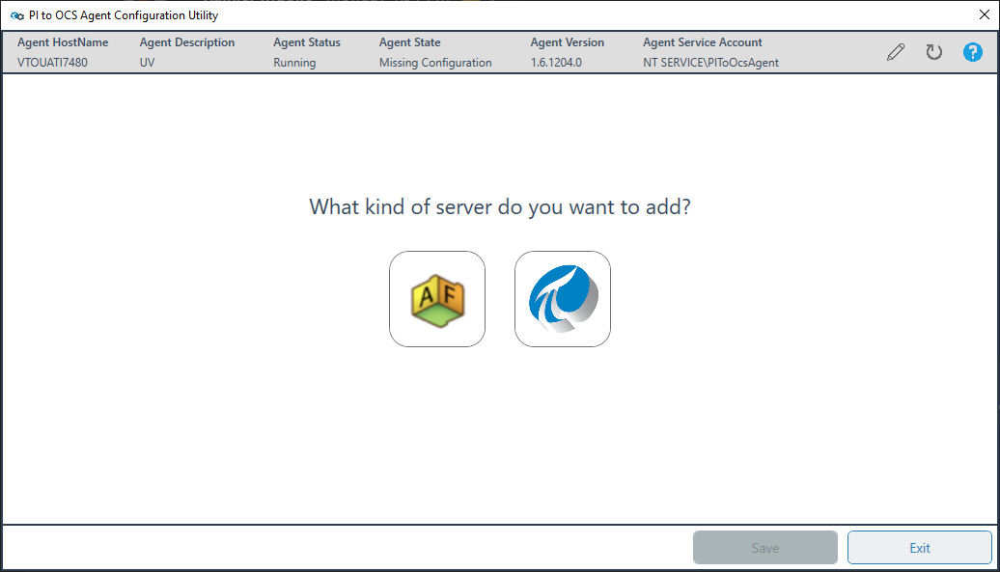

# Run the PI to OCS Agent Configuration Utility

Use the PI to OCS Agent Configuration Utility to configure your PI Data Archive server connection settings before creating a data transfer. After a PI to OCS Agent installation or upgrade, you can use the utility to add or change the source PI Data Archive, view connection details, add PI mappings, and set data privacy settings.

### Topics in this section

* [Add a PI Data Archive](#add-a-pi-data-archive)

* [Create a PI mapping](#create-a-pi-mapping)

* [Set data privacy and add an agent description](#set-data-privacy-and-add-an-agent-description)

* [List of agent status states](#list-of-agent-status-states)

* [Access the PI to OCS Agent Configuration Utility](#access-the-pi-to-ocs-agent-configuration-utility)

* [Uninstall an agent](#uninstall-an-agent)

   

## Add a PI Data Archive

You must add and configure the source PI Data Archive you want to transfer on-prem data from to OCS. If you are upgrading an agent, the PI to OCS Agent Configuration Utility maintains the previously selected PI Data Archive configuration.

#### Before you begin

Install the [PI to OCS Agent](xref:install-agent). To open the PI to OCS Agent Configuration Utility, click the **Windows** menu button, then click **OSIsoft > PI to OCS Agent Configuration Utility**.

### Procedure

1. Click the  button in the PI to OCS Agent Configuration Utility.
   
   
   
2. Enter the name of the source PI Data Archive in the text box, then click **Add Server**.

   **Result:** After successful detection, the PI Data Archive connection is added and you are advanced to the next page of the utility.
   

3. Review the following details for your PI Data Archive:
   * Server name, version, and server ID
   * IP address
   * PI mapping (see [Create a PI mapping](#create-a-pi-mapping) for more information)
   * Connection status and timeout

4. **Optional:** Click the pencil icon next to the **Connection Timeout (sec)** text box to change the length of time the agent checks for a server connection before timing out.

5. **Optional**: Click the **Test Connection** button to confirm that the connection to the Data Archive is working.

6. **Optional**: Click the **Remove Server** button to remove the configured PI Data Archive from the PI to OCS connection.

7. Click **Save** to retain and add your PI Data Archive configuration.

8. Optional: If you are finished, click **Exit**.

   **Note:** You must click **Save** to finish setting up your PI Data Archive connection.  

## Create a PI mapping 

PI mappings enable access to data stored on a PI Data Archive by service accounts assigned to a PI identity.  PI mappings can be created for a PI identity, user or group. Accounts assigned to a PI identity can read and transfer PI point data to OCS. See ["What are PI identities and mappings?"](https://docs.osisoft.com/bundle/pi-server/page/what-are-pi-identities-and-mappings_new.html) for more information. The following applies to PI mappings:

* The user account used to launch the utility must have permissions to create mappings.
* You can edit mappings.

#### Procedure

1. In the PI to OCS Agent Configuration Utility, click the pencil icon next to the **PI Mapping** field.
   **Result:** The **Configure Mapping** dialog box opens.

2. Select an identity for the PI mapping under Identity.
3. Click **Edit**.
   
   **Result:** The PI mapping is created for the selected identity, group or user.
   
   **Note:** If a PI mapping has already been created with another tool, a warning is displayed. 
4. Click **Close** to return to the utility, then click **Save**.

## Set data privacy and add an agent description

You can set data privacy settings and assign a descriptive name to an agent in the PI to OCS Agent Settings dialog box. In the OCS portal, this description appears where the agent is referenced, and also allows you to search by agent name. Data privacy settings control if the host name of a PI Data Archive is published and displayed in OSIsoft Cloud Services (OCS). 

**Note:**  By default, OCS does not publish host names.  If you opt to have the host name published, it appears in the OCS portal on the PI to OCS Agents window. 

#### Procedure

1. In the PI to OCS Agent Configuration Utility, click the pencil icon to the right of the **Agent Service Account** field.
   **Result:** The `PI to OCS Agent Settings` dialog box opens.

   

2. To have your PI to OCS Agent's hostname visible and published in OCS, select the **Opt-in to publishing PI to OCS Agent Hostname in OCS?** option.

3. Optional: Enter a descriptive name for the agent In the **PI to OCS Agent Description** text box.

4. Click **Ok** to save your selections, then click **Save** in the utility.

## List of agent status states

It may take a few minutes for your PI System to be registered. The following states may appear under the Agent Status field in the PI to OCS Configuration Utility to indicate a connection issue.

| **State**                     | **Description**                                              |
| ----------------------------- | ------------------------------------------------------------ |
| Data  Source Connection Issue | Indicates  the PI To OCS Agent isn’t able to connect to the PI Data Archive. Some  reasons for this status include the PI Data Archive is turned off, a firewall  issue is preventing connections or an incorrect name is configured for the  Data Archive (for example, trying to connect to a machine that doesn’t  exist/was renamed). There may be additional reasons for this status. |
| Data  Source Security Issue   | Indicates  the PI Data Archive connection is unsecure and security settings need to be  addressed. |
| Missing Configuration         | The PI Data Archive server or AF server has not been configured in the PI to OCS Agent. |
| Registration Failed           | Contact OSIsoft Customer support for assistance.             |
| Registering                   | The PI to OCS Cloud portion is creating the necessary resources for your PI to OCS Agent. |
| Shutdown                      | The last communication that the PI to OCS Cloud had with the agent was a shutdown message. |

## Access the PI to OCS Agent Configuration Utility

You can open the PI to OCS Agent Configuration Utility to change server connections and other settings after the initial setup. 

**Note:** If you're not the original user who installed the agent, the new user account will need to be authenticated in OCS before access is granted to the utility. 

### Procedure

1. Click the Windows menu button.

2. On the Windows menu, scroll down and click **OSIsoft > PI to OCS Agent Configuration Utility**, then click **Yes**. 

   **Result:** Upon successful authentication, the **PI to OCS Agent Configuration Utility** opens.

   **Note:** If you have not yet added a PI Data Archive server, see [Add a PI Data Archive](#add-a-pi-data-archive) for instructions.

## Uninstall an agent

You may want to remove a PI to OCS Agent from a host machine. To uninstall an agent, open the **Apps & features** window and then follow the prompts in the **PI to OCS Agent** window.

#### Procedure

1. Click the Windows Start button, then click the **Settings** button.

   **Result:** The `Windows Settings` window opens.
2. Double-click **Apps**.

   **Result:** The `Apps & features` window opens.
3. Scroll to and click **PI to OCS Agent** in the list of installed apps.
4. Click **Uninstall** twice, then click **Yes** in the `User Account Control` window.

   **Result:** The `PI to OCS Agent (Administrator)` window opens.
5. Select the **Uninstall** option, then click **Next**.
6. Click the **Unregister agent from OCS** option, then click **Next**.

   **Result:** The agent's associated client and connection information is removed in OCS.
7. Select the user account you wish to use to log on to OCS.

   **Result:** You are returned to the `PI to OCS Agent` window.
8. Click **Uninstall**, then click **Close**.

   **Result:** The PI to OCS Agent is uninstalled and removed from the host machine.