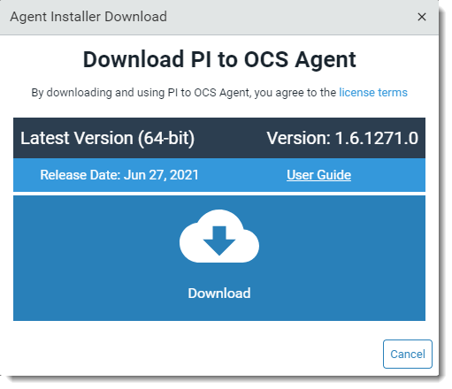
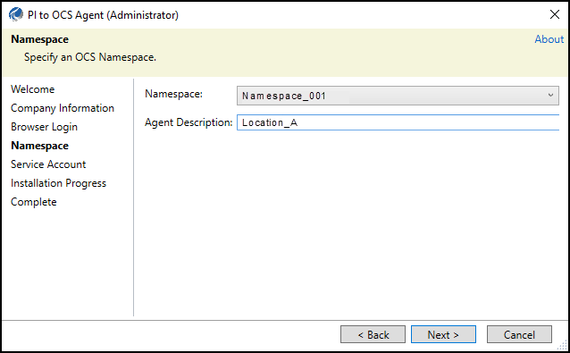
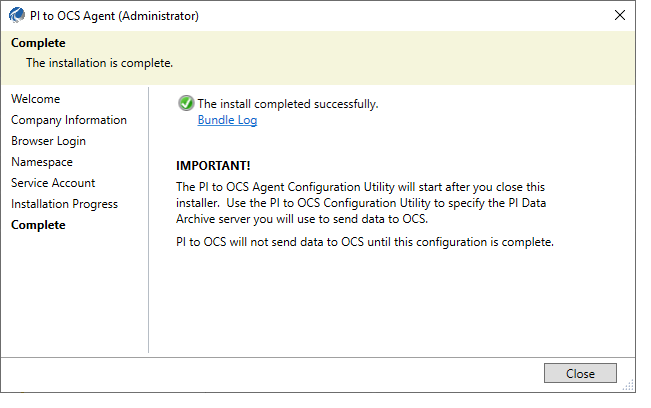

# Install the PI to OCS Agent

Follow these guidelines to install the PI to OCS Agent:

* Install the agent on a host computer separate from your PI Data Archive deployment
* Use an account that has been granted Administrator privileges

You can download the PI to OCS Agent Installation kit and then transfer it to the computer that will host the agent.

**NOTE:** The PI to OCS Agent installation cannot be completed if the system time is not correct. Additionally, you cannot complete the PI to OCS Agent installation if Internet Explorer Enhanced Security configuration is enabled. See [Disable Internet Explorer Enhanced Security Configuration](xref:disable-ie-security) for details. 

## Topics in this section

This topic contains these sections:

* [Install the PI to OCS Agent](#install-the-pi-to-ocs-agent)

* [Verify the PI to OCS Agent is running and registered](#verify-the-pi-to-ocs-agent-is-running-and-registered)

## Install the PI to OCS Agent

### Procedure

1. In the OCS portal, click the  icon, then click **Data Collection > PI to OCS Agents**.

   **Result:** The `PI to OCS Agents` window opens.
2. Click the **Download Agent** button.

    **Result:** The **Agent Installer Download** dialog box opens.

3. Download the agent to the desired location.

4. Navigate to the downloaded PI to OCS agent installation file.
5. Right-click the PI to OCS Agent installation file, then click **Run as administrator**.
6. Click **Yes**.

   **Result**: The **Welcome** page opens.
7. Click **Next**.

   **Result:** The **Company Information** page opens.
   
8. Enter your OCS tenant ID or company alias in the **Tenant ID or Company Alias** text box, then click **Next**.

   **Note:** You are logged on to your tenant account in OCS.  The account used to log on must be assigned to the OCS Tenant Administrator role to complete the PI to OCS Agent installation.

   **Result:** The PI to OCS Agent setup kit advances to the **Browser Login** page. An OCS message on the status of the user authentication process opens in your browser. 
9. Close the browser window, then click **Next** in the PI to OCS Agent setup kit.

    **Result:** The **Namespace** page opens.

10. Select or enter the following information for your PI to OCS connection:

   * **Namespace**: Select the location where your transferred data will be stored. The region indicates where the namespace resides. Streaming data sent by the PI to OCS Agent only goes to the selected namespace's region.
   
   * **Agent Description:** Enter an optional name for your agent.

11. Click **Next** to open the **Service Account** page, then select a service account for the connection:

    * **NT Service**: Use an NT account to connect to PI Data Archive.

    * **This account**: Specify a user name and password (domain\account) to connect to PI Data Archive.

    **Note:** The service account must have Administrator privileges and read access to certain data on PI Data Archive.

12. Click the **Install** button.

    **Result:** The PI to OCS Agent is installed.

    **Note:** Installation may take a few moments.

    
13. Click **Close** to close the agent setup kit.

    **Result**: The PI to OCS Configuration Utility opens. See [Run the PI to OCS Agent Configuration Utility](xref:pi-to-ocs-utility) for instructions.

    **Note:** An agent cannot be registered until a PI Data Archive server has been added and configured.

## Verify the PI to OCS Agent is running and registered

After installation, check that the PI to OCS Agent Windows service is running on the machine where the agent is installed. You also should confirm the agent has been registered in OCS.

### Procedure

1. On the host machine where you installed the agent, type *services.msc* in the text box next to the Windows menu button, then press ENTER.
2. In the `Services` window, scroll to and verify that that the PI to OCS Agent’s status is running.

3. Navigate to the **PI to OCS Agents page** in OCS, then select the connection you just created. 
4. On the **Details** pane, Verify that "Registered" appears next to the **Agent Status** field.
   

   **Note:**  The agent status is also visible in the PI to OCS Configuration Utility.  See [List of agent status states](xref:pi-to-ocs-utility) for a list of states and descriptions that explain why an agent may not be running.