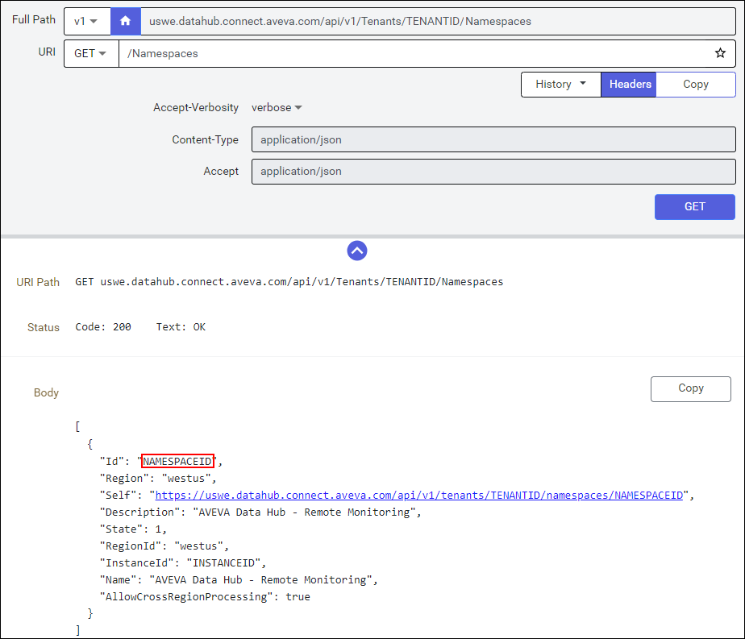

# Install the PI to Data Hub Agent

The PI to Data Hub Agent can be installed as part of the PI Server installation kit, or as a standalone install.

## Configure access to PI Data Archive Security tables, PI point data, and optional AF server

For the following PI Server data, you will need to enable read access to the PI identity, PI group, or PI user that the PI to Data Hub Agent is connecting as. For AF Server, ensure the AF Identity that the PI to Data Hub Agent is connecting as has read access to the elements and attributes to be transferred. 

- Archive data (PIARCDATA Security table)

- The PI points configuration table (PIPOINT Security table)

- The PI points and data to be transferred

- The AF server elements and attributes to be transferred 

If PI to Data Hub is remote to PI Data Archive and AF server, it is recommended to use a domain account as the `Run as` user for the PI to Data Hub Agent service. 

## Install the PI to Data Hub Agent

This section describes how to install the PI to Data Hub Agent using the standalone PI to Data Hub Agent installation kit. For guidance on installing the PI to Data Hub Agent with the PI Server installation kit, refer to the PI Server 2023 (or greater) documentation. 

To install the standalone PI to Data Hub Agent:

1. In the left pane of the AVEVA Data Hub portal, select **Data Collection** > **PI to Data Hub Agents**.

1. Select **Download Agent**.

1. On the `Agent Installer Download` window, select **Download**. When the download completes, close the window.

1. Open the downloaded PI to Data Hub Agent installation file, then select **Yes** to confirm running the installation file.
   
   The `Welcome` page of the PI to Data Hub Agent window opens.

1. On the `Welcome` page, select **Next**.

   The `Service Account` page opens.

   **Note:** The Service Account page is shown only for new installations.

1. On the `Service Account` page, select the service account type for the connection:

   - **NT Service** - Select NT account for the service to run as NT SERVICE\PIToDataHubAgent.

   - **This account** - Specify a username and password (domain\account) for the `Run as` user for the PI to Data Hub Agent service.

   **Note:** For Windows integrated security, the service account selected on this page determines the account to use for PI Identity mapping and AF Mapping. The `Run as` user can be changed after the installation from the Windows Service control panel. Changing this account may require configuration changes to PI Mapping and AF Mapping, but changing the account will not otherwise affect the access to local resources needed by the agent.

1. Select **Install**.

1. After the agent is installed, select **Close**.

   The PI to Data Hub Configuration Utility opens. See [Run the PI to Data Hub Agent Configuration Utility](xref:pi-to-ocs-utility) for instructions.

   **Note:** Agent registration is not complete until you add and configure a PI Data Archive server in the PI to Data Hub Configuration Utility.

## Silent Installation Instructions for PI to Data Hub Agent 

There are several use cases for doing a silent installation of the PI to Data Hub Agent. 

- Silent installations are useful for automating deployments. 

- Silent installations avoid browser logins to PI to Data Hub. A new, interactive installation requires that Internet Explorer Enhanced Security be disabled, and some customers cannot disable this security. 

- Installations of the PI to Data Hub Agent on Windows Server Core Operating System is supported only with a silent installation. 

### Silent installs for new installations 

These instructions can be used to set up a new installation of the PI to Data Hub Agent, configured with connections to AVEVA Data Hub, without needing to run the PI to Data Hub Configuration Utility. The command lines in this section can be used for upgrades as well, but tenant, namespace, PI Data Archive, and AF server cannot be changed during an upgrade. Command line parameters related to this will be ignored. For the minimal command line needed for upgrades, see Silent Installations for Upgrades or Minimal New Installations.

1. Create a client-credentials client with an assigned role of Tenant Contributor and add a secret. See <xref:gpClientCredentialsClient>.

   **Note:** Be sure to record the Client Id and Client Secret where you can access it again, because this is the only time you will have access to this information. You will need this information to proceed with the silent install. 

1. Find the TENANTID and record it where you can access it.

   When you log into AVEVA Data Hub, the TENANTID is visible in the URL. It is the long GUID.
   `https://datahub.connect.aveva.com/tenant/[YOUR TENANT ID]/dashboard`

   Alternatively, select **Developer Tools** > **API Console** and the TENANTID is displayed in the Full Path.
   `uswe.datahub.connect.aveva.com/api/v1/Tenants/[YOUR TENANT ID]/Namespaces`. 

1. Find the NAMESPACE Id and record it where you can access it.

   Select **Developer Tools** > **API Console** and select **GET**. The NAMESPACE Id appears as the `Id` field in the response.

   

   **Note:** If you have multiple namespaces, you will have multiple entries in this list. Be sure to select the NAMESPACE Id of the namespace where you want PI to Data Hub Agent to send data. 

1. Open a Windows command prompt as an administrator.

1. Change to the folder where you have downloaded the PI To Data Hub Agent installation kit. 

1. If you do not need to configure an Alternate Display Name for your Data Archive or AF servers, enter the following command. This command will immediately register the agent with the actual PI Data Archive name specified by the DATAARCHIVE command line argument.

   **Note:** The TENANTID, CLIENTID, CLIENTSECRET, and NAMESPACE keywords are required for the agent to connect to AVEVA Data Hub at installation time. All keywords are case sensitive. SERVICEACCOUNT and SERVICEPASSWORD provide the `Run As` user and password, respectively, for the PI to Data Hub Agent service. 

   `PItoDataHubAgent_SetupKit.exe TENANTID=[tenantid] CLIENTID=[clientid] CLIENTSECRET=[clientsecret] NAMESPACE=[namespaceID] DATAARCHIVE=[DataArchiveName] AFSERVER=[AFServerName] SERVICEACCOUNT=[user] SERVICEPASSWORD=[password] AGENTDESCRIPTION="Your Description" /quiet`

1. If you need to configure an Alternate Display Name for your Data Archive or AF servers, enter the following command. The PI Data Archive, AF server, and Alternate Display Names will be configured in a subsequent step.

   **Note:** The TENANTID, CLIENTID, CLIENTSECRET, and NAMESPACE keywords are required. All keywords are case sensitive. 

   `PItoDataHubAgent_SetupKit.exe TENANTID=[tenantid] CLIENTID=[clientid] CLIENTSECRET=[clientsecret] NAMESPACE=[namespaceID] AGENTDESCRIPTION="Your Description" /quiet`

1. Check that the PIToDataHubAgent service is running.

   From an administrative command prompt, run the command `net start | find "PI"` and verify that "PI To Data Hub Agent" is in the list. 

1. Check the event logs for any errors.

   1. Right-click on Start and select **Event Viewer**.

   1. Select **Applications and Services Logs** and double-click **PI to Data Hub**.

   For Windows Server Core operating systems, you can connect to the Event Viewer remotely.

1. Check the setup logs.

   1. Open a command prompt and navigate to `%ProgramData%/OSIsoft/Setup/log`.

   1. Logs can be listed from oldest to newest with the command `dir /od`.

1. (Optional) Configure an Alternate Display Name for PI Data Archive and/or AF server.

   1. Open an administrative command prompt and navigate to `%ProgramData%/OSIsoft/PItoDataHub`.

   1. Run the command `notepad.exe appsettings.json`.

   1. To specify an alternate display name for the Data Archive, add the following AlternateDisplayName entry. If you did not specify AFSERVER and DATAARCHIVE on the command line above, you will need to add the server names in this step as well as specifying the alternate display name. 

      ```
      "PIDataArchiveServerNames": [ 
          { 
            "Name": "MyActualDataArchiveServerName", 
            "AlternateDisplayName": "AlternateDisplayName", 
            "ConnectionTimeout": 10, 
            "OperationTimeout": 60 
          } 
        ],
      ```

   1. To specify an alternate display name for AF, add the following AlternateDisplayName Entry: 

      ```
      "PIAssetFrameworkServerNames": [ 
          { 
            "Name": "MyActualAFServerName", 
            "AlternateDisplayName": "AlternateDisplayName", 
            "ConnectionTimeout": 10, 
            "OperationTimeout": 60 
          } 
        ], 
      ```

   1. Save the changes and restart the PI to Data Hub Agent service from an administrative command prompt with the commands:

      `net stop pitodatahubagent`

      `net start pitodatahubagent`

1. Verify your agent is visible on the `PI to Data Hub Agents` page in the portal and ready to configure. 

### Silent installations for upgrades or minimal new installations 

These instructions can be used to upgrade the PI to Data Hub Agent. They can also be used for a new installation of the PI to Data Hub Agent, but the installation requires configuration with the PI to Data Hub Configuration Utility for the new installation.   

1. Open a Windows command prompt as an administrator. 

1. Change to the folder where you have downloaded the PI To Data Hub Agent installation kit. 

1. Run the following command:

   `PItoDataHubAgent_SetupKit.exe /quiet`

The above command is sufficient for an upgrade. For a new installation, run the PI to Data Hub Configuration Utility to register the PI to Data Hub Agent after the silent installation completes.
