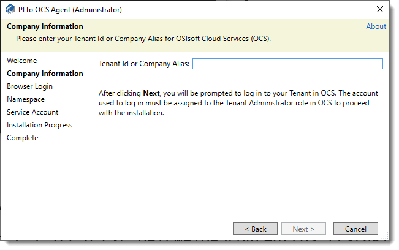
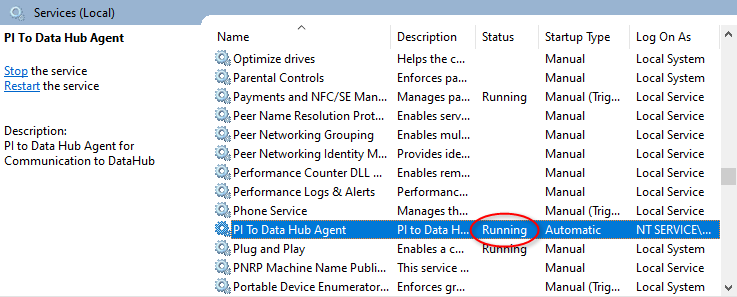
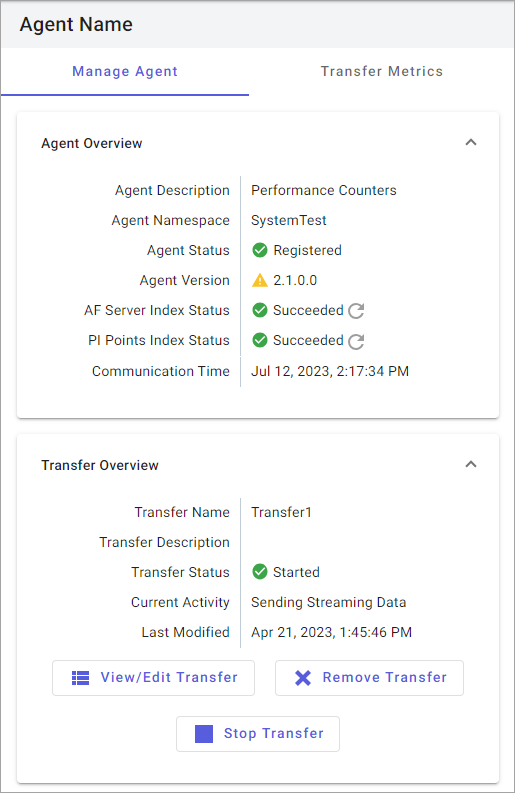

# Install the PI to OCS Agent

When you install the PI to OCS Agent, make sure to follow these guidelines:

* Install the agent on a host computer separate from your PI Server deployment.
* Use a domain account that has been granted Administrator privileges on a computer registered to the same domain.
* Enable read access to Data Archive security tables and the PI points and data to be transferred.
* Enable read access to the AF server elements and attributes to be transferred.

You can download the PI to OCS Agent from the PI to OCS Agents page on the portal and then transfer it to the computer that will host the agent.

**NOTE:** The PI to OCS Agent installation cannot be completed if the system time is not correct. Additionally, you will not be able to complete the PI to OCS Agent installation if Internet Explorer Enhanced Security configuration is enabled. See [Disable Internet Explorer Enhanced Security Configuration](xref:disable-ie-security) for details. 

## Configure access to PI Data Archive Security tables, PI point data, and optional AF server

**Important:** The PI to OCS Agent requires the Windows service account to "run as user". Enable read access to the following PI Server data:

* Archive data (the PIARCDATA Security table)
* The PI points configuration table (PIPOINT Security table)
* The PI points and data to be transferred
* The AF server elements and attributes to be transferred 

## Topics in this section

This topic contains these sections:

* [Install the PI to OCS Agent](#install-the-pi-to-ocs-agent)

* [Verify the PI to OCS Agent is running and registered](#verify-the-pi-to-ocs-agent-is-running-and-registered)

## Install the PI to OCS Agent

1. In the left pane, select **Data Collection** > **PI to OCS Agents**.

2. Click the **Download Agent** button.

   **Result:** The **Agent Installer Download** dialog box opens.

3. Download the agent to the desired location.

4. Navigate to the downloaded PI to OCS agent installation file.

5. Right-click the PI to OCS Agent installation file, then click **Run as administrator**.

6. Click **Yes**.

   **Result**: The **Welcome** page opens.

7. Click **Next**.

   **Result:** The **Company Information** page opens.

   

8. Enter your tenant ID or company alias in the **Tenant Id or Company Alias** text box, then click **Next**.

   **Note:** You are logged on to your tenant account.  The account used to log on must be assigned to the Tenant Administrator role to complete the PI to OCS Agent installation.

   **Result:** The PI to OCS Agent setup kit advances to the **Browser Login** page. An message opens in your web browser regarding the status of the user authentication process. 

9. Close the browser window, then click **Next** in the PI to OCS Agent wizard.

   **Result:** The **Namespace** page opens.

10. Enter the following information, then click **Next**:

    * **Namespace**: Select the location where your transferred data will be stored. The region indicates where the namespace resides. Streaming data sent by the PI to OCS Agent only goes to the selected namespace's region.

    * **Agent Description:** Enter an optional name for your agent.

      **Result:** The **Service Account** page opens.

11. Select the service account type for the connection:

    * **NT Service**: Use an NT account to connect to PI Data Archive.

    * **This account**: Specify a user name and password (domain\account) to connect to PI Data Archive.

    **Note:** The service account used to run the PI to OCS Service requires Administrator privileges. Read access to the PIARCDATA Security and PIPOINT Security tables, the PI points and data to be transferred, and the AF server, elements, and attribute data is required.

12. Click the **Install** button.

    **Result:** The PI to OCS Agent is installed.

    **Note:** Installation takes a few moments.

13. After the agent has been successfully installed, click **Close** to exit the wizard.

    **Result**: The PI to OCS Configuration Utility opens. See [Run the PI to OCS Agent Configuration Utility](xref:pi-to-ocs-utility) for instructions.

    **Note:** An agent cannot be registered until a PI Data Archive server has been added and configured in the PI to OCS Configuration Utility.

## Verify the PI to OCS Agent is running and registered

After installation, check that the PI to OCS Agent Windows service is running on the machine where the agent is installed. You also should confirm the agent is registered in OCS.

### Procedure

1. On the host machine where you installed the agent, type *services.msc* in the text box next to the Windows menu button, then press ENTER.

2. In the `Services` window, scroll to and verify that that the PI to OCS Agent's status is running, then close the window.

   

3. Navigate to the **PI to OCS Agents** page, then select the connection you just created.

4. On the **Details** pane, verify that "Registered" appears next to the **Agent Status** field.

   

   **Note:**  The agent status is also displayed in the PI to OCS Configuration Utility.  See [List of agent status states](xref:pi-to-ocs-utility#list-of-agent-status-states) for a list of states and descriptions that explain why an agent may not be running.
