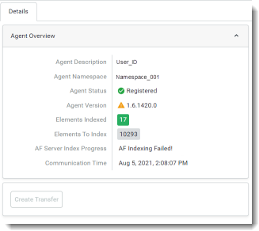

# Troubleshoot failed AF indexing

Immediately after PI to OCS Agent registration, AF indexing is initiated and must finish successfully before a new transfer can be defined. The progress of AF indexing is displayed next to the **AF Server Index Progress** field on the **Agent Overview** pane, as shown in the image below.

If the  **"AF Indexing Failed!"** message appears next to this field, follow these steps to reinitiate AF indexing:

1. Navigate to the cache files on the local PC where the agent runs: `C:\ProgramData\OSIsoft\PIToOCS\Cache`.

1. Delete the `Cache` folder. 
 
1. Reboot the host machine that the PI to OCS Agent runs on (recommended) or stop/restart the PI to OCS service.

**Note:** It is possible for an agent to complete and indicate that indexing has completed, but still need to re-index.  Additionally, there may be times when an agent appears to be working, but you are unable to create a transfer. In both cases, OCS advises to restart the PI to OCS Agent to initiate AF indexing.
