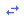

# Create and configure an asset

Follow the procedures to create an asset, add and configure its metadata and properties, and select and configure a property whose status will be visible in the card or table view.

## Create the asset

1. In the left pane, select **Visualization** > **Asset Explorer**.
 
1. Click the **Change Namespace** button in the upper-right toolbar, then select the desired namespace.

5. Verify that the **Assets/Asset Type** selector is set to **Assets**.

5. Click the **+** in the toolbar to create a new asset.

     The `Select Type for New Asset` window opens. By default, the type selected is  <None>.

6. Accept the default and click **Continue**.

    The details blade opens on the right side. 

1. Enter a name and description for the asset.

## Add metadata to the asset

1. Click the **Metadata** tab and click **Add Metadata**.

    **Note:** Metadata is static attributes about assets, for example, model or region.

    Result: The fields for entering the metadata details appear. 

    <!-- We need a definition for metadata that covers its use in different OCS contexts. --> 

2. Enter a name for the metadata.

3. Optional: Enter a value for the metadata and select a type.
   
    **Note:** The value must match the selected type. The following date/time format is supported: MM/DD/(YY)YY hh:mm(:ss).

    <!--WRITER NOTE: What date/time formats are supported? Is this the same as for PI Server? i.e., Microsoft standard date/time formats? -->

4. (Optional) Select a UOM.

5. Continue adding metadata for the asset. 

## Add properties to the asset

1. Click the **Properties** tab. 

1. Click **Add Stream References** to add a property.

1. In the `Select Streams` window, select the stream you want.
   
     **Note:** Use the search box to find the stream. You can search on the stream name, description, or the type. Use the asterisk (*)  as a wildcard character.

1. Click **Add**. 
  
   **Result:** The stream reference appears in the right pane. This is the automatically generated user-friendly stream name. You can edit this name.
         
1. Click the scroll bar to display the properties for the stream reference.
   
1. Click **Configure UOMs**. 

1. On the `Configure UOMs` page, make any changes to the property UOMs.

    **Note:** UOMs can be set only on numeric types.

1. When you are done, click **Save**.

    **Note:** Once you click **Save**, any changes are immediately made to the UOMs on the stream, regardless of any other actions you take on this asset. For example, the UOM changes to the stream are not reversed if you click **Cancel** on the **Properties** tab or if you delete the asset.

## Add status tracking to the asset

1. Click the **Status** tab.

2. Click **Add Status Configuration**.

3. In the `Select Property` window, click the property that you want to display status for. Click **Continue**.

    **Note:** Only properties with enumerated states or string values can be selected for the asset status;  therefore, only these properties are displayed. 

    You can only specify one property as the asset's status. 

1. Click the status icons to map the icon for each value.
    
    **Tip:** You can switch to a different property by clicking the  icon.

## Save the asset

1. Click **Save**. 

## Related links

- [Assets](xref:AssetsProperties) Properties
- [Assets API](xref:AssetsAPI)