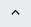

# Create an asset from an asset type

For more information on asset types, see [Asset types](xref:AssetTypes).

## Procedure

1. In the left pane, select **Visualization** > **Asset Explorer**.

1. Click the **Change Namespace** button in the upper-right toolbar, then select the desired namespace.

1. Verify that the **Assets/Asset Type** selector is set to **Assets**.

1. Click the **Add Asset** button to open the `Select Type for New Asset` dialog box. 

1. Select the type from the list and click **Continue**.
   
   **Result:** The details blade opens to the right.

1. Enter a name and description for the asset.

    **Note:** The asset type on which this asset is based is shown in the `Asset Type` field.

1. Click the **Metadata** tab. 

1. Edit the values for any of the metadata.

    **Note:** You can only edit the values. The metadata are derived from an asset type, as indicated by the **T** and, therefore, you cannot add or delete metadata or change the type.

1. Click the **Properties** tab.

1. Click the caret  icon to reveal the stream reference configuration details. 

1. Click **Choose a Stream** to open the `Select Stream` window.

1. Select the stream from the list of streams.

     **Note:** Only streams of the type specified for the stream reference are displayed. You can search the stream name, ID, or description. You can use the asterisk (*) as a wildcard.

1. Click **Add**.

1. Click **Configure UOMs**. 

1. On the `Configure UOMs` page, make any changes to the property UOMs.

    **Note:** UOMs can be set only on numeric types.

1. When you are done, click **Save**.

     **Note:** Once you click **Save**, any changes are immediately made to the UOMs on the stream, regardless of any other actions you take on this asset. For example, the UOM changes to the stream are not reversed if you click **Cancel** on the **Properties** tab or if you delete the asset.

1. Click **Save** to save the asset.

## Related links

- [Assets](xref:AssetsProperties) Properties
- [Asset Types API](xref:AssetTypesAPI)
