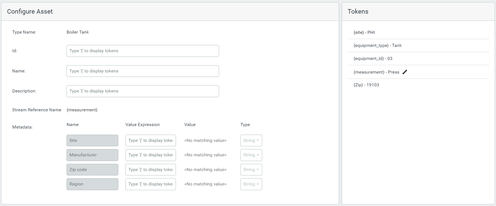
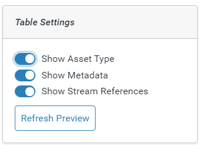

# Create asset rules

Asset rules identify patterns in stream names and use this information to automatically create assets. In order to generate the assets, stream names must have the following characteristics:

- Stream names must have a pattern that can be mapped for configuration.

- Stream names must include a set of characters that uniquely identify the asset.

- The stream name must include a unique set of characters that identifies one stream from another for the same asset.  For example, the stream name could include an abbreviation for the stream measurement. 

 The asset rule identifies the pattern and the parts of the stream name and stream metadata that provide information about the asset. A “token”  is created for each part of the pattern and piece of information. The tokens are used to construct the asset and add references to the relevant streams.

Depending on the definition and consistency of the stream names, you may have to create multiple rules to capture all the relevant streams for your asset. For more information, see [Using multiple asset rules to create assets](xref:UsingMultipleRules).

## Tank Rule A example

<!-- Writer's Note: This example can be found in the DaedalusTest tenant, VizTesting namespace. See Prachi Bagayatkar or Scott Harrison for access. -->

Throughout the [Use the Asset Rule Builder to create the asset rule](#create) procedure, we refer to the following simple example. There are three tank assets. The following characters in the stream names identify the three assets : SL-Tank01, SL-Tank02, and PHI-Tank03. There are two streams for each tank, one stream with temperature data (indicated by *Temp* in its name) and the other with pressure data (indicated by *Press* in its name).

We will construct an asset rule, named Tank Rule A, that creates three assets, one for each tank. Each asset will include references to the two streams that belong to that tank. The following table displays the six streams, the asset associated with the stream, and the measurement in each stream. 

| Stream Name     | Asset Name | Stream Measurement |
| --------------- | ---------- | ------------------ |
| SL-Tank01Press  | Tank 01    | Pressure           |
| SL-Tank01Temp   | Tank 01    | Temperature        |
| SL-Tank02Press  | Tank 02    | Pressure           |
| SL-Tank02Temp   | Tank 02    | Temperature        |
| PHI-Tank03Press | Tank 03    | Pressure           |
| PHI-Tank03Temp  | Tank 03    | Temperature        |

## Add an asset rule and select the stream

1. Click the  icon and click **Asset Management** (under Data Management).

2. In the `Select a Namespace` dialog, click the namespace in which you want to create the asset rule.

3. Click **Add a Rule**.

4. In the `Create New Asset Rule` dialog, enter the following:
   - `Name` &ndash; Name of the asset rule. The name must be unique within a namespace.
   
     In this example, the asset rule is named *Tank Rule A.*
   
   - `Description` &ndash; (Optional) Description of the rule
   
   - `Asset Type` &ndash; (Optional) Asset type on which the asset is based. The assets created with the asset rule will inherit the properties of the asset type, including stream type, metadata, and status configurations.
   
     In this example, the asset type is named Boiler Tank.
     
     For more information on asset types, see [Asset types](xref:AssetTypes) and [Create an asset from an asset type](xref:CreateAssetFromAssetType).

   **Note:** If your rule is not based on an asset type, there are some differences in the procedure. These differences are noted in the steps.

5. Click **Continue**.

6. In the `Select Stream` dialog, click the stream that will be the basis for creating the asset rule. 

   OSIsoft recommends that you pick a stream whose name is a good representation of the stream names for which this rule is being built.
   
   In this example, we use the PHI-Tank03Press stream to create the stream pattern.
6. Click **Add**. 
   
   The `Asset Rule Builder` window displays.

## Use the Asset Rule Builder to create the asset rule

The Asset Rule Builder walks you through the following steps to create and execute the asset rule:

1. [Extract the tokens from the stream](#step-1)
2. [Map the tokens to values](#step-2)
3. [Configure the asset](#step-3)
4. [Preview the asset](#step-4)

### Step 1: Extract the tokens from the stream

In this step, you configure the pattern used to find and match the appropriate streams. You isolate each part of the stream name and create a token for it. The rule contains intelligence to recognize special characters (such as periods, dashes, and underscores) in the stream name as delimiters. By default, the rule uses any special characters in the name to isolate the stream parts and facilitates the rule-building process. In this step, you also create tokens for the stream metadata. 

1. Move the slider, as needed, to correctly highlight the first identifiable section of the stream name. 

2. In the **1. Match** list, pick the choice that describes how the value is identified in the stream name. <!-- WRITER'S NOTE: I will add an explanation of each of the options after this gets revised. -->

3. In the **and name it** textbox, enter a name for the token.

4. Click **Capture**.  

   Referring to our [Tank Rule A example](#tank), the first part of all stream names identifies the site location. This is represented by the characters *SL* or *PHI*. In the PHI-Tank03Press stream, the site location is represented by the characters *PHI*. This part of the stream name is selected in the screen capture below.

   The **1. Match** list of choices displays different ways in which this string of characters can be identified by the asset rule. Some of the choices would work with the example stream, but they would fail to identify the site information in all stream names. For example, *the string literal "PHI"* or *the next 3 characters*  would not identify *SL* as the site. 

   As you create your tokens, keep in mind that the descriptor must be able to extract the correct information for all of the streams that you want identified by this rule. The rule must also exclude any streams that you do not want identified with this rule, for example, streams that belong to a pump asset. In this example,  *everything preceding the delimiter"-"* will extract the site information for all streams. 

   The token is assigned the name *site*. 

   <!-- WRITER'S NOTE: All the screen captures need to be reviewed and probably updated. In particular, the screen captures in this "Step 1: Extract the tokens from the stream" will need to be updated. The wording of the choices is being changed. -->

   
   The token and the placeholder value, *{site} - PHI*, are added to the **Tokens** list in the right pane. 

5. Repeat steps 1-4 for each part of the stream name. 

   In this example, the second part of the stream name is the type of equipment. Notice that the match options change depending on what portion of the stream name is highlighted. The first option is disabled because it cannot be applied. *Tank* is matched using *the next group of letters* choice. The token is assigned the name *equipment_type*. 

   **Note:** There are other matching options which could be used with our streams, *the string literal "Tank"* or *the next 4 letters*. However, we want to be able to use this rule with equipment other than tanks or equipment with names that are not 4 letters long. Therefore, these are not good choices. 

   <!--WRITER'S NOTE: These images were taken with SnagIt and reduced by 50%. The resolution may be too fuzzy and they may have to be enlarged. -->

    
   
   The next part of the stream name is a number that identifies the equipment's ID. *03* is matched using  *the next group of numbers*, and this token is assigned the name *equipment_id*. Because we anticipate using this rule to create assets with Ids running into the thousands, we do not use *the next 2 numbers* to match the Id.

   

   The last part of the stream name identifies what is being measured in the stream. This token is matched using *the rest of the stream name*, and it is named *measurement*.
   
   
6. In the `Token Sources` pane on the left, click **Stream Metadata**.

   The stream metadata are displayed in the center pane.

7. Select the checkboxes for each stream metadata that you want to use to construct your assets. 

8. Click **Back to Stream Name Pattern**.

   The metadata tokens are added to the `Tokens` pane.

9. When you have completed identifying all the tokens in the stream name, click **Next**.

   The description of the stream pattern is displayed in the `Stream Name Pattern` pane. In the `Tokens` pane are the four tokens that make up the stream name pattern.

   

   The `Configure Steam Name Token` page displays.

### Step 2: Map the tokens to values

In this step, you specify which part of the stream name identifies the measurement in the stream. Then you map values for each token.

1. Click the  icon to open the `Select Stream Reference Name Token` dialog.

2. Select the token that identifies the part of the stream name that references the measurement on the asset. Click **Select**. <!--WRITER'S NOTE: This step is still not very clear. Please review it again after the UI changes which may make it clearer. -->

   In our example, the last part of the stream name (Press or Temp) is where the measurement is identified, and we gave this token the name *measurement*. 

   

   ****

   <!-- Writer's Note: The text on this page is changing. -->
   
   The token appears in the `<Select a Token>` field. 
   The `Token Mappings Status` pane displays a list of all the tokens identified on the previous page.  
   
   **Note:** The  icon identifies the token that is the measured quantity.

 

3. Select each token in the `Token Mappings Status` list.

4. In the `Token Value Mappings` pane on the right, choose either of the following: <!-- WRITER'S NOTE: Changes are coming. -->

   - **Use Existing Token Values** &ndash; OSIsoft Cloud Services (OCS) replaces the token with the values found in the stream names or in the stream metadata.
   - **Rename Token Values** &ndash; OCS replaces the value in the stream name and stream metadata with the mapped values.

   In this example, the equipment_type and equipment_id tokens use the existing token values. The following screen capture shows the token value mapping for the equipment_type token. 

   

5. If you want to map a different value in place of the token values, click the **Rename Token Values** option. Then click **Generate Mappings** to display the list of token values. 

6. in the `Generate Mappings` dialog, click **Generate** to confirm that you want to overwrite mappings with server-generated mappings. <!--WRITER'S NOTE: This message is changing. -->

   OCS searches for any streams that match the stream pattern, and it provides a list of the token values. 

   In this example, the *site* token is selected. **Rename Token Values** is selected, and **Generate Mappings** generates two values, PHI and SL. 

   

7. For each value on the left, provide the value you want to use in its place in the text box on the right.

   In this example, *PHI* is mapped to *Philadelphia*, and *SL* is mapped to *San Leandro*.

   
   
8. For the measurement token, select **Rename Token Values**, and then click **Generate Mappings** to generate the list of token values. 

9. Click in the text box to display a list of measurements or properties that are defined in the asset type. Select the correct value to map to the token value. 

   **Note:**  The values in the list are taken from the asset type. If your asset rule is not based on a type, then you must manually enter the values for each of the mappings.

   The screen capture below shows the values that are mapped for the *measurement* token.

   

10. You can provide additional mappings by clicking **Add Mapping**. 

11. When you have completed configuring the token values for all your tokens, indicated by the green check mark, click **Next**.

    The `Configure Asset` page displays. 

    

### Step 3: Configure the asset

In this step, you specify how the rule builds the asset by assigning the tokens to different asset fields. When the assets are generated, the tokens are replaced with the value mappings.

1. In the `Configure Asset` pane, click in each text box and enter **{** (left curly bracket symbol)  to see a list of tokens.

2. Select the token to add it to the text box. 

   You can string tokens together and separate them with spaces and periods.

   **Note:** `Id` and `Name` are required fields. `Description` is optional.

   In the following screen capture, the fields are specified with tokens. 
   
   
   
   **Note:**
   
     - The sequence of tokens used to specify the Id must resolve to a unique asset. Referring to our [Tank Rule A example](#tank), a combination of the site, equipment type, and equipment ID creates a unique ID for the tank. If the ID is not unique, the generated assets may incorrectly reference streams that belong to another asset.
     - The `Stream Reference Name` field shows the token that was provided in [Step 2](#step-2) as the measurement.

3. For each of the  metadata, click in the **Value Expression** text box, enter **{** (left parentheses symbol), and select the correct token from the list.

   **Note:** 

   - The list of metadata is automatically populated based on the asset type. You cannot add or delete any metadata. Select a value expression for the metadata you want defined for your assets and leave the others blank.
   - If your asset rule is not based on an asset type, then you must manually enter the metadata name in the `Name` field and select the correct token in the `Value Expression` field.

4. When you are finished entering the tokens for the asset properties and metadata, click **Next**.

###    Step 4: Preview the assets

The asset preview displays a list of the assets that will be created using the asset rule. Use the preview to verify that the rule creates all the assets you expect and they are created correctly.

1. Review the assets. Verify that they are created as you expect and verify that the correct streams are referenced.

   

   **Note:** 

   - The  icon identifies the metadata and the  icon identifies the stream references. 

   - The stream Id is identified for each stream. For example, the Id of the stream in the first row is PHI-TNK01.

1. Use the Table Settings to customize your preview.

   
   
   Use the metadata filters  to isolate the assets you want to view.
   
2. Refer to the asset rule statistics to validate that the rule produced the expected number of assets and the expected number of streams were processed. 

   In this example, we expect to see three assets as indicated in the **Total Assets**. **Streams Processed** is the total number of streams in the namespace. The asset rule checks every stream name in the namespace to see if it matches the specified pattern. In this example, six of the nine streams matched the pattern. 
   
   
3. Click the **Back** button to return to earlier steps and make any changes to the tokens, token mapping, or asset configuration. 

4. When you are satisfied with the results, click **Save & Execute**.

   The rule appears in the Asset Rule Builder list and a message confirms that the rule was successfully created. The rule is executed and applied to the streams, and the assets are created.
   
   **Note:** Click on the rule in the Asset Rule Builder list to open a pane that displays any errors that occurred during the execution of the rule.

## Review the assets

Once the asset rule is successfully executed, review the created assets and confirm the results.

1. From the  icon, click Asset Explorer (under Visualization).

2. Use search and the metadata filters to find the assets you expect to be created.<!-- Writer's Note: Add a link to the "Filtering Assets in the Asset Explorer" topic. -->

3. Verify that the assets in your preview have been created. 
    

4. Select one of the assets to see the details for the asset. 

    **Tip:** Click the pencil icon in the toolbar to see the individual streams referenced in the asset.

## See also

[How tokens are used in the Asset Rule Builder to generate assets](xref:TokensGenerateAssets) 

[Using multiple asset rules to create assets](xref:UsingMultipleRules)

