# Create an asset rule

An asset rule identifies patterns in a stream name and uses this information to automatically create assets. In order to generate assets, the stream names must have the following characteristics:

- A pattern that can be mapped for configuration.

- A set of characters that uniquely identify the asset.

- A unique set of characters that identifies one stream from another for the same asset. For example, the stream name could include an abbreviation for the stream measurement. 

The asset rule identifies the pattern and the parts of the stream name and stream metadata that provide information about the asset. A token is created for each part of the pattern and piece of information. The tokens are used to construct the asset and add references to the relevant streams. For more information, see [How tokens are used in the Asset Rule Builder to generate assets](xref:TokensGenerateAssets).

Depending on the definition and consistency of the stream names, you may have to create multiple rules to capture all the relevant streams for your asset. For more information, see [Using multiple asset rules to create assets](xref:UsingMultipleRules).

## Tank Rule A example

<!-- Writer's Note: This example can be found in the DaedalusTest tenant, VizTesting namespace. See Prachi Bagayatkar or Scott Harrison for access. -->

The [Use the Asset Rule Builder to create the asset rule](#create) procedure uses the following simple example to illustrate how to create an asset rule. In this example, there are three tank assets. The following characters in the stream names identify the three assets: `SL-Tank01`, `SL-Tank02`, and `PHI-Tank03`. There are two streams for each tank, one stream with temperature data, indicated by *Temp* in its name, and the other with pressure data, indicated by *Press* in its name. The following table shows the six streams, the asset associated with the stream, and the measurement in each stream. 

| Stream Name     | Asset Name | Stream Measurement |
| --------------- | ---------- | ------------------ |
| SL-Tank01Press  | Tank 01    | Pressure           |
| SL-Tank01Temp   | Tank 01    | Temperature        |
| SL-Tank02Press  | Tank 02    | Pressure           |
| SL-Tank02Temp   | Tank 02    | Temperature        |
| PHI-Tank03Press | Tank 03    | Pressure           |
| PHI-Tank03Temp  | Tank 03    | Temperature        |

We will construct an asset rule, named `Tank Rule A`, that creates three assets, one for each tank. Each asset will include references to the two streams that belong to that tank.

## Add an asset rule and select the stream

1. Click the  icon and select **Data Management** > **Asset Management**.

1. In the `Select a Namespace` window, click the namespace in which to create the asset rule.

1. Click **Add a Rule**.

1. In the `Create New Asset Rule` window, enter the following:

   - **Name** &ndash; Name of the asset rule. The name must be unique within a namespace.
   
     In this example, the asset rule is named *Tank Rule A.*
   
   - **Description** &ndash; (Optional) Description of the rule.
   
   - **Asset Type** &ndash; (Optional) Asset type on which the asset is based. The assets created with the asset rule inherit the properties of the asset type, including stream type, metadata, and status configurations.
   
     In this example, the asset type is named Boiler Tank.
     
     For more information on asset types, see [Asset types](xref:AssetTypes) and [Create an asset from an asset type](xref:CreateAssetFromAssetType).

   **Note:** If the rule is not based on an asset type, there are some differences in the procedure. These differences are noted in the steps.

1. Click **Continue**.

1. In the `Select Stream` window, click the stream to use as the basis of the naming pattern for the asset rule. 

   OSIsoft recommends that you pick a stream with a name that models the pattern of the stream names this rule should identify.
   
   The `Tank Rule A` examples uses the `PHI-Tank03Press` stream to create the stream pattern.

1. Click **Add**. 
   
   The `Asset Rule Builder` page displays.

## Use the Asset Rule Builder to create the asset rule

The Asset Rule Builder walks you through the following steps to create and execute the asset rule:

1. [Extract tokens from the stream name](#step-1)

1. [Map the tokens to values](#step-2)

1. [Configure the asset](#step-3)

1. [Preview the asset](#step-4)

### Step 1: Extract tokens from the stream name

In this step, you specify the naming pattern used to find and match the appropriate streams. You isolate each part of the stream name and create a token for it. The rule contains intelligence to recognize special characters in the stream name as delimiters, such as periods, dashes, and underscores. By default, the rule uses any special characters in the name to isolate the stream parts and facilitates the rule-building process. In this step, you also create tokens for the stream metadata. 

1. In the `Stream Name Pattern` pane, move the slider to highlight the first identifiable section of the stream name. 

1. In the **Match** list, select the option that describes how to identify the value in the stream name. 

1. In the **and name it** text box, enter a name for the token.

1. Click **Capture**.  

   In the [Tank Rule A example](#tank), the first part of all stream names identifies the site location. This is represented by the characters *SL* or *PHI*. In the `PHI-Tank03Press` stream, the site location is represented by the characters *PHI*. This part of the stream name is selected in the screen capture below.

   The **1. Match** list of choices displays different ways to identify this string of characters. Some of the choices would work with the example stream, but they would fail to identify the site information in all stream names. For example, *the string literal "PHI"* or *the next 3 characters* would not identify *SL* as the site. 

   As you create tokens, keep in mind that the **Match** option selected must identify the correct information for all the streams the rule needs to identify. The rule must also exclude any streams that you do not want identified with this rule, for example, streams that belong to a pump asset. In this example, *everything preceding the delimiter"-"* will extract the site information for all streams. 

   The token is assigned the name `site`. 

   <!-- WRITER'S NOTE: All the screen captures need to be reviewed and probably updated. In particular, the screen captures in this "Step 1: Extract the tokens from the stream" will need to be updated. The wording of the choices is being changed. -->

   

   The token and the placeholder value, `{site} - PHI`, are added to the **Tokens** pane. 

1. Repeat steps 1-4 for each part of the stream name. 

   In this example, the second part of the stream name is the type of equipment. Notice that the match options change depending on what portion of the stream name is highlighted. The first option is disabled because it cannot be applied. *Tank* is matched using `the next group of letters`. The token is assigned the name `equipment_type`. 

   **Note:** There are other matching options which could be used with the example streams, `the string literal "Tank"` or `the next 4 letters`. This rule needs to identify equipment other than tanks and equipment with names that are not 4 letters long, so these are not good choices. 

   <!--WRITER'S NOTE: These images were taken with SnagIt and reduced by 50%. The resolution may be too fuzzy and they may have to be enlarged. -->

   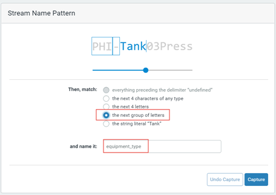 
   
   The next part of the stream name is a number that identifies the equipment Id. `03` is matched using `the next group of numbers`, and this token is assigned the name `equipment_id`. Because we anticipate using this rule to create assets with Ids running into the thousands, we do not use `the next 2 numbers` to match the Id.

   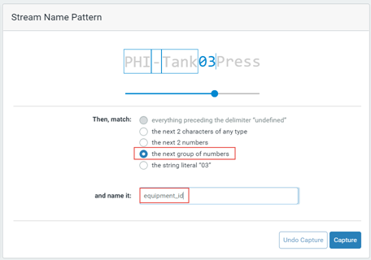

   The last part of the stream name identifies what is being measured in the stream. This token uses `the rest of the stream name` and is named `measurement`.

   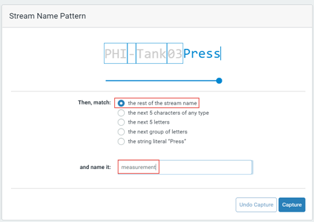
   
1. In the `Token Sources` pane on the left, click **Stream Metadata**.

   The stream metadata are displayed in the center pane.

1. Select the checkbox for each stream metadata to use to construct assets. 

   The metadata tokens are added to the `Tokens` pane.

1. In the `Token Sources` pane on the left, click **Stream Name Pattern** and review the screen.

   The description of the stream pattern is displayed in the `Stream Name Pattern` pane. The `Tokens` pane shows the tokens that make up the stream name pattern.

   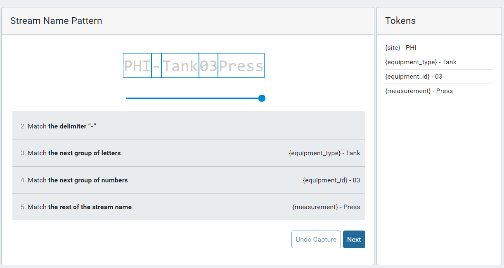

1. When you have completed identifying all the tokens in the stream name, click **Next**.

### Step 2: Map the tokens to values

In this step, you specify the token that identifies the stream measurement in the stream. Then you map values for each token.

1. In the `Configure Stream Reference Name Token` pane, click the  icon to open the `Select Stream Reference Name Token` window.

1. Select the token that identifies the stream measurement and click **Select**. <!--WRITER'S NOTE: This step is still not very clear. Please review it again after the UI changes which may make it clearer. -->

 In the `Tank Rule A` example, the token for the last part of the stream name identifies the measurement, either `Press` or `Temp`, and we gave this token the name `measurement`. 

 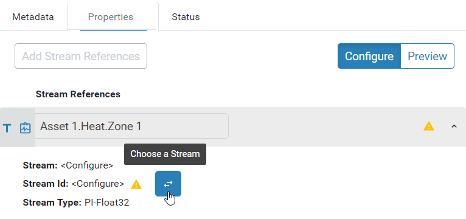
   
 The `Token Mappings Status` pane displays a list of all the tokens identified on the previous page. The token for the measurement is indicated with the  icon.

 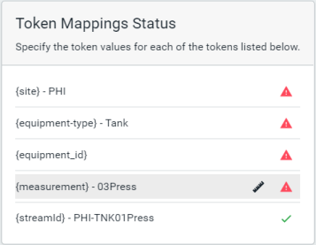

1. Select a token in the `Token Mappings Status` list.

1. In the `Token Value Mappings` pane on the right, select one of the following:

   - **Use Existing Token Values** &ndash; Use the value in the stream name that corresponds to the token.

   - **Rename Token Values** &ndash; Replace the values in the stream name and stream metadata with mapped values.

   In the `Tank Rule A` example, the `equipment_type` and `equipment_id` tokens use the existing token values. The following screen capture shows the token value mapping for the `equipment_type` token. 

   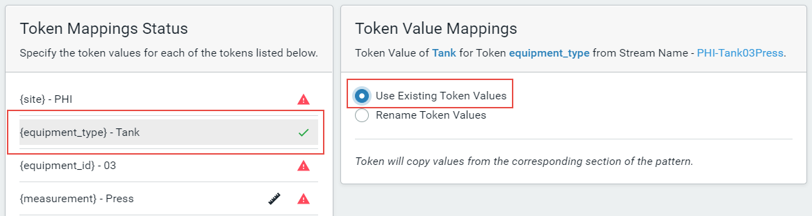

1. If you selected **Rename Token Values**, click **Generate Mappings** to display the list of token values. 

   OCS searches for streams that match the stream pattern and provides a list of the token values. 

   In this example, the `site` token is selected. **Rename Token Values** is selected, and **Generate Mappings** generates two values, `PHI` and `SL`. 

   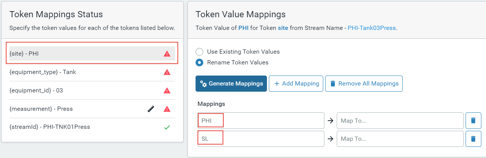

1. For each value on the left, provide the value to use in its place in the text box on the right.

   In this example, `PHI` is mapped to `Philadelphia`, and `SL` is mapped to `San Leandro`.

   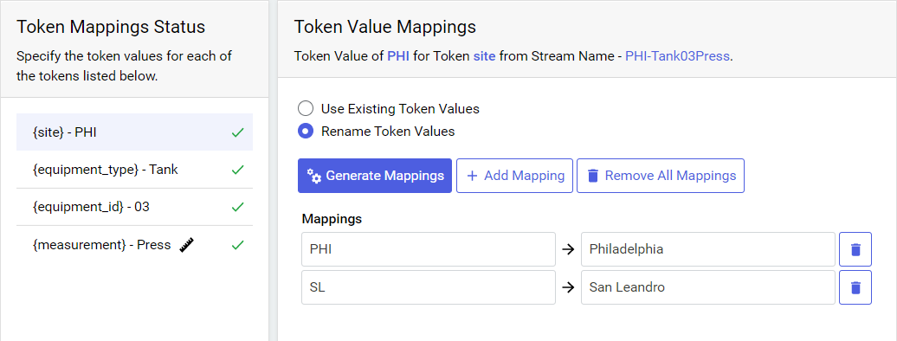

   For the measurement token, click in the text box to display a list of measurements or properties that are defined in the asset type and select the value to map to the token value. The values in the list come from the asset type. If the asset rule is not based on a type, then you must manually enter the values for each of the mappings.

   The screen capture below shows the values that are mapped for the `measurement` token.

   

1. To manually add additional mappings, click **Add Mapping**. 

1. When you have configured the token values for all your tokens, indicated by the green check mark, click **Next**.

### Step 3: Configure the asset

In this step, you specify how the rule builds assets by assigning the tokens to asset fields. When the assets are generated, the tokens are replaced with the value mappings.

1. In the `Configure Asset` pane, for each of the following asset fields enter the sequence of tokens and characters that resolve to create a value for each asset. To pick from a list of tokens, enter { and select a token. 

  - **Id** - The Id must be unique for each asset. If the ID is not unique, the generated assets may incorrectly reference streams that belong to another asset. 
  
  For the [Tank Rule A example](#tank), a combination of the site, equipment type, and equipment ID creates a unique ID for the tank. 

  - **Name** - Enter the sequence of tokens and characters that resolve to create the name for each asset. To pick from a list of tokens, enter { and select a token.

  - **Description** - Optional.

   **Note:** The **Stream Reference Name** field shows the token that was configured in [Step 2](#step-2) as the measurement.

1. To map metadata values, do one of the following:

  - If the asset rule is based on an asset type, the list of metadata is automatically populated based on the asset type and you cannot add or delete metadata. In the **Value Expression** field for each metadata you want defined for your assets, enter the sequence of tokens and characters that resolve to create the value for the metadata. To pick from a list of tokens, enter { and select a token. Leave the **Value Expression** field blank for metadata you do not want mapped.

  - If the asset rule is not based on an asset type, complete the following steps for each metadata you want to add:

    1. Click **Add Metadata**.
    
    1. In the **Name** field, enter the name for the metadata. 
    
    1. In the **Value Expression** field, enter the sequence of tokens and characters that resolve to create the value for the metadata. To pick from a list of tokens, enter { and select a token.

    1. In the **Type** field, select the data type for the metadata from the drop-down.
     
   The following screen capture shows an example of asset fields and metadata mapped to tokens. 
   
   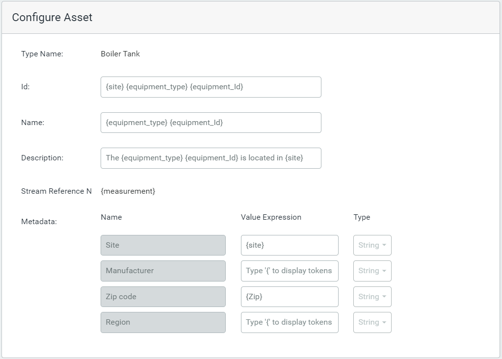

1. When you are finished mapping tokens to asset fields and metadata, click **Next**.

### Step 4: Preview the assets

The asset preview displays a list of the assets that will be created using the asset rule. Use the preview to verify that the rule creates all the assets you expect and they are created correctly.

1. Review the assets. Verify that they are created as you expect and verify that the correct streams are referenced.

   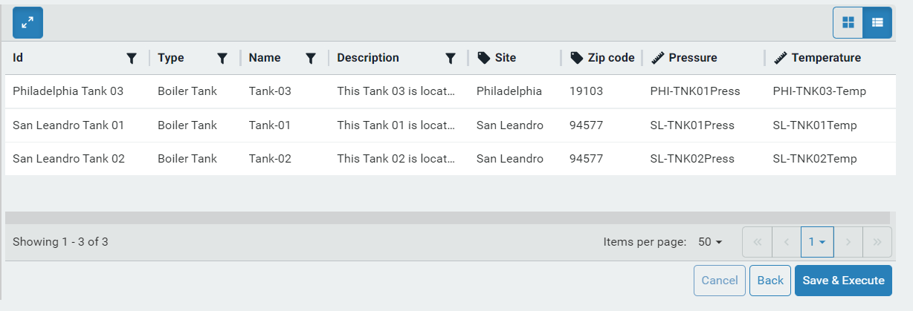

   **Note:** 

   - The  icon identifies the metadata and the  icon identifies the stream references. 

   - The stream Id is identified for each stream. In the example above, the Id of the stream in the first row is `PHI-TNK01`.

1. To show or hide information in the preview, click the `Settings` tab in the `Preview Information` pane, and then click on the following options:

  - **Show Asset Type**

  - **Show Metadata**

  - **Show Stream References**
  
1. To filter the data in a column, click  in the column header, enter the text to find, and press Enter.
   
1. Click the `Details` tab in the `Preview Information` pane, to review the asset rule statistics to validate that the rule produced the expected number of assets and the expected number of streams were processed.

   In the [Tank Rule A example](#tank), we expect to see three assets as indicated in the **Total Assets**. **Streams Processed** is the total number of streams in the namespace. The asset rule checks every stream name in the namespace to see if it matches the specified pattern. In this example, six of the nine streams matched the pattern.
   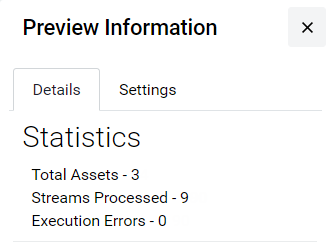
  
1. To return to earlier steps and make any changes to the tokens, token mapping, or asset configuration, click **Back**.

1. To save the rule configuration without running it, click **Save as Draft**. Use this option to continue modifying the rule later.

1. To save the rule configuration and run the rule, click **Save & Execute**.

   The rule appears in the Asset Rule Builder list and a message confirms that the rule was successfully created. The rule is executed and applied to the streams, and the assets are created.

   **Note:** Click on the rule in the Asset Rule Builder list to open a pane that displays any errors that occurred during the execution of the rule.

## Review the assets

Once the asset rule is successfully executed, review the created assets and confirm the results.

1. From the  icon, select **Visualization** > **Asset Explorer**.

1. Use search and the metadata filters to find the assets you expect to be created. For information, see [Filter assets in the Asset Explorer](xref:FilterAssets)

1. Verify that the assets in your preview have been created.
    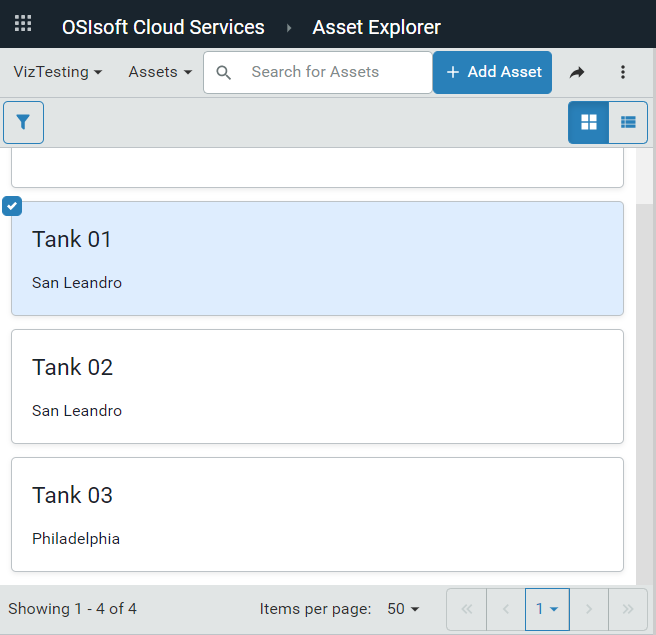

1. Select an asset to see its details.

    **Tip:** Click the pencil icon in the toolbar to see the individual streams referenced in the asset.
