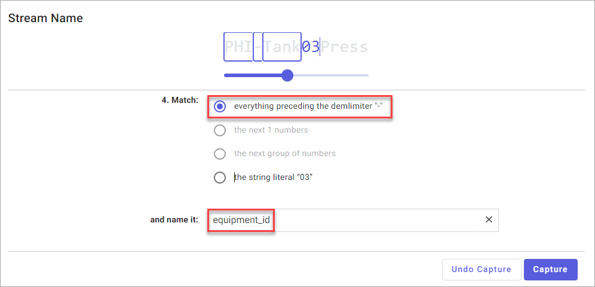
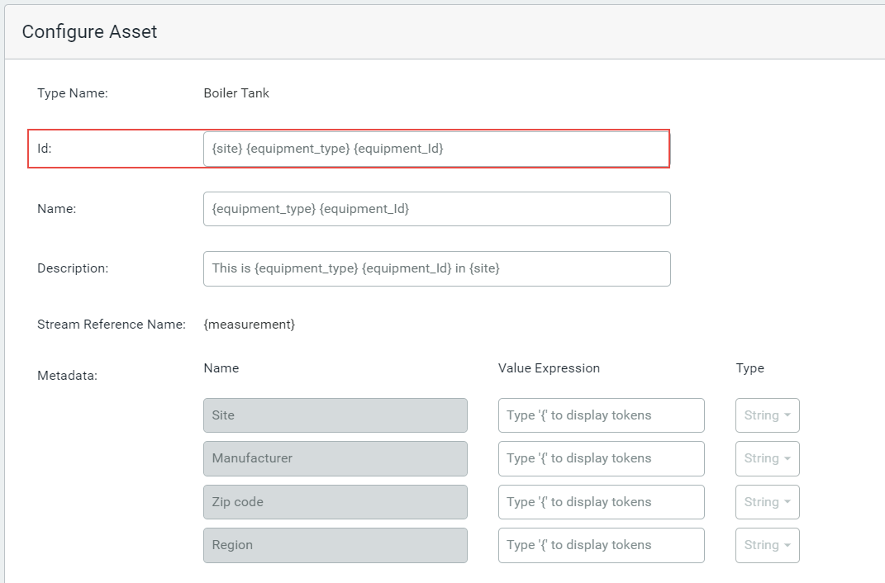
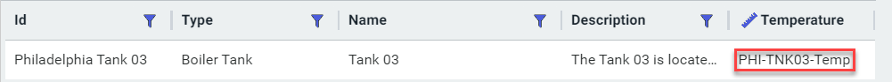
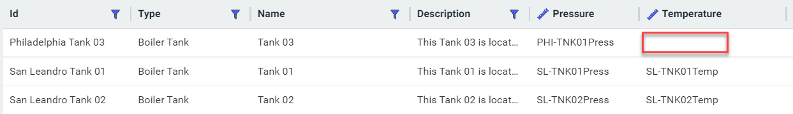

# Using multiple asset rules to create assets

 In [Tank Rule A example](xref:CreateAssetRule#tank), the stream names followed a single pattern that could be defined with one asset rule. There are situations where a single asset rule cannot identify all the streams required to create your assets. Returning to the Tank Rule A example, let us assume that there is one stream name that deviates from this pattern and cannot be identified by this rule. In the table below, PHI-Tank03-Temp differs from the other stream names and contains a hyphen delimiter between the third and fourth parts of its name, that is, between *03* and *Temp*.

| Stream Name                                     | Asset Name | Stream Measurement |
| ----------------------------------------------- | ---------- | ------------------ |
| SL-Tank01Press                                  | Tank 01    | Pressure           |
| SL-Tank01Temp                                   | Tank 01    | Temperature        |
| SL-Tank02Press                                  | Tank 02    | Pressure           |
| SL-Tank02Temp                                   | Tank 02    | Temperature        |
| PHI-Tank03Press                                 | Tank 03    | Pressure           |
| PHI-Tank03-Temp | Tank 03    | Temperature        |

Therefore, you must create a second asset rule, which we will call Tank Rule B, that can identify this stream. The stream name pattern is identical to Tank Rule A, except for the third part of the stream name.  In Tank Rule A, this part of the stream name was matched with *the next group of numbers*. To correctly identify the PHI-Tank03-Temp stream, *03* must be matched using *everything preceding the delimiter "-"*. This token for the third part of the stream name is assigned the name *equipment_Id*, the same name as in Tank Rule A.

**Note:** OSIsoft recommends that you use the same names for all of your tokens in both rules. This will make it easier for you to manage the rules and troubleshoot any problems that may occur.

Set up the mappings and configure the asset as described in [Create an asset rule](xref:CreateAssetRule).

**Note:** The Id and Name for both rules must resolve to the same values in order to achieve the intended result, that is one asset that references both streams. If the Ids are different, then two assets with the name Philadelphia 03 will be created, one that references the Pressure stream and the other that references the Temperature stream.

While it is not a requirement, OSIsoft recommends that you configure the other asset fields (Description and Metadata) the same in both rules.

The following is the asset preview of Tank Rule B which matches the PHI-Tank03-Temp stream for the Philadelphia Tank 03 asset.

Tank Rule A, applied to the streams in this example, creates three tanks with the Philadelphia Tank 03 missing the Temp measurement as shown below.

The two rules complement each other and both are required to create the three assets with stream references for pressure and temperature.
