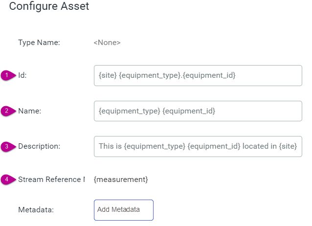
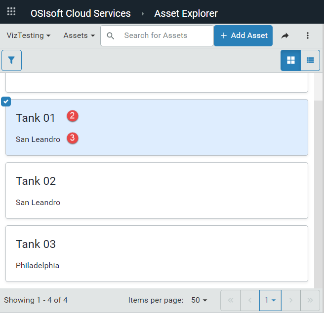
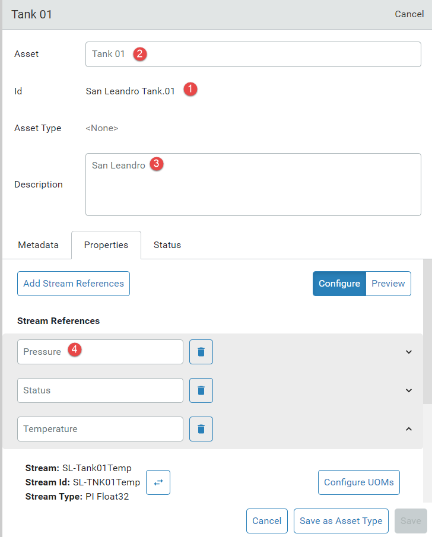

# How tokens are used to generate assets

<!-- WRITER'S NOTE: I need to update these screen captures to show changes I've made to the Configure Asset dialog and to show that the assets are based on an asset type. But I'm not able to produce the assets in order to take the screen captures. -->
When creating asset rules, use tokens to represent the parts of an asset name. A _token_ is a placeholder for a part of the naming pattern and used to construct an asset and add references to the relevant streams.

The following screen capture shows the `Configure Asset` window for the [Tank Rule A example](xref:CreateAssetRules#tank). The numbers identify the different fields and the tokens assigned to those fields. These tokens are used to configure the assets created with the rule.

The following table shows the token definitions for the Tank rule and the resulting values for one of the assets (Tank 01) when the rule is applied.

| #                     | Configuration field   | Token definition                       | Values for the Tank 01 asset |
| :-------------------: | --------------------- | -------------------------------------- | ---------------------------- |
|    | Id                    | {site} {equipment_type}.{equipment_id} | San Leandro Tank.01          |
|    | Name                  | {equipment_type} {equipment_id}        | Tank 01                      |
|  | Description           | {site}                                 | San Leandro                  |
|   | Stream Reference Name | {measurement}                          | Pressure                     |

The screen capture below displays the three assets that were created with the example Tank rule. The numbers identify the properties of Tank O1 that are derived by applying the asset rule. Refer to the table above to match the value with the configuration field and token definition.

The following screen capture is an example of what you might see when you edit the Tank 01 asset in Asset Explorer. The numbered fields&mdash;asset name, Id, description, and stream references&mdash;are generated by the asset rule. For example, the *{site} {equipment_type}.{equipment_id}* expression is used to generate the `San Leandro Tank.01` Id. 

