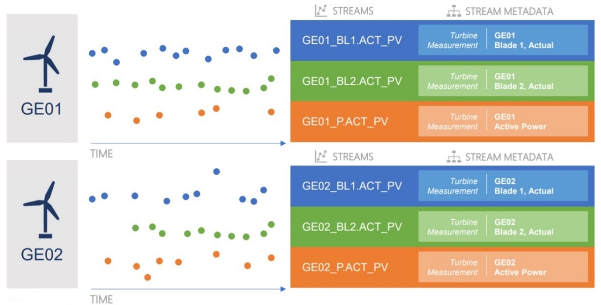
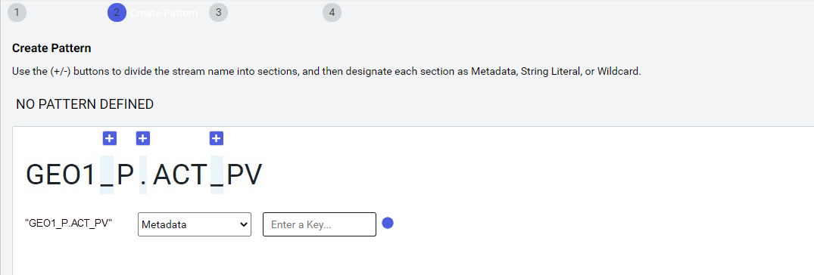
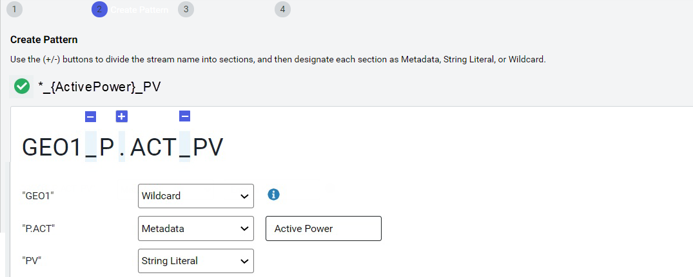

# Metadata rules

OSIsoft recommends that you explicitly include metadata when you create streams; but, that is not always possible. In these instances, you can establish or leverage a consistent naming pattern for streams and embed metadata such as location, asset class, and asset ID in the stream names. Then use a metadata rule to describe the pattern of the stream names. The metadata rule identifies all streams that match the pattern. Then OCS parses each stream and builds out the metadata following the defined rules. 
<!-- Angela Flores 6/11/21 -Having read through the topic, I don't understand how you could use a metadata rule to "establish a consistent naming pattern". It seems like if the naming pattern is consistent, you can use metadata rules to decode the information stored in the name. Also, this topic talks about creating metadata rules and how they are applied to data streams, but then what? Where do I see this information? How does it help me? -->

## PI Server counterpart

Metadata rules do not have a similar counterpart in PI Server because PI points cannot store generic metadata. <!--If a similar feature existed in PI Server, it might be a tool that runs against a list of PI points and fills in their point attributes by parsing out different parts of a structured PI point name.--> <!-- Angela Flores 6/11/21 - I don't think the second sentence adds value. It is talking about a hypothetical tool. -->

## Metadata best practices  

OSIsoft recommends the following best practices to make it easier to add metadata to streams:

- The easiest way to explicitly add metadata is when streams are created. Whenever possible, OSIsoft recommends metadata be added during stream creation.
- There may be situations where streams are created from an external source and you cannot explicitly include metadata fields. If possible, establish and apply a naming pattern for stream names that can be used with metadata rules.  An example of a naming pattern is: {Region}.{Site}.{Equipment}.{Measurement}. Use delimiters to separate the parts in the naming pattern. 
- If possible, manually create a few streams with your proposed stream naming pattern. Then experiment with creating metadata rules to ensure that you can collect all of the metadata that you want from the stream name. Once you have confirmed that all of the metadata is captured in the stream name, then proceed with creating the remainder of your streams.

## Using metadata rules to add metadata to streams

The following diagram shows metadata for two turbines named GEO1 and GEO2, each with three data streams:

- The color-coded data streams show the specific data each stream is tracking, which is detailed in the Stream Metadata column. 
- The basic description of the stream data is encoded in the stream name. For example, for the third stream in the table, the metadata rule translated, GEO1_P.ACT_PV, into meaningful information. You see that GEO1 is the name of the turbine and that Active Power is the measurement in this stream.  
- A metadata rule based on this stream naming pattern can capture active power values for all turbines in each wind farm. 

 

Create metadata rules by selecting a stream as a template and then define the criteria to match with other streams. In the example below, OCS shows a stream selected for metadata rule and identifies characters you could use to divide the stream name into parts using a + sign. 

Assign a metadata type to each part of the stream name, using the following metadata types:

- wildcard - variable information
- metadata - a key that identifies values in the stream; part of a key-value pair
- string literal - static characters that convey information

In the following example, all data comes from wind turbines on a wind farm and the template stream name has three parts: *GEO1*, *P.ACT*, and *PV*. The first part of the stream name identifies the wind turbine and is different for each wind turbine. This part of the stream name is a wildcard. The second part of the stream name, *P.ACT*, identifies the measurement *Active Power*. This part of the stream name is metadata. The third part of the stream name, *PV*, stands for Pine Valley Wind Farm and is a string literal. 

When the parts are combined, this metadata rule creates metadata for streams coming from turbines for Active Power in the Pine Valley Wind Farm.

 
When you create a metadata rule, OCS applies it to all existing streams and subsequently to any new streams added to the namespace. You can edit a metadata rule; but the modified rule may capture a different set of streams. 

## Related links

- [Create a metadata rule](xref:gpMetadataRules)
<!-- Angela Flores 6/11/21 - Adding a related links section seems unnecessary. -->
