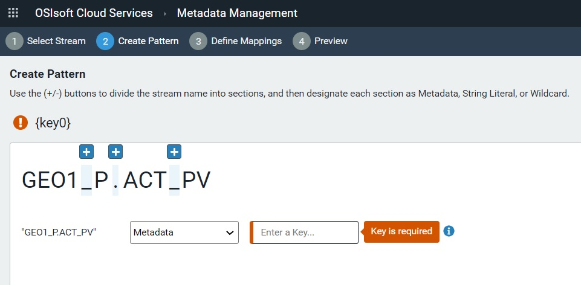
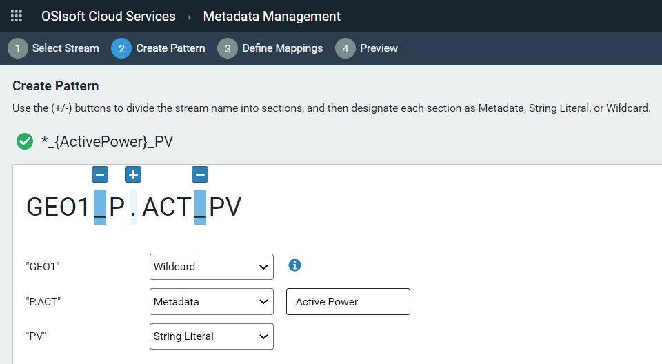

# Metadata rules

Whenever possible, OSIsoft recommends that metadata be explicitly included in the streams when they are being created. However, there are situations where this is not possible. In these instances you can establish or leverage an existing consistent naming pattern for your streams and embed metadata such as location, asset class, and asset ID in your stream names.  Then you can create metadata rules that define the pattern of the stream name. The metadata rule identifies all streams that match the defined pattern. OSIsoft Cloud Services (OCS) then parses each stream and builds out the metadata following the defined rules.

## PI Server counterpart

Metadata rules do not have a similar counterpart in PI Server because PI points cannot store generic metadata. If a similar feature existed in PI Server, it might be a tool that runs against a list of PI points and fills in their point attributes by parsing out different parts of a structured PI point name.

## Metadata best practices  

The following best practices are recommended to make it easier to add metadata to your streams:

- The easiest way to explicitly add metadata is at the time that streams are created. Therefore, whenever possible, OSIsoft recommends that metadata be added during stream creation.
- In situations where streams are created from an external source and you cannot explicitly include metadata fields but you are able to establish a naming pattern for stream names, adopt and apply a naming pattern that can be used with metadata rules. <!-- What are the characteristics of a naming pattern that can be used with metadata rules? -->
- If possible, manually create a few streams with your proposed stream naming pattern. Then experiment with creating metadata rules to ensure that you can collect all of the metadata that you want from the stream name. Once you have confirmed that all of the metadata is captured in the stream name, then proceed with creating the remainder of your streams.

## Using metadata rules to add metadata to streams

The following diagram shows metadata in the context of several different but similar data streams. 

The diagram above shows three data streams for turbines named GEO1 and GEO2. 
1. The color-coded data streams show the specific data each stream is tracking, detailed in the Stream Metadata column. 

2. The basic description of the stream data is encoded in the stream name. For example, looking at the first stream in the table, the metadata rule takes what might have been meaningless to a user, GEO1_P.ACT_PV, and translates this.  The user sees that GEO1 is the name of the turbine and ACT_PV  or Active Power is the measurement in this stream.  

3. A metadata rule based on this stream naming pattern can capture active power values for all turbines in each wind farm. 
   

The OCS portal provides a wizard to create metadata rules. Users select a stream as the template for creating a metadata rule and define the criteria by which the metadata rule determines matching streams. 

In the screen capture above, the wizard displays the stream name selected by the user, and it identifies each delimiter with a + sign. 

Each part of the stream name is assigned a metadata type. The screen capture above shows the different metadata types (wildcard, metadata, and string literal) that can be assigned to each delimited part of a stream name. 

*       In this example, all data is coming from wind turbines on a wind farm, The user knows that the first part of the stream name (GEO1 in the selected stream above) identifies the wind turbine. This rule uses a wildcard to capture streams for all turbines.  

*       The second part of the stream name (P.ACT in the selected stream above) has been assigned a metadata type of metadata. Metadata is defined as key-value pairs. For example*, P.ACT* is the key for *Active Power*. The user defines all key-value pairs for this part of the stream name. 

**Note**: Stream name parts designated as metadata are defined as key-value pairs. Each value occupying a part designated as metadata is categorized under a key defined for it. This typically takes the form of values recorded at different timestamp intervals for a particular object or device, or key. The key-value data structure facilitates analytical processing of stream data returned by a metadata rule. 

*       PV is defined as a string literal. In this example, it refers to the Pine Valley Wind Farm. 

*       As defined, this metadata rule creates metadata for streams coming from turbines for Active Power in the Pine Valley Wind Farm.

   In addition to being applied to any existing streams, a metadata rule captures any matching streams that are subsequently added to the selected namespace. You can edit a metadata rule. The modified rule may then capture a different set of streams.

## Related links

- [Create a metadata rule](xref:gpMetadataRules)
