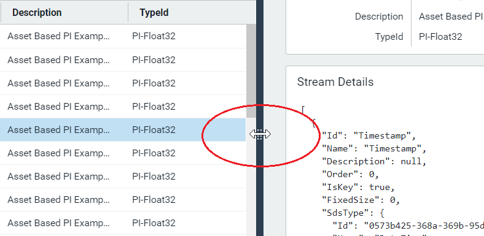
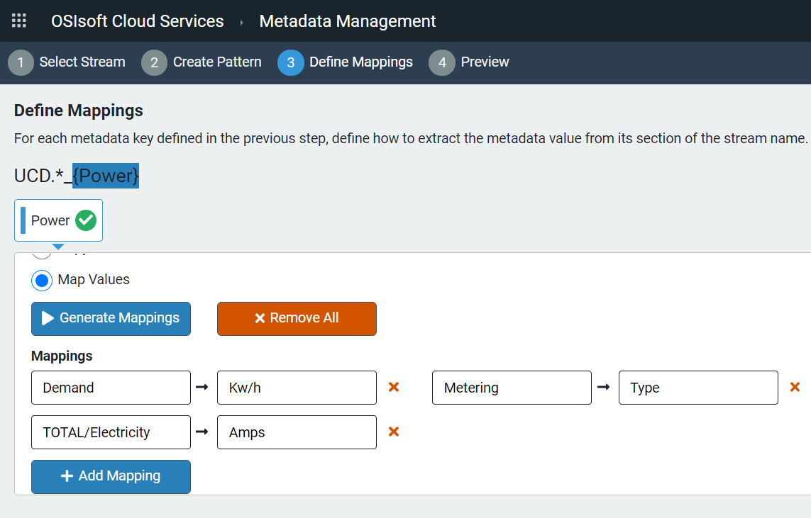

# Create a metadata rule

Use metadata rules to identify groups of similar streams for analytical purposes. You select a stream name to use as a name pattern and assign metadata to selected stream name parts, such as a plant location or device category. The resulting stream name pattern with assigned metadata parts defines a metadata rule. Metadata rules assign defined metadata to all streams in a given namespace matching the stream name pattern defined in the rule.  

## Procedure

To create a new metadata rule, follow these steps:

1. In the OCS portal, click the menu icon and select **Sequential Data Store** under **Data Management**. 
2. On the `Sequential Data Store` page, click **Streams**.
3. In the **Namespace** drop-down list, select the namespace in which you intend to create the metadata rule.
4. Expand the `Streams` pane if necessary to copy the full name of the stream that will be the basis for your metadata rule.

    

5. Click the menu icon to display the menu again, and select **Metadata Management** under **Data Management**. The `Metadata Management` page displays.
6. Click the **Namespace** drop-down list, and choose the namespace in which the model stream resides and where the metadata rule is to be created.
7. Click **Add Metadata Rule**. The `Select Stream` page displays.
8. Paste the copied stream name into the `Search` field. All streams in the namespace that share the name pattern of the stream you selected display.

    **Note**: You can also search for a stream name by entering the first few characters of a name followed by the wild card symbol (*) in the `Search` field.
   
9. Click the row of the stream name to use for the metadata rule and click **Next**.
10. In the `Create Pattern` page, click the **+** sign above each selected delimiter to separate sections of the stream name.
11. For each delimited section of the stream name you select, use the drop-down list to assign a metadata type: Metadata, String Literal, or Wildcard. See the table following this procedure for a description of these metadata types. 
12. After entering all metadata type entries, click **Next**.

    **Note**: If you select metadata type **Metadata**, you must also enter a metadata key. A metadata key is the key portion of a key-value pair, typically the type of data provided, such as Measurement. This is helpful when streams that match the rule provide different types of data. Entries in the **Map To** portion of mapping represent the value part of the key-value pair. For example, Power would be the defined key, while different types of data could be Demand, TOTAL/Electricity, or Metering. The mapping entries specify the labels you want to display for each of those values, as in the following image:
    
    

13. In the `Define Mappings` page, choose one of the following options:
     - To display the raw stream data for the specified metadata key, select **Copy Values** under **Mapping Type**.
     - To assign a label to data values, select **Map Values** and click **Generate Mappings**.
14. If you selected **Map Values**, then do the following: In the **Map To** field, enter the label you want displayed for each defined metadata key, and click **Next**.
15. (Optional) Click **Add Mapping** to define a mapping for any other stream name part.
16. Click **Next**. All matching streams for the rule are displayed.
17. Enter the metadata rule **Name** and **Description** in the `Preview and Run` page.
18. Click **Save & Execute**.

## Metadata types
The table below provides a list of metadata types and descriptions.<!--Vicki T. 6/25/21 -Is there anything else we want the user to know about these metadata types? It seemed odd that this table appears at the end of the procedure since metadata types are discussed/selected in steps 11 and 12. I recommend moving the table after the "Create a metadata rule" section. Angela Flores - Will hold off until we finalize guidelines for procedure.-->

| Metadata type                       | Description                                        |
|---------------------------------|------------------------------------------------------------|
| **Metadata**     | Assigned to the data values provided by each stream matching the name pattern of the metadata rule. |
| **String Literal**      | Only stream names with the specified string in the part designated will match the name pattern of this metadata rule. |
| **Wildcard**       | Designates a part of the stream name pattern in which any value is accepted by this metadata rule. |
