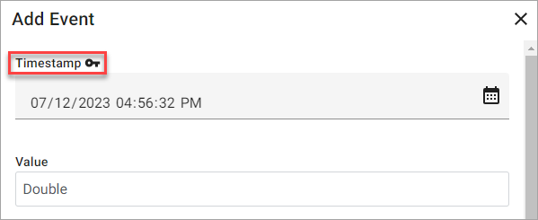

# Add event

While viewing the data for a stream, you can add _events_, which are data values that the user manually adds to a stream. Any events that you add to a stream can then be visualized while viewing the stream's data or viewing the stream in a Trend session.

To add an event to a stream, complete the following steps.

1. In the left pane, select **Data Management** > **Sequential Data Store**.

1. Select the stream to add an event for and choose **View Data**.

    **Tip:** Use <xref:Search> to find your stream.

1. Select **Add Event**.

    The **Add Event** panel opens.

1. (Required) Configure the key property for the event.

    The key property is the index value for the event. This property is usually **Timestamp**, but there is no restriction as to what type the index can be within SDS. Sometimes it can be another property, like **Index**.

    **Key property**

    

1. Configure the remaining property values for the event.

    For enumerated data types, values map to the friendly name rather than an integer.

1. Select **Save**.

The event is added to the stream. You can view the new event in your list of data values creating a ranged query that includes your new event.