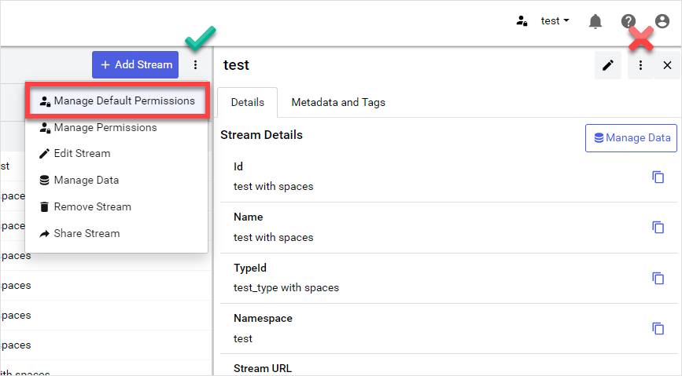
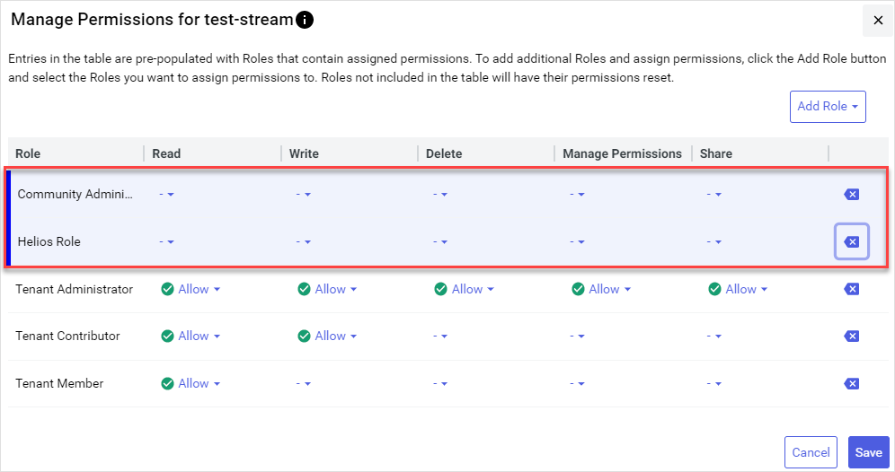

# Manage stream permissions

If you are assigned the **Manage Permissions** access right, then you can configure stream permissions for other user roles in your tenant. You can granularly assign individual stream permissions to each user role in your tenant.

## Prerequisites

To manage data stream permissions, your user role must be assigned the **Manage Permissions** access right.

## Manage permissions for streams

When managing permissions for streams, you can either edit them one at a time or in bulk.

### [Single stream](#tab/tabid-1)

When editing permissions for a single stream, each user role that has permissions for the stream is displayed.

1. From the left pane, select **Data Management** > **Sequential Data Store**.

1. Select a single stream that you want to manage permissions for.

1. Select **Manage Permissions**.

1. Select **More options**  > **Manage Permissions** from the toolbar (not the side panel). 

     

1. Use the `Manage Permissions` window to:

    - Add user roles that have permissions on the stream.
    - Edit stream permissions for each user role.

    For more information, see [Manage Permissions for Streams window](#manage-permissions-for-streams-window).

1. When you are finished editing permissions, select **Save**.

### [Multiple streams](#tab/tabid-2)

When editing permissions for multiple streams, you must add each user role that you want to have permissions on the stream before editing each permission setting.

1. From the left pane, select **Data Management** > **Sequential Data Store**.

1. Select one or more stream that you want to manage permissions for.

1. Select **Manage Permissions**.

1. Use the `Manage Permissions` window to:

    - Add user roles that have permissions on the stream.
    - Edit stream permissions for each user role.

    For more information, see [Manage Permissions for Streams window](#manage-permissions-for-streams-window).

1. When you are finished editing permissions, select **Save**.

***

## Manage default permissions for new streams

You can edit the default user roles and permissions added to stream when it is created. Editing these default roles and permissions speeds up creation of new data streams by minimizing permission edits.

1. From the left pane, select **Data Management** > **Sequential Data Store**.

1. Select **More options**  > **Manage Default Permissions**.

1. Use the `Manage Default Permissions` window to edit default edit stream permissions. For more information, see [Manage Permissions for Streams window](#manage-permissions-for-streams-window).

1. (Optional) To update all existing data streams within the namespace with your selected default settings, select **Apply to all existing streams in the Namespace**.

	**Warning!** Use of this option applies your updated permission settings to *all* streams in the namespace. Use this option with care, as it overwrites existing permission settings.

1. When you are finished editing permissions, select **Save**.

## Manage Permissions for Streams window

Regardless of what context you are editing stream permissions, all edits are performed using the **Manage Permissions for Streams** dialog. This dialog lists a matrix of roles that have permissions for the selected streams, along with the setting for each individual each permission. Use this matrix to add new roles that have permissions for the streams or update individual permissions.

### To add roles

Add roles that have permissions for the selected streams by selecting **Add Role** > **Add** .

### To remove roles

Remove newly added roles by selecting **Remove** .

### To edit permissions

Read, write, delete, manage permissions, and share permissions can be edited for each user role that has permissions on the stream. Mouse over the **Information**  icon for more information about each permission.

- To allow a permission, select  **Allow**.

- To explicitly deny a permission, select  **Deny**. Permissions that have a value of `-` are equivalent to  **Deny**.

Roles that are highlighted indicate that one of more of its permissions settings have been modified. You can restore the original settings by selecting **Cancel**.

**Modified roles**

### To clear permissions for a role
    
Clear the permissions applied to a role by selecting **Backspace** . 

**Notes:**

- Allow Manage Permissions access is required on at least one role.

- Roles that have no permissions assigned will not be listed the next time that you manage stream permissions.
