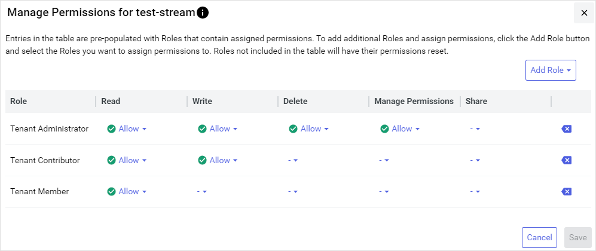
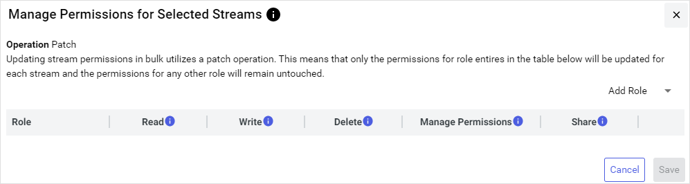
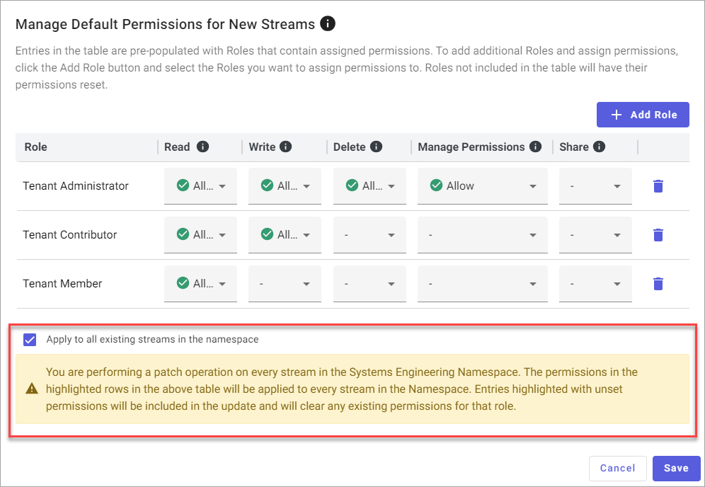
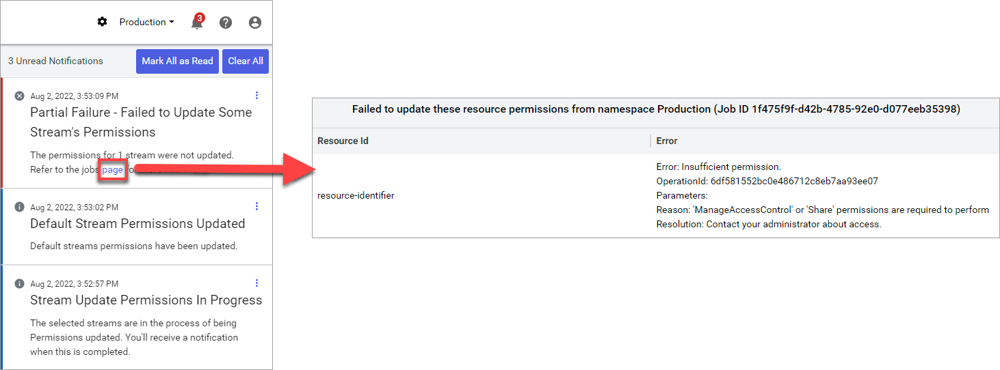

# Manage permissions for streams

If you are assigned the **Manage Permissions** access right, then you can configure stream permissions for other user roles in your tenant. You can granularly assign individual stream permissions to each user role.

## Prerequisites

To manage data stream permissions, you must be assigned the **Manage Permissions** access right.

## To manage permissions for streams

When managing permissions for streams, you can either edit them one at a time or in bulk.

### [Single stream](#tab/tabid-1)

When editing permissions for a single stream, each user role that has permissions assigned are pre-populated in the window that opens.

1. From the left pane, select **Data Management** > **Sequential Data Store**.

1. Select a single stream that you want to manage permissions for.

1. Select **More options**  > **Manage Permissions**.  

    The `Manage Permissions for Stream` window opens. Because you are editing permissions for a single stream, all user roles that have permissions on the stream are displayed along with their settings.

    **Stream with pre-populated user roles and permissions**

    

1. Use the `Manage Permissions for Stream` window to:

    - (Optional) Add user roles that have permissions on the stream.
    - Edit stream permissions for each user role.

    For more information, see [Manage Permissions window](xref:permissions-management#manage-permissions-window).

1. When you are finished editing permissions, select **Save**.

### [Bulk streams](#tab/tabid-2)

When editing permissions for multiple streams, no user roles or permission settings are pre-populated in the window because the permissions for each stream are unique. Therefore you must add each user role that you want to have permissions on the stream before editing each permission setting.

Updating streams in bulk uses a patch operation, meaning only the permissions for role entries that you edit are updated, and any previously existing permissions assigned to each role remain in place.

1. From the left pane, select **Data Management** > **Sequential Data Store**.

1. Select the streams that you want to manage permissions for.

1. Select **Manage Permissions**.

    The `Manage Permissions for Selected Streams` window opens. Because you are editing permissions for multiple streams, no user roles or settings are listed, as the permission settings for each stream are different.
    
    **Note:** If your user account does not have permissions to manage permissions for a selected stream, **Manage Permissions** is unavailable. Contact an administrative user to request permissions to share the stream.  

    **Streams without pre-populated user roles and permissions**
    
    

1. Use the `Manage Permissions` window to:

    - Add user roles that have permissions on the stream.
    - Edit stream permissions for each user role.

    For more information, see [Manage Permissions window](xref:permissions-management#manage-permissions-window).

1. When you are finished editing permissions, select **Save**.

    The edited permissions and roles are updated. This action overwrites any previous permission settings applied to the affected user roles. For more information, see [Bulk stream permission management notifications](#bulk-stream-permission-management-notifications).

***

## To manage default permissions for new streams

You can edit the default user roles and permissions added to a stream when it is created.

1. From the left pane, select **Data Management** > **Sequential Data Store**.

1. Select **More options**  > **Manage Default Permissions**.

1. Use the `Manage Default Permissions` window to edit default user roles and stream permissions. For more information, see [Manage Permissions window](xref:permissions-management#manage-permissions-window).

1. (Optional) To update all existing data streams within the namespace with your selected default settings, select **Apply to all existing streams in the Namespace**.

	**Warning!** Use of this option applies updated permission settings to *all* streams in the namespace. Use this option with care, as it overwrites existing permission settings.

    **Apply to all existing streams option**

    

1. When you are finished editing permissions, select **Save**.

## Bulk stream permission management notifications

When you update stream permissions in bulk or use the `Manage Default Permissions` window to update all namespace stream permissions by selecting the **Apply to all existing streams in the namespace** option, OSIsoft Cloud Services (OCS) runs a job to update applicable permissions. When this job completes, the completed operation is listed in your notifications . If this job fails to update any streams, the job notification lists the resource identifiers and errors for the applicable streams. Click on the link to review job errors.

**Note:** Stream permissions jobs are only accessible from your notifications. If you clear the notification for a job, you must re-run the job to view its result again.