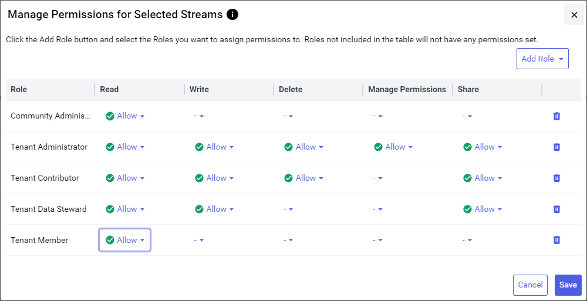

# Manage stream permissions

If you are assigned the **Manage Permissions** access right, then you can configure stream permissions for other user roles in your tenant. You can granularly assign individual stream permissions to each user role in your tenant.

## Prerequisites

To manage data stream permissions, your user role must be assigned the **Manage Permissions** access right.

## Manage permissions for streams

To manage permissions for a single data stream, complete the following steps:

1. From the left pane, select **Data Management** > **Sequential Data Store**.

1. Select one or more stream that you want to manage permissions for.

1. Select **More options**  > **Manage Permissions**.

1. Use the `Manage Permissions` to edit stream permissions. For more information, see [Manage Permissions for Streams window](#manage-permissions-for-streams-window).

1. Select **Save**.

## Manage default permissions for new streams

You can edit the default user roles and permissions added to stream when it is created. Editing these default roles and permissions speeds up creation of new data streams by minimizing permission edits.

1. From the left pane, select **Data Management** > **Sequential Data Store**.

1. Select **More options**  > **Manage Default Permissions**.

1. Use the `Manage Default Permissions` window to edit default edit stream permissions.

1. (Optional) To update all existing data streams within the namespace with your selected default settings, select **Apply to all existing streams in the Namespace**.

	**Warning!** Use of this option applies your updated permission settings to *all* streams in the namespace using a patch operation. Use this option with care, as it will overwrite existing permission settings.

1. Select **Save**.

## Manage Permissions for Streams window

Regardless of what context you are editing stream permissions, all edits are performed using the **Manage Permissions for Streams** dialog. This dialog lists a matrix of roles that have permissions for the selected streams, along with the setting for each individual each permission. Use this matrix to add new roles that have permissions for the streams or update individual permissions.

### Roles column

The matrix lists each user role that has permissions for the selected streams.

- To add a user role that has permissions for the selected stream, select **Add Role** > **Add Role** .

- To remove all permissions for a user role, clear the row by selecting the **Clear**  icon. Then select the **Delete**  icon.

### Stream permissions columns

When managing permissions for data streams, you can explicitly allow or deny individual permissions for each user role. Select  **Allow** or  **Deny** for each permission that you want to explicitly define for each role. Undefined permissions (-) default to a setting of  **Deny**.

For a description of each permission, mouse over its **Information**  icon.

Roles that are highlighted indicate a *dirty* state—one of more of its permissions settings have been modified. You can restore the original settings by selecting **Cancel**.
