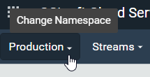
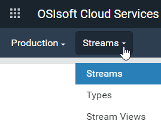

# Add a stream

Sequential Data Store (SDS) stream data are values or events of the same SDS type. SDS stream data are stored in the Sequential Data Store and indexed by one or more properties defined by the stream's SDS type. See the following for more information about streams:

- [Streams](xref:ccStreams)
- [Streams best practices](xref:bpStreams)

## Procedure

1. Click the  and click **Sequential Data Store** (under Data Management).

1. Click the **Namespace** selection button to open the `Select a Namespace` window. Select the namespace in which you want to create the stream.
   
   
1. From the **Streams** drop-down list, select **Streams** if it is not already selected.
    
    
1. Click **Add Stream**.

1. In the `Add Stream` window, enter the following:

   `Id` &ndash; (Optional) Identifier for referencing the stream. If you do not provide an Id, OCS generates a GUID.
   
   `Name` &ndash; (Optional) User-friendly name for the stream. If you do not provide a name, it takes the value of the `Id`. 
   
   `Description` &ndash; (Optional) User-friendly description of the stream
   
   `Type` &ndash; SDS type identifier of the type used in this stream 

1. Click the **Tags** tab, if it is not already selected.

1. In the `New Tag` field, type the name of the metadata tag and click **+** to add the tag. 

1. Continue adding tags to your stream.

1. Click the **Metadata** tab and click **Add Metadata**.

1. In the `Metadata Key` and `Metadata Value` fields, enter the key and value of your metadata.

1. Continue adding metadata to your stream.

1. When you are done, click **Save**.

## Related links

- [Streams](xref:sds-streams) API