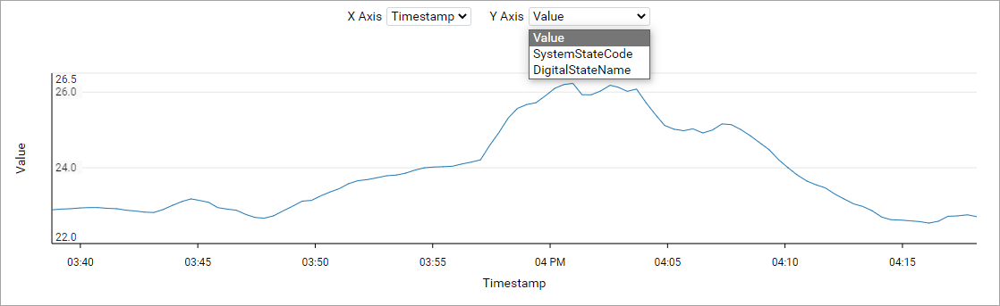

# View stream data

You can view each data value for a stream by choosing it from the Sequential Data Store.

1. In the left pane, select **Data Management** > **Sequential Data Store**.

1. Select the stream that you want to view data for.

    Use <xref:Search> or the **Communities**  filter to find your stream.

1. Select **View Data**.

By default, the last data value available for the stream displays. However, you can change which data values are displayed by editing the **Query Type** dropdown. See the heading below for more information.

**Tip:** You can manually add data values to a stream by adding an event. For more information, see <xref:streams-add-event>.

## Edit query type

Edit the query type for the stream to view its first value, last value, or a range of data.

To edit the query type, ensure that the **First Value/Last Value/Range Query** button is enabled. Then select a value from the **Query Type** dropdown.

| Query Type | Description |
|--|--|
| Get First Value | Gets the first recorded value for the stream. |
| Get Last Value | Gets the last recorded value for the stream. |
| Get Range Values | Gets a range of recorded values for the stream. For more information on setting a range, see the heading below.

## Range values

When setting a ranged value query type, you most provide additional parameters to display data values:

| Parameter | Description |
|--|--|
| Start Index | The start index for the range. Choose a date and time. By default, this value is the current date and time.  |
| Count | The number of data values included in the range. By default, this value is 100. |
| Reversed | The order that data values are listed. By default, data values are not reversed. |

Select **Apply** to apply your parameters. The data values included in the query are listed on screen, and they are plotted in a graph as well. For streams with multiple properties, you can view different data values included in the stream by editing the **X Axis** and **Y Axis** dropdowns, as depicted in the image below.

