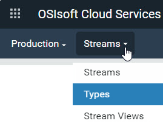

# Add a type

Sequential Data Store (SDS) types define the shape and structure of events and how to associate events with streams of data. See the following for more information about types:

- [Types](xref:ccTypes)
- [Types best practices](xref:bpTypes)

Once a type is created, it cannot be edited. 

## Procedure

1. Click the  icon and click **Sequential Data Store** (under Data Management).

1. From the **Namespace** drop-down list, select the namespace in which you want to create your type.  

1. From the **Streams** drop-down list, select **Types**. 

1. Click **Add Type**.

1. In the `Add Type` window, enter the following:

   - `Id` &ndash; Id for referencing the type
   - `Name` &ndash; User-friendly name
   - `Description` &ndash; Descriptive text that you can use to identify the type
   - `Base Type` &ndash; (Optional) Select a previously created type on which the new type will be based. The new type inherits the properties of the base type. Inherited properties are read only and cannot be modified.

1. Click  **Add Property** to add a property.

1. Complete the following fields for the first property:
   - `Key` &ndash;  When selected, identifies the property as the index 
   
   - `Id` &ndash; Identifier for referencing the property
   
   - `Name` &ndash; Name of the type. By default, the `Id` and `Name` are the same. 
   
   - `Type` &ndash;  Sds type of the property
   
     **Note:** You can filter on the property types by entering text in the **Filter Types** box. You can also use the **System** or **Tenant** controls to include or exclude these types. **Tenant** includes any property types that were previously created in your namespace. <!-- What does System include? All types in all tenants? --> 
   
   - `UOM` &ndash; (Optional) Select a unit of measure from the list. 
   
   **Note:**
   
   - The `Key` field identifies the property as the index.
   
   - You can select multiple properties as indexes. Drag and drop the properties in the list to reorder the index keys.
   
1. Continue adding properties to the type.

1. When you are done adding properties, click **Save**.

## Related links

- [Types](xref:sdsTypes) API