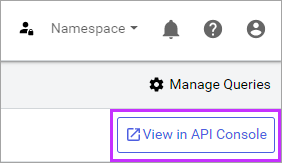

### API console

While creating or editing a data view, use the ** View in API Console** to open the view in the <xref:apiConsole>. The API console includes the URI and query values for accessing your data view in its current configuration. 

**View in API Console button**

