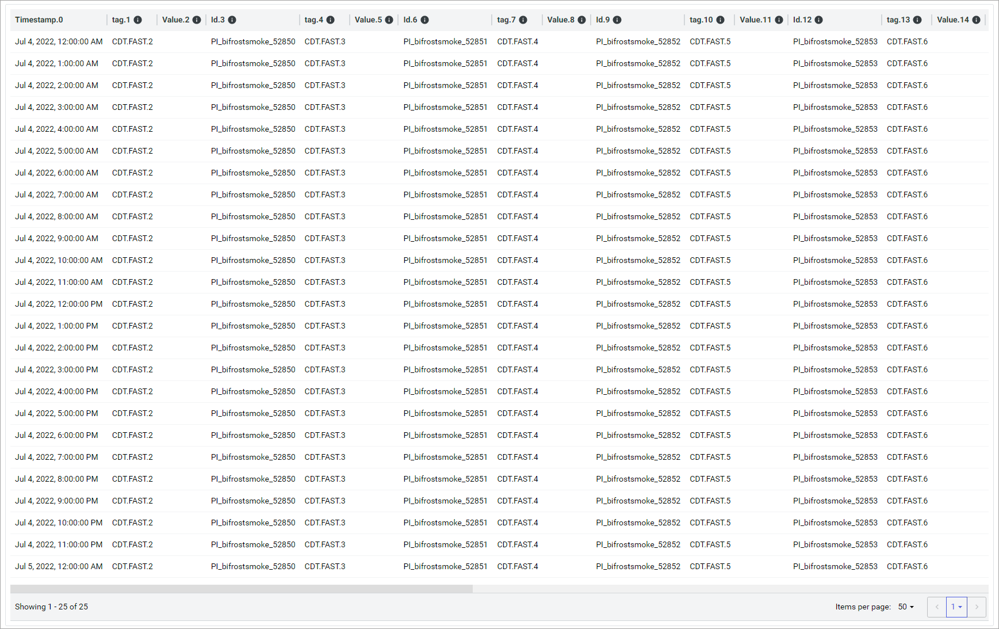
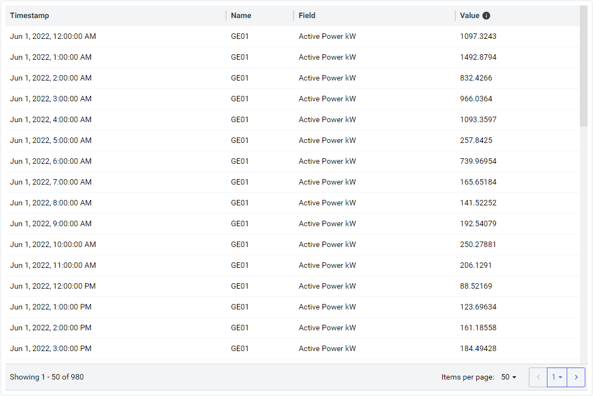
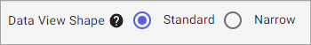

# Step 4: Configure data shape

[!include[choose-data-shape](_includes/choose-data-shape.md)]

[!include[data-shape-intro](_includes/data-shape-intro.md)]

## Standard

[!include[standard-shape](_includes/standard-shape.md)]

**Standard data shape**

## Narrow

[!include[narrow-shape](_includes/narrow-shape.md)]

**Narrow data shape**

## To configure data shape

To choose a data shape, choose between the **Standard** and **Narrow** options at the top of the page.

**Data view shape options**

## Developer documentation

For developer documentation on choosing a data shape using the REST API, see <xref:DataViewShape>.

## Next steps

Continue to <xref:data-views-preview-and-save>.