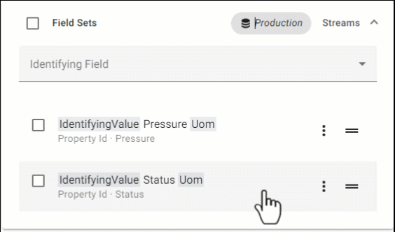

# Edit field set order

By default, fields added to a field set are listed alphabetically within your data view. However, you can manually edit the order that fields display. Fields will display in your data view in the configured order, immediately following grouping fields.

## To edit field order

You can either edit the field order by using page controls or drag and drop.

### [Page controls](#tab/tabid-1)

1. Within a field set, select the field that you want to reorder.

1. Select **Arrow up**  or **Arrow down**  to move the field to the desired position within the field set.

### [Drag and drop](#tab/tabid-2)

To reorder data fields within a data field set, you can also drag and drop a field to its desired position.

**Drag and drop fields**

---

## Next Steps 

Proceed to <xref:data-view-choose-data-shape>.